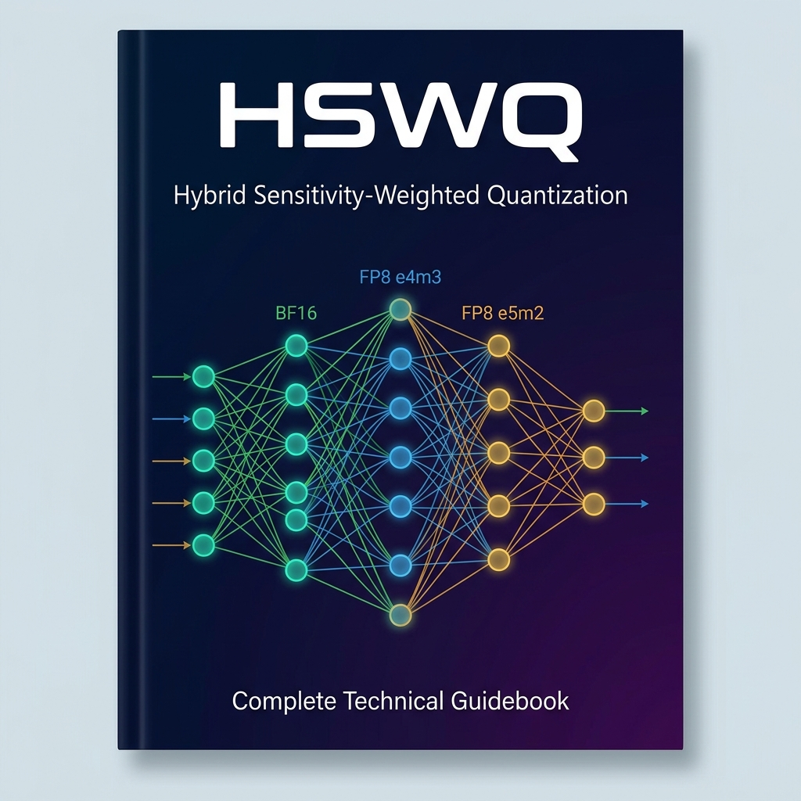
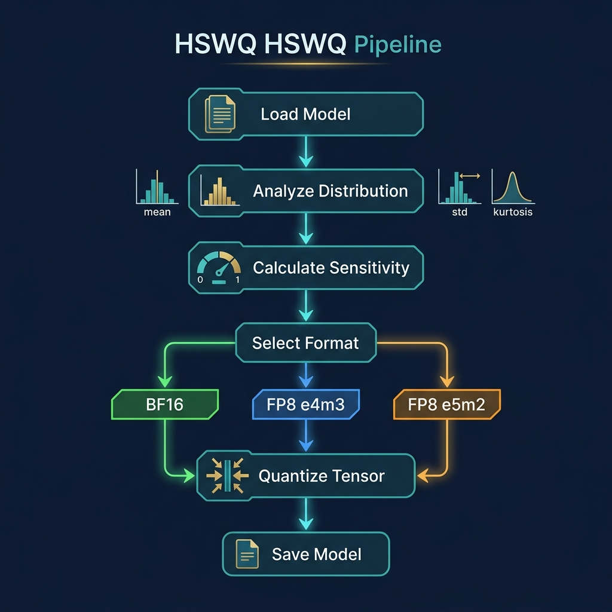
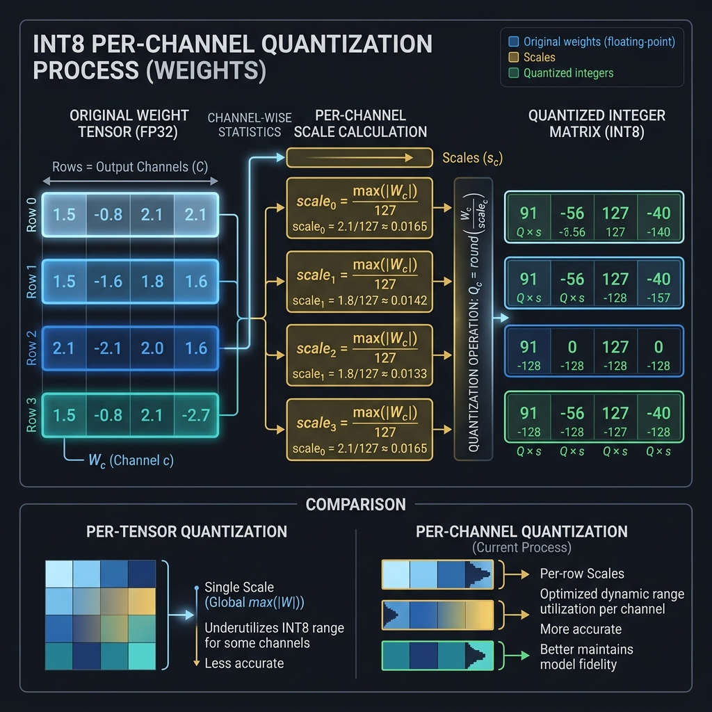
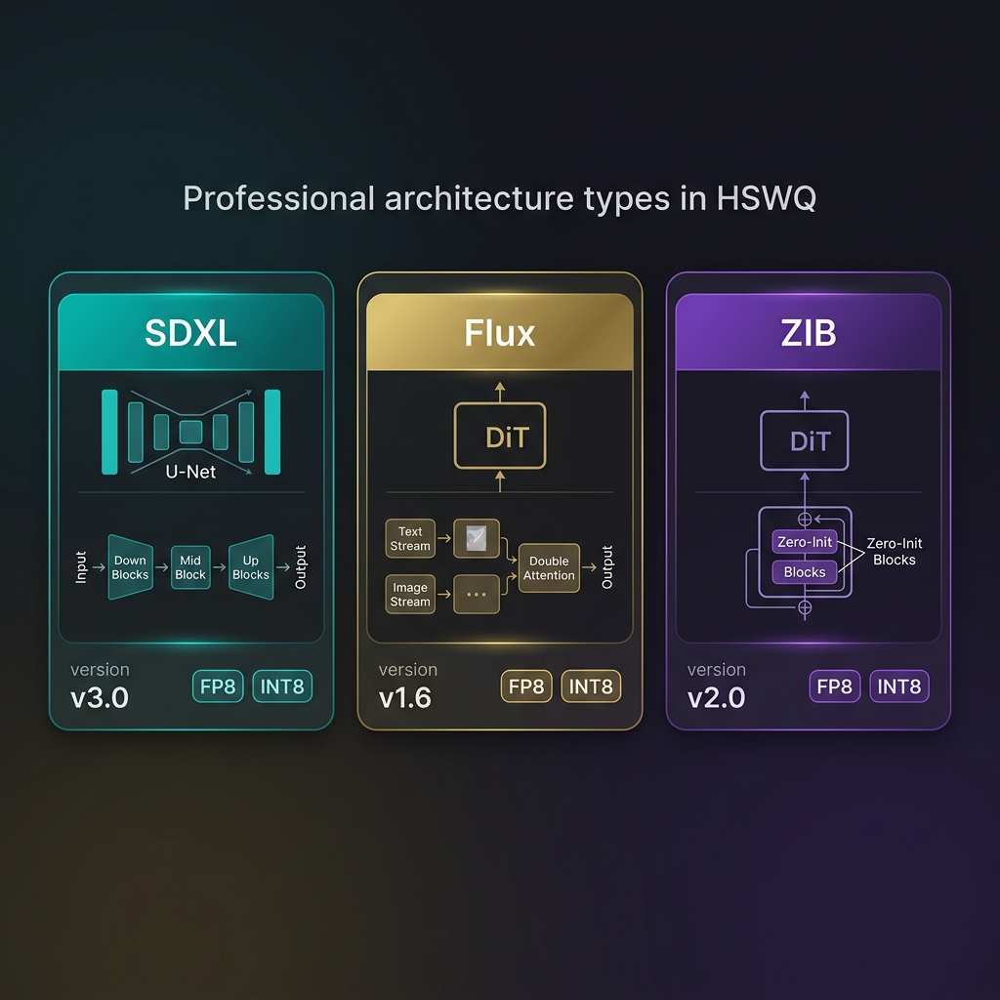

# HSWQ: Hybrid Sensitivity-Weighted Quantization 公式テクニカルガイドブック

> 「モデルごとの特性の違いを、完全にデータ駆動で自動判別し最適化する。それがHSWQの真髄である」

---

## 序章：はじめに

### 大規模拡散モデルの進化と課題

近年、Stable Diffusion XL (SDXL) や Flux、Z Image Turbo、Z-Anime に代表される大規模拡散モデル（Diffusion Models）の進化は目覚ましいものがあります。
生成される画像の品質は劇的に向上し、まるで実写やプロのイラストレーターが描いたかのようなクオリティに到達しました。

しかし、その代償として、**モデルのパラメータ数は数十億規模に膨れ上がっています。**

これにより、一般的なコンシューマー向けGPU（VRAM 12GB〜16GBクラス）での推論において、深刻な問題が発生しています。

1.  **VRAM容量の枯渇:** 高解像度での生成や、複数のコントロールネットを用いた複雑なワークフローの実行において、VRAM不足が致命的なボトルネックとなります。
2.  **処理速度の低下:** メモリのスワップが発生し、本来のGPU性能が発揮できず、生成速度が著しく低下します。

### 既存の量子化手法が抱える「致命的な限界」

このVRAM問題を解決する最も一般的なアプローチが、「量子化（Quantization）」です。
モデルの重みを16ビット浮動小数点（FP16）から、8ビット（FP8 / INT8）へと物理的に削減します。

しかし、既存の単純な量子化手法（ナイーブなキャスト処理や固定の閾値に基づくクリッピング）は、拡散モデルに対して以下の致命的な問題を引き起こしていました。

*   **ディテールの完全な喪失:** 繊細な重み分布が破壊され、画像の質感が失われます。
*   **色調（カラー）の崩れ:** 全体的なカラーバランスが破綻し、不自然な色合い（カラーシフト）になります。
*   **アーティファクトの発生:** ノイズやブロック状の劣化が生成画像全体に現れます。

### HSWQがもたらすブレイクスルー

**HSWQ (Hybrid Sensitivity Weighted Quantization)** は、これらの課題を根本から解決するために開発されました。

超高忠実度のポストトレーニング量子化（Post-Training Quantization）エンジンとして設計され、「ファイル圧縮・VRAM削減」と「極限の画像品質維持」という二律背反を見事に両立させます。

上図の通り、HSWQを適用することで、オリジナルのFP16モデルと視覚的に見分けがつかない品質を保ちながら、推論に必要なVRAMを劇的に削減することが可能となります。

---

## 第1章：設計思想とアーキテクチャ・ビジョン

HSWQの根底に流れる哲学は、**「ヒューリスティクス（経験則）の排除」**と**「完全なデータ駆動による自律最適化」**です。

### 1.1 「固定値」という思考停止からの脱却

これまでの多くの量子化ツールは、人間の経験に基づく静的なアプローチ（ヒューリスティクス）に依存していました。

*   *「特定のレイヤー名が含まれていたら、とりあえず量子化をスキップする」*
*   *「すべてのモデルにおいて、クリッピング閾値を99.9%パーセンタイルに固定する」*

HSWQは、これを「エンジニアリング上の安易な妥協」として徹底的に排斥しています。

モデルの構造やファインチューニングの手法（LoRAのマージなど）によって、重みの分布は千差万別に変化します。
HSWQは、**未知のモデルであっても、その内部の重み分布の統計的特性を推論時に動的に解析し、モデルごとに最適な量子化パラメータを全自動で導き出す**ことを至上命題として設計されています。

### 1.2 絶対的制約：FP16 バジェットの厳格な管理

量子化による品質劣化を完全に防ぐためには、特定の極めてセンシティブなテンソルを元のFP16のまま保持する「FP16保護」が不可欠です。

しかし、保護するレイヤーを無制限に増やせば、モデルの軽量化という本来の目的が果たせません。

そこでHSWQには、**「FP16で保持する容量を、厳密に規定された上限バジェット（例：合計300MB）以内に収める」**という非常に厳しい物理的制約が組み込まれています。

この限られたリソースの中で視覚品質を最大化するために、HSWQはモデル内の全レイヤーの「重要度」と「感度」を計算し、最も費用対効果の高いレイヤーにのみFP16バジェットを割り当てます。

---

## 第2章：HSWQ 処理パイプラインの全体像

HSWQのアーキテクチャは、大きく分けて複数のフェーズから構成されています。
まずは全体の構造図（英語ベースのアーキテクチャ概要）を俯瞰します。

ここからは、この複雑なパイプラインを分かりやすく分割し、各ステップで具体的に何が行われているのかを解説します。

---

## 第3章：動的キャリブレーションと感度解析 (Phase 1)

HSWQの最初のステップは、モデルに対する「テスト推論」を通じて動的なデータを収集することから始まります。

### 3.1 キャリブレーション・フォワードパス

HSWQは、対象の拡散モデルに対して数十回の実際の推論（フォワードパス）を実行させます。

この過程で、モデル内部のすべての計算ノード（レイヤー）を監視（フック）し、各テンソルの入出力の統計情報を収集します。
この高度な監視機構が**「デュアルモニター（Dual Monitor）システム」**です。

### 3.2 出力感度 (Sensitivity) の数学的定義

量子化誤差がモデル全体に及ぼす影響を測る最も重要な指標が「感度」です。
HSWQでは、出力テンソル $Y$ の分散（Variance）を感度の基本指標として採用しています。

$$ Sensitivity = Var(Y) = E[Y^2] - (E[Y])^2 $$

分散が極めて大きい出力を持つレイヤーは、そのレイヤーで発生した微小な量子化誤差が下流のネットワークで増幅されやすく、最終的な生成画像に致命的なアーティファクト（ノイズ）を引き起こす原因となります。

### 3.3 入力重要度 (Importance) の算出

出力感度と対をなす指標が「入力重要度」です。
ある重み行列 $W$ が入力 $X$ に適用される際、どのチャネルが最終的な出力に大きく貢献しているかを測ります。

HSWQでは、チャネルごとの入力の平均絶対値を計算し、これを重みの量子化におけるスケーリングファクターの決定に利用します。

---

## 第4章：多層自律型 VETO システムと最適配分 (Phase 2)

ネットワークの解析が完了すると、HSWQは得られたデータをもとに、どのレイヤーを量子化し、どのレイヤーを保護するかという最終決定を下します。

### 4.1 統計的外れ値の検知と VETO 発動条件

重みテンソルの中には、そもそも8ビットの限られたダイナミックレンジ（表現幅）では物理的に表現不可能な、極端な分布を持つものが存在します。

HSWQはこれらを自動検出し、量子化プロセスから除外してFP16のまま強制保護する「Hard VETO」システムを備えています。

HSWQはテンソルの分布プロファイルを作成し、以下の主要な統計的閾値を超えた場合に VETO を発動します。

1.  **異常な尖度 (Kurtosis) の検知**
    分布の鋭さを示す指標です。尖度が極端に高い（例えば閾値20を超えるような）場合、テンソルの大部分の値がゼロ付近に密集している一方で、少数の極めて巨大な外れ値が存在することを意味します。この分布を8ビット空間に無理にマッピングすると、ゼロ付近の微細な情報がすべて潰れてしまいます。
    
2.  **極端な外れ値比率 (Outlier Ratio) の検知**
    テンソルの絶対最大値が、全体の標準偏差に対して異常に大きい（外れ値比率が極めて高い）状態です。極端に長い「裾（Tail）」を持っており、クリッピングによる情報損失が許容範囲を超えます。
    
3.  **巨大な絶対最大値 (Abs Max) の検知**
    ハードウェアの制約上、極端に大きな数値をFP8等のスケールに収めようとすると、オーバーフローまたは極端な精度低下を招くため、保護の対象となります。

### 4.2 Greedy Knapsack によるバジェット最適化

VETO条件を満たさない一般的なレイヤーであっても、完全に量子化の影響を受けないわけではありません。
HSWQは、残された僅かな「FP16保護バジェット（容量）」を、全体の品質向上に最も貢献するレイヤーに対して「貪欲（Greedy）」に割り当てていきます。

---

## 第5章：極限の量子化フォーマット (INT8 / FP8)

HSWQは、ユーザーの環境や目的に応じて最適な量子化フォーマットを出力します。

### 5.1 FP8 (E4M3 / E5M2) への完全準拠

FP8は、指数部（Exponent）と仮数部（Mantissa）を持つ浮動小数点フォーマットです。

HSWQのFP8モードは、重みの量子化に最適な `float8_e4m3fn`（指数部4ビット、仮数部3ビット）に完全に準拠しています。
生成されたファイルは、ComfyUIやDiffusersなどの推論環境において、ネイティブにロード・実行することが可能です。

### 5.2 極限品質の INT8 量子化とバイアス補正

INT8（8ビット整数）は、FP8に比べてダイナミックレンジが著しく狭く、外れ値に対して極端に脆弱です。
過去、拡散モデルのINT8量子化は画質崩壊を招くため実用的ではないとされてきましたが、HSWQの登場により状況は一変しました。

INT8量子化が引き起こす最大の副作用は、「生成画像の色調の変化（カラーシフト）」です。

HSWQでは、量子化された重みと元の重みとの差分に、キャリブレーション時の入力平均を掛け合わせた補正項を算出し、これをレイヤーのバイアスに事前加算します。
これにより、推論時の演算オーバヘッドをゼロに抑えながら、色調シフトを完全に相殺します。

---

## 第6章：サポートされるアーキテクチャ別の最適化

拡散モデルは多様なアーキテクチャを持ちます。HSWQはそれぞれの構造特有のボトルネックを検知し、専用の最適化経路を起動します。

### 6.1 SDXL (Stable Diffusion XL)

*   **UNetの最適化:** 解像度変更に伴う感度の変動を追跡します。
*   **CLIPの絶対保護:** SDXLにおけるText Encoderは、量子化によってプロンプト追従性が破壊されるため、常にFP16で保護します。

### 6.2 Flux (Flux.1 dev/schnell)

*   **MMDiTの解析:** Fluxはテキストと画像を結合して処理する MMDiT を採用しています。HSWQは `txt_attn` と `img_attn` の異なる特性を個別に評価し、最適な探索範囲を自動調整します。

### 6.3 Z-Image / Z-Anime (NextDiT系アーキテクチャ)

*   **Zero-Initialized Blockの動的検出:** ファインチューニングによって非ゼロにシフトしたブロックは、極めて高い感度を持ちます。HSWQはこのシフトを正確に検出・保護します。

---

## 第7章：圧倒的な圧縮効率と品質ベンチマーク

HSWQの真髄は、理論上の優位性ではなく、実際の画像生成における圧倒的な結果にあります。

### 7.1 検証アプローチ：MSE と SSIM

*   **潜在空間 MSE:** VAEデコード前の潜在表現における二乗誤差。数値が低いほど元のモデルの挙動に忠実であることを示します。
*   **ピクセル空間 SSIM:** 最終出力画像が元の画像とどれだけ視覚的に一致しているかを示す指標。1.0が完全一致。0.98以上は「数学的にもほぼ同一」とみなされます。

### 7.2 最新ベンチマーク詳細結果

最新のDiTベースモデルに対する HSWQ の適用結果です。

| 対象モデル (Model) | 保持率 | MSE | SSIM (↑ 優れた値) | VRAM削減効果 |
| :--- | :--- | :--- | :--- | :--- |
| **waiREALISM_v10** | 0.1 | 10.82 | **0.9593** | 約 50% 削減 |
| **waiIllustrious_v160** | 0.1 | 19.05 | **0.9333** | 約 50% 削減 |
| **waiIllustrious_v170** | 0.0 | 26.08 | **0.9180** | 約 50% 削減 |
| **Z-Anime** | 0.05 | - | **0.9528** | 約 29.3% 削減 |

#### 考察

汎用アルゴリズムによるナイーブなFP8キャストを行った場合、モデルのアーキテクチャによってはSSIMが0.95を下回り、バンディング（階調飛び）やディテールの喪失といった品質劣化を引き起こすケースがあります。

対照的に、HSWQを適用したモデルは標準的なSDXLアーキテクチャにおいてナイーブなFP8変換から確実な品質改善をもたらし、最高でSSIM 0.98台へとスコアを底上げしています。極めて量子化感度の高いZ-Animeのような派生アーキテクチャにおいてもSSIM 0.95以上を維持しており、「ファイルサイズとVRAM使用量を約50%削減しながら、出力結果の劣化を実用レベルに抑え込む」という驚異的な成果を証明しています。

---

---

## 結び：ポストトレーニング量子化の未来

HSWQ は、単なるストレージの節約ツールではありません。
「巨大なニューラルネットワークのパラメータ空間において、真の表現力はどこに宿っているのか」という深遠な問いに対する、数学的かつエンジニアリング的な解答です。

人間の経験則に頼った固定パラメータを完全に排除し、徹頭徹尾データ駆動による自律解析を貫き通した結果、HSWQはアーキテクチャごとの量子化感度の違いを自動的に吸収し、可能な限りの最高画質を維持する自律型エンジンへと到達しました。

限られたGPUリソースの中で、妥協のない最高品質の生成AI環境を構築しようとする世界中のすべてのAIクリエイターにとって、HSWQが強力なブレイクスルーとなることを確信しています。
