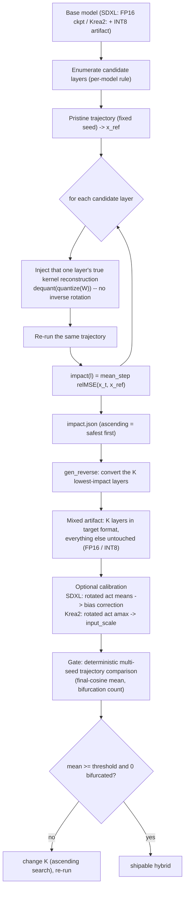

# Diag → Reverse Hybrid Quantization (SDXL / Krea2) — Technical Guide

**Document version:** 1.0  
**Date:** 2026-09-12  
**Targets:**
- **SDXL** — `sdxl/diag_impact_sdxl.py` (trajectory impact) → `sdxl/gen_reverse_int8_sdxl.py` (reverse hybrid) → `benchmark/sdxl_int8_traj_compare.py` (gate)
- **Krea2** — `Krea2/diag_impact.py` (trajectory impact) → `Krea2/gen_reverse_nvfp4.py` (reverse hybrid)

**Companion documents:**
[Trajectory-Sensitivity Impact Ranking — Technical Guide](diag_impact_trajectory_sensitivity_technical_guide.md) (the universal theory:
interaction terms, nonlinear amplification, marginal effects), [How to quantize SDXL](How%20to%20quantize%20SDXL.md) (CLI contract),
[How to quantize Krea2 ConvRot INT8](How%20to%20quantize%20Krea2.md).

This document describes the **diag → reverse** pipeline as it is currently implemented for SDXL and Krea2.
It is not the philosophy document: the mathematics of *why* a per-layer scalar is only the first-order term of the
sampling map, and *why* the reverse method measures in the low-error regime, is in the companion theory guide.
Here the subject is the **machinery**: what is measured, with which kernel, on which trajectory, with what ranking
contract, and how the hybrid is written.

---

## 1. Core idea (one paragraph)

Both pipelines answer the same operational question:

> *If exactly one layer were stored in the target format (`ConvRot INT8` for SDXL, `NVFP4` for Krea2),
> how far does the denoising result move?*

The answer is a **trajectory divergence**: the layer's weight is replaced by the **true reconstruction of the
production quantization kernel** (`dequant(quantize(W))`), a fixed-seed denoising trajectory is run, and the drift of
the final latent is recorded as a relative MSE. Layers are then converted **in ascending order of that divergence**
(hence *reverse*), so the layers that damage the trajectory least are converted first, and the layers that damage it
most stay at FP16/high precision. The ranking is only trustworthy in the **low-error regime** where the interaction
terms of the sampling map are negligible — which is exactly why the conversion is committed in ascending order and
why the boundary of usability (the largest `K` that still passes) is **measured, never extrapolated**.

| | SDXL | Krea2 |
|---|---|---|
| Target format | **ConvRot INT8** (`int8_tensorwise` + `convrot` stamp) | **NVFP4** (Kitchen `nvfp4`, `convrot: true`) |
| Source the hybrid is built from | the **FP16 checkpoint** itself | the **ConvRot INT8** artifact the hybrid is built from (dequantized; weights stay rotated) |
| Kept-at-high-precision set | complement of the K lowest-impact layers (FP16) | complement (INT8) |
| Trajectory engine | ComfyUI **production sampler** | the model's own fixed-step Euler loop |
| Status | production | **NVFP4 development cancelled** (machinery retained; see §4) |

---

## 2. Why trajectory impact replaces static saliency

Static per-layer measures (weight-histogram MSE, cosine similarity, SVD leverage) score a layer **in isolation**, in
weight space. The sampling map is not additive outside the infinitesimal limit: the joint effect of quantizing many
layers contains cross terms (which can be *negative* — error cancellation) and second-order amplification, so a
static scalar cannot rank layers for a real quantization budget. `diag_impact` sidesteps this by measuring the
**propagated** effect on the actual sampler trajectory, in the regime where a single-layer measurement is meaningful.

The practical consequence for this repository: **the candidate set and the ranking must be re-measured for every
checkpoint.** Rankings are not transferable, and a ranking measured on a different candidate set (for example, one
inherited from another artifact's layer list) does not describe the model at hand.

---

## 3. Architecture



### 3.1 Candidate enumeration

The candidate set is **the set of layers of the model the hybrid is built from** — nothing else is consulted, and no
other artifact is imported to define it.

| Model | Rule | Reference count |
|---|---|---|
| **SDXL** | `net.named_modules()` over the loaded `BaseModel`; keep a module iff it has a `weight`, `weight.ndim in (2, 4)`, `weight.shape[1] >= 4`, it is **not** a boundary layer, and `convrot_group_size_for_features(in_dim, 256)` is not `None` | **788** (794 2D/4D weights − 6 boundary) |
| **Krea2** | `named_modules()` with `weight` **and** `in_features` (Linear only; NVFP4 is 2D-only), and `in_features ∈ {1536, 6144, 16384}` (`_SAFE_IN_FEATURES`; other Linear, e.g. `txtfusion`, must never be converted) | checkpoint-specific |

**Boundary layers** are never candidates (they stay at their original precision in both models):

* SDXL: `input_blocks.0.0` (conv_in), `out.*` (conv_out), `time_embed.*`, `add_embedding.*`, `label_emb.*`.
* Krea2: structure blacklist (`first.`, `last.`, `mod.`, `norm`, `projector`, `tmlp`, `txtmlp`, `tproj`, `txtfusion`, `bias`).

### 3.2 The injection kernel (what "quantization error" means here)

The injected value is the **reconstruction produced by the production kernel** applied to that layer's weight —
`quantize → dequantize` round-trip, **without an inverse rotation**. This is the same object the shipped file
contains, so the measured error is the real on-device error, not a proxy.

**SDXL — `convrot_int8_quant_error(w, gs)`** (Linear 2D and Conv2d 4D):

```
Linear 2D : w_rot = w @ H^T ;  q, s = per-output-channel INT8 (rowwise  [out,1])
Conv2d 4D : w_rot = rotate in_channels(w) ; q, s = per-output-channel INT8 (channelwise [out,1,1,1])
injected  = q * s          # W_rot approximation; NO un-rotation
```

* `H` is the normalized regular Hadamard matrix of the layer's group size (`convrot_group_size_for_features(in_dim, 256)`:
  the largest power-of-4 divisor ≤ 256 that divides the input dimension).
* Because the shipped weights are stored **rotated** and the runtime rotates the activation online (`x_rot = x @ H`),
  injecting the rotated reconstruction is the correct single-layer model of the deployed computation.
* Layers with no eligible group size are not ConvRot-convertible and are skipped (`None`).

**Krea2 — `nvfp4_quant_error(w)`**: `TensorCoreNVFP4Layout.quantize(w)` → `dequantize(...)` (E2M1 × 16-element blocks
with a global scale). Exactly the kernel that produces the shipped NVFP4 artifact.

### 3.3 The trajectory

The impact is a property of *the trajectory*, so the trajectory definition is part of the contract. The two models
differ here, and this difference is deliberate:

| | **SDXL** | **Krea2** |
|---|---|---|
| Engine | `comfy.sample.sample(...)` — the **production sampler** | the DiT's own forward loop |
| Call | `sample(patcher, noise, steps, cfg=7.0, "dpmpp_2m", "karras", pos, neg, latent, denoise=1.0, callback=cb, seed=seed)` | `x = x + (t_{k+1} − t_k) · model(x, t_k, context)` |
| Schedule | the sampler's own (Karras) schedule | `t_steps = torch.linspace(1.0, 0.0, steps + 1)` |
| Context | CLIP positive/negative (`encode_from_tokens_scheduled`) | `randn(1, seq, txtlayers·txtdim)` |
| Noise | `comfy.sample.prepare_noise(latent, seed, None)` | `randn(1, channels, lat, lat)`, `Generator(seed)` |
| Latent | `[1, 4, H/8, W/8]` from `fix_empty_latent_channels` | `[1, channels, lat, lat]`, bf16 |
| Determinism | `torch.backends.cudnn.deterministic = True`, `benchmark = False` | same |

**SDXL is epsilon-prediction with the DDPM sigma schedule**: a hand-rolled `σ ∈ [0,1]` Euler loop borrowed from a
flow-matching model is *not* the production trajectory (`calculate_input` / `model_sampling.timestep` would be
bypassed). The implementation therefore calls the production sampler itself — the same engine, sampler, scheduler,
CFG and seed as the quality gate — so the ranking is measured on exactly the trajectory the gate evaluates.
Runs are deterministic for a fixed seed set **on a quiet GPU**; concurrent GPU processes can shift the numbers.

### 3.4 Ranking and the JSON contract

`impact(l) = mean over steps of relMSE(x_t(l), x_ref)`, with

```
relMSE(a, b) = ||a − b||_F² / ||b||_F²        # scale-invariant
```

The injection overwrites `module.weight.data` and is **restored in a `finally` block** after each measurement.

Output JSON:

```json
{ "x_ref_norm": <float>,        // ||x_ref||_F² (denominator reference)
  "steps": <int>, "seed": <int>,          // SDXL adds cfg / sampler / scheduler
  "base": "<absolute path of the measured checkpoint>",
  "impacts": { "<module.name>": <relative MSE>, ... }   // ascending = safest to convert
  // Krea2 adds: "act_amax": { "<module.name>": <max |rotated activation|> }   // for NVFP4 input_scale
}
```

Progress prints every `--progress-every` layers (`[25/788] ... [788/788]`). The first line can take minutes
(checkpoint load + conditioning + pristine trajectory).

### 3.5 Reverse conversion (`gen_reverse*`)

1. Rank `impacts` **ascending** (lowest impact first).
2. Convert the first **K** (skipping boundary/non-eligible layers — they do not consume a slot silently; the skip is
   counted and printed).
3. Write each converted layer in the target format; **every other tensor is copied unchanged**.

**SDXL → ConvRot INT8 on-disk format** (per converted layer):

```
<mod>.weight        int8   Linear [out, in] / Conv2d [out, in, kH, kW]   # stored ROTATED
<mod>.weight_scale  f32    Linear [out, 1] / Conv2d [out, 1, 1, 1]
<mod>.comfy_quant   u8     {"format":"int8_tensorwise","convrot":true,"convrot_groupsize":N}
```

ComfyUI mixed-precision ops arm the quantized path per layer from the `.comfy_quant` marker, so one file carries both
the FP16-kept and the ConvRot INT8 layers. `_quantization_metadata` lists the converted layers; an extra
`hswq_reverse_int8` metadata block records `{base, impact, k_requested, converted, groupsize, bias_correction,
bias_applied}`.

**Krea2 → NVFP4 on-disk format**: `.weight` U8 packed `[out, in/2]`, `.weight_scale` F8_E4M3, `.weight_scale_2` F32,
`.comfy_quant` = `{"format":"nvfp4","convrot":true,"convrot_groupsize":256}`, plus `.input_scale` F32 when calibration
amax is available. The source weights are dequantized INT8 (`q·s = W_rot`) and quantized to NVFP4 **without
re-rotation**.

**Size:** SDXL FP16 base 6.94 GB → all 788 eligible layers converted ≈ **4.39 GB** (≈ 3.2 MB per converted layer).

### 3.6 Calibration (optional, per-format)

**SDXL bias correction (`--bias_correction`)** — ConvRot quantizes the rotated weight and the runtime rotates the
activation online, so the systematic output shift of a converted layer is

```
delta[o] = sum_j (W_q_rot − W_rot)[o, j] · E[x_rot][j]
```

The converter collects `E[x_rot]` per converted layer with **forward pre-hooks** during
`--num_calib_samples` passes of the **production sampler** (default 32 × 25 steps, fixed seed), then adds `−delta` to
that layer's existing `.bias` (layers without a bias are skipped; size and format are unchanged). Verify with the
final log line `bias correction: applied=<N>, no_bias=<N>, no_act=<N>`: `applied > 0` and `no_act = 0` are expected —
a non-zero `no_act` means the calibration hooks never reached those layers and the file is *byte-equivalent to the
uncorrected one*. Bias correction is **model-dependent**; measure both variants with the gate before shipping.

**Krea2 `input_scale`** — collected during the pristine diag trajectory by a pre-hook that rotates the activation
(Hadamard 256) and keeps the running max, over the default seed **and** two extra seeds (1337, 7) for coverage; written
as `input_scale = amax / (F8_E4M3_MAX · F4_E2M1_MAX)`. `--skip-act-amax` omits both the hooks and the extra-seed runs
(block-scale-only mode; pair with `--no-input-scale`).

### 3.7 What stays at high precision

The protected set is the **complement** of the converted set, and is therefore *derived from the measurement*, never
from a keep-ratio percentage or a static budget ranking. Two structural exclusions are applied on top:

1. the **boundary** layers of §3.1 (never candidates), and
2. every tensor that is not a convertible matmul weight (norms, biases, embedders, …) — copied unchanged.

A candidate layer that is *not* among the K lowest-impact layers keeps its original precision; this is precisely the
"precision reserve" that makes a reverse hybrid score above a uniform pack at the same size.

### 3.8 The gate (how a `K` is accepted)

Acceptance is **not** decoded-image SSIM. It is the deterministic per-step latent-trajectory comparison
(`benchmark/sdxl_int8_traj_compare.py` for SDXL): both models are sampled from **identical noise per seed**, and the
per-step latent cosine is compared.

| Metric | Threshold | Meaning |
|---|---|---|
| `final-cos` | — | final-step latent cosine (FP16 vs candidate, same seed) |
| `max-step-drop` | **> 0.05** | that seed is **bifurcated** (a sudden trajectory jump — a different picture, not a degradation) |
| `same-image` | **≥ 0.98** | final cosine high enough to call it the same picture |
| **PASS** | **mean ≥ 0.95 AND 0/25 bifurcated** | production gate, 25 random seeds × 25 steps |

Fixed protocol: 25 random seeds (script default), `--steps 25`, 1024×1024, cfg 7.0, dpmpp_2m / karras.
`drifted` (final-cos < 0.98) is normal small divergence and is **not** a failure.

**Finding `K`:** search sequentially (±10, one process at a time). The answer is the **largest K that still passes**;
any K with a bifurcated seed is rejected even if the mean passes. If a size cap applies, remember that quality
degrades monotonically in K — the cap must be compatible with a passing K, or it is not achievable with this method
for that checkpoint.

---

## 4. Family status

| Family | Pipeline | Status |
|---|---|---|
| **SDXL ConvRot INT8 (reverse hybrid)** | `sdxl/diag_impact_sdxl.py` → `sdxl/gen_reverse_int8_sdxl.py` → `benchmark/sdxl_int8_traj_compare.py` | **Production** (25-seed gate; optional rotated-domain bias correction) |
| Krea2 ConvRot NVFP4 (reverse hybrid) | `Krea2/diag_impact.py` → `Krea2/gen_reverse_nvfp4.py` | **Cancelled** — 4-bit precision could not maintain structural fidelity on Krea2 SingleStreamDiT (trajectory cosine below 0.90). The diag→reverse machinery above documents the shared mechanism and remains the reference implementation of the method |
| Z Image Hybrid NVFP4 (reverse hybrid) | `Z_Image/diag_impact.py` → `Z_Image/gen_reverse_nvfp4.py` → `benchmark/zi_convrot_nvfp4_traj_compare.py` | Production (see the hybrid NVFP4 how-to; TC/W4A4 + `input_scale` calibration) |

---

## 5. Recommended parameters

| Parameter | SDXL | Krea2 |
|---|---|---|
| diag steps | `--steps 25` (mirrors the gate) | `--steps 12` (script default 4; the ZI/Krea2 recipe uses 12) |
| diag seed | `--seed 42` | `--seed 42` (+ extra amax seeds 1337, 7) |
| resolution / latent | 1024×1024 (`--width/--height`) | `--lat 128`, `--seq 256` |
| sampler / cfg | `dpmpp_2m` / `karras` / cfg 7.0 (script defaults, fixed) | own Euler, `linspace(1.0 → 0.0)` |
| `--groupsize` (ConvRot) | 256 preferred, largest power-of-4 divisor per layer | 256 (NVFP4) |
| bias correction | `--bias_correction --calib_file <prompts> --comfy_path <root>`, 32 × 25, seed 42 | n/a (uses `input_scale`) |
| gate | mean ≥ 0.95, 0/25 bifurcated | (cancelled) |
| `K` | search ±10, largest passing | search |

---

## 6. Benchmark (reference)

Measured 25-seed trajectory cosine means on one reference SDXL checkpoint (`waiIllustriousSDXL_v170`), fixed protocol
(25 seeds × 25 steps, 1024×1024, cfg 7.0, dpmpp_2m/karras):

| Artifact | mean final-cos | bifurcated |
|---|---|---|
| FP16 baseline (identity) | 1.000 | — |
| native ConvRot INT8 (all convertible layers INT8) | ≈ 0.938 | 0 |
| reverse hybrid, K = 620 (4.82 GB) | ≈ 0.9625 | 0/25 |

Numbers are **checkpoint-specific and not transferable**; a candidate must be re-measured after any change of
candidate set, `K`, calibration or bias-correction setting. Per-model tables: `benchmark result/benchmark_sdxl_int8.md`.

---

## 7. End-to-end pipeline (function map)

**SDXL**

| Stage | Functions |
|---|---|
| Load | `setup_comfy` / `import_comfy` → `comfy.sd.load_checkpoint_guess_config` (`load_sdxl`) |
| Candidates | loop over `net.named_modules()`; `is_boundary_layer`; `convrot_group_size_for_features` |
| Kernel | `build_hadamard`, `rotate_weight`, `rotate_weight_conv2d`, `quantize_int8_rowwise/channelwise`, `convrot_int8_quant_error` |
| Trajectory | `build_conditioning`, `make_latent`, `run_trajectory` (`comfy.sample.prepare_noise` / `comfy.sample.sample`) |
| Rank | `rel_mse`; per-layer inject/restore loop; JSON payload |
| Convert | `parse_args` → rank → `module_to_sd_key` → rotate + per-channel INT8 → `.comfy_quant` → `save_file` |
| Bias (opt.) | `collect_rotated_act_means` (pre-hooks; `rotate_activation_lastdim/nchw`), `compute_bias_delta_rotated` |
| Gate | `benchmark/sdxl_int8_traj_compare.py` |

**Krea2**

| Stage | Functions |
|---|---|
| Load | `_ensure_comfyui` / `_load_comfy_pkg` / `_install_comfy_stubs` → `detect_krea2_dit_config` → `load_krea2` |
| Candidates | `named_modules()` + `_SAFE_IN_FEATURES`; layer list from the INT8 artifact metadata |
| Kernel | `nvfp4_quant_error` (`TensorCoreNVFP4Layout`) |
| Trajectory | local `run()` closure (`t_steps = linspace(1,0,steps+1)`) |
| amax | `_build_hadamard`, `_rotated_amax`, `_mk_amax_hook` |
| Rank | `rel_mse`; `{"x_ref_norm", "impacts", "act_amax"}` |
| Convert | `gen_reverse_nvfp4.py`: dequant INT8 → `TensorCoreNVFP4Layout.quantize` → stamps + `.input_scale` |

---

## 8. Key formulas (symbol ↔ code)

| Symbol | Code / meaning |
|---|---|
| `relMSE(a,b)` | `rel_mse` — `‖a−b‖²_F / ‖b‖²_F` |
| `H` | `build_hadamard(size)` — normalized regular Hadamard (power-of-4), `kron(h4)` / `√size` |
| `W_rot = W·Hᵀ` | `rotate_weight` (2D) / `rotate_weight_conv2d` (4D, in-channel) |
| `q, s` | `quantize_int8_rowwise` (`[out,1]`) / `quantize_int8_channelwise` (`[out,1,1,1]`) |
| `What = q·s` | `convrot_int8_quant_error` (SDXL) / `nvfp4_quant_error` (Krea2) |
| `impact(l)` | mean over steps of `rel_mse(x_t, x_ref)` |
| `E[x_rot]` | `collect_rotated_act_means` — forward pre-hook, rotated activation mean |
| `δb` | `compute_bias_delta_rotated` — `err_rot @ μ_rot`; applied as `−δb` on `.bias` |
| `input_scale` | `amax / (F8_E4M3_MAX · F4_E2M1_MAX)` |
| gate | `benchmark/sdxl_int8_traj_compare.py` — per-step cosine, bifurcation if `max-step-drop > 0.05` |

---

## 9. Forbidden mistakes

| Mistake | Why it is wrong |
|---|---|
| Deriving the candidate set from **another artifact** (e.g. an older pack's layer list) | The candidates are the layers of the model the hybrid is built from. Importing another artifact's list silently excludes layers and makes the ranking describe a different model — and it is an unauthorized dependency |
| Using a hand-rolled `σ ∈ [0,1]` Euler loop for an epsilon-prediction model (SDXL) | That is a flow-matching schedule; it bypasses `model_sampling` / `calculate_input` and does not match the production trajectory. Use the production sampler |
| Mapping module names as `model.diffusion_model.*` when the model exposes `diffusion_model.*` | Hooks silently never fire (calibration collects nothing → the artifact is byte-equivalent to the uncorrected one). Always verify `len(means)` / `no_act = 0` |
| Un-rotating the weight before injection (or after) | The shipped artifact stores **rotated** weights and the runtime rotates the activation online; an inverse rotation models a different layer |
| Decoding images and reporting SSIM as the gate | The gate is the latent trajectory comparison; SSIM hides bifurcation |
| Reporting a size/quality number that was not measured, or for a different candidate set | Rankings, sizes and scores are checkpoint- and candidate-set-specific |
| Treating a single measurement as the answer at small seed counts | 5-seed noise is large; always run the full 25-seed set on a quiet GPU |
| Extrapolating the usable `K` across checkpoints | The cliff is a property of the checkpoint; it is found by **measurement** |

---

## 10. Related documents

- [Trajectory-Sensitivity Impact Ranking — Technical Guide](diag_impact_trajectory_sensitivity_technical_guide.md) — the universal theory
- [How to quantize SDXL](How%20to%20quantize%20SDXL.md) — SDXL reverse hybrid CLI contract
- [How to quantize Krea2 ConvRot INT8](How%20to%20quantize%20Krea2.md) — Krea2 ConvRot INT8
- [How to quantize Z Image - Hybrid NVFP4](How%20to%20quantize%20Z%20Image%20-%20Hybrid%20NVFP4.md) — the Z Image reverse hybrid (TC/W4A4, `input_scale`)
- Scripts: `sdxl/diag_impact_sdxl.py`, `sdxl/gen_reverse_int8_sdxl.py`, `Krea2/diag_impact.py`, `Krea2/gen_reverse_nvfp4.py`
- Gate: `benchmark/sdxl_int8_traj_compare.py`, `benchmark/zi_convrot_nvfp4_traj_compare.py`
- Benchmarks: `benchmark result/benchmark_sdxl_int8.md`
