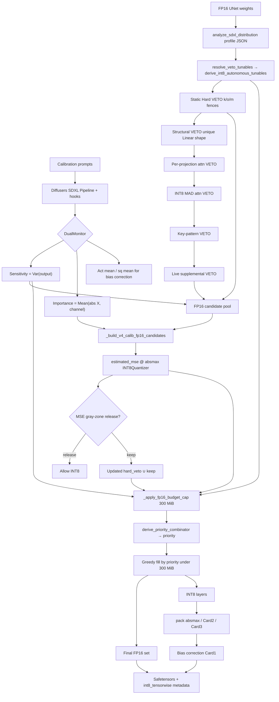

# HSWQ INT8 (SDXL V3.0) — Technical Overview

**Document version:** 1.0  
**Date:** 2026-07-13  
**Target:** Stable Diffusion XL UNet — `quantize_sdxl_hswq_v3.0.py`  
**Companion (FP8 families):** [HSWQ: Hybrid Sensitivity Weighted Quantization — Technical Overview](HSWQ_%20Hybrid%20Sensitivity%20Weighted%20Quantization.md)

This document is the **INT8-only** counterpart to the FP8 technical overview. It enumerates every decision path in the V3.0 pipeline at the same level of detail: philosophy, mermaid architecture, Hard VETO stack, DualMonitor, V4 MSE ranking, 300 MiB FP16 budget, gray-zone release, pack Cards, bias correction, ComfyUI metadata, formulas, and CLI contracts. FP8 scripts and FP8 `derive_veto_tunables` are **not** modified by this path.

---

## 1. Philosophy (INT8 vs FP8)

Naive INT8 cast applies one global rounding rule to every weight. Diffusion UNets still fail under that policy because:

- Some layers have **extreme weight-space tails** (high `outlier_ratio`, `kurtosis`, `abs_max`). They cannot absorb uniform ±127 quantization without destroying activations.
- A different set of layers are **structurally critical** (output variance dominates the UNet). Even small rounding error collapses global SSIM.
- The remaining well-behaved layers can be packed at the **natural INT8 point** (absmax) if the **FP16 protection set** is chosen correctly — not by inventing a keep-ratio percentage.

HSWQ INT8 V3.0 is still a **three-surface decision system**, but the roles of amax search and FP16 selection are **split** relative to FP8:

| Axis | FP8 (overview §1) | INT8 V3.0 |
|---|---|---|
| **Distribution profile** | Hard VETO + per-layer `search_low` for amax | Hard VETO + severity + autonomous tunables; **`search_low = 1.0` (absmax pack)** |
| **Sensitivity (DualMonitor)** | Top-`keep_ratio` → FP16 | **Candidate signal only**; never invents keep_ratio; final set from **300 MiB budget ranking** |
| **Importance / V4** | Drives **optimal amax** via weighted histogram MSE | Measures **`estimated_mse` at absmax** to **rank FP16 keep**; does **not** choose pack amax |

**Non-negotiable INT8 contracts** (see also [HSWQ Philosophy and Principles](HSWQ_Philosophy_and_Principles.md)):

1. **Pack amax = absmax** (`search_low = 1.0`). Deep clipping on a uniform INT8 grid drops SSIM. Absmax pack is **not** “skipping HSWQ.”
2. **V4 must still run** at that pack point. Its job is FP16 protection candidate ranking via `estimated_mse`. Saying “absmax ⇒ V4 unnecessary” is false.
3. **`keep_ratio` is r0 (exactly 0).** Non-zero keep-ratio is fatal. DualMonitor must not be wired as a keep-ratio engine.
4. **FP16 overhead hard ceiling = exactly +300 MiB** vs all-INT8 (`FP16_BUDGET_MB_HARD`). Auto analysis may only optimize **inside** that frame.
5. **FP8 path frozen.** INT8 uses `derive_veto_tunables_int8` / `derive_int8_autonomous_tunables`. Do not rewrite FP8 fences with 127/448 collapse.

The deployable output is ComfyUI **`int8_tensorwise`**: `torch.int8` weights + `float32` `weight_scale`, with `_quantization_metadata` / per-layer `comfy_quant` JSON. Critical layers remain FP16 in the same Safetensors.

---

## 2. Family Status (INT8)

| Family | Script | Histogram | Strategy | Notes |
|---|---|---|---|---|
| **SDXL INT8 V3.0** | `quantize_sdxl_hswq_v3.0.py` | `HSWQWeightedHistogramOptimizerV4` + injected `INT8Quantizer` | Autonomous INT8 engine: profile Hard VETO + structural / key-pattern / per-projection / MAD attn VETO + DualMonitor + V4 MSE @ absmax + gray-zone release + **300 MiB** priority fill | UNet only. Profile from `analyze/analyze_sdxl_distribution.py` (auto-generated if missing). |
| SDXL FP8 | `quantize_sdxl_hswq_v1.3.py` | Fast histogram | DualMonitor → keep_ratio FP16 + channel-importance amax | Separate document / How-to. |
| Z Image FP8 | `quantize_zib_hswq_v2.0.py` | V4 SVD×RMS | Pure Autonomous Engine V2.0 (amax search) | [FP8 technical overview](HSWQ_%20Hybrid%20Sensitivity%20Weighted%20Quantization.md) |

INT8 V3.0 **reuses** the V4 histogram MSE core unchanged; only the **quantizer grid** and the **consumer of `estimated_mse`** change.

---

## 3. Architecture



### 3.1 DualMonitor (calibration time)

Class: `DualMonitor` in `quantize_sdxl_hswq_v3.0.py`.

During Diffusers SDXL latent inference, hooks accumulate:

| Signal | Definition | Downstream use |
|---|---|---|
| **Sensitivity** | Output variance \(Var(y)\) with finite/clamp guards | FP16 budget axis `sens`; pool membership |
| **Importance** | Per-input-channel \(\mathrm{mean}(|x|)\) | V4 histogram weights when present (`use_svd_leverage=False`) |
| **Act moments** | Signed channel mean / squared mean | Bias correction \(\delta b \approx (W_q-W)\,\mathbb{E}[x]\) |

**Contract:** recommended **32 calibration samples × 25 inference steps** (same numbers as FP8 How-to). DualMonitor **never** invents `keep_ratio`. It feeds the **final** FP16 protection pass only.

Full DualMonitor mathematics: [Dual Monitor System — Technical Guide](Dual_Monitor_System_Technical_Guide.md).

### 3.2 Distribution profile (`analyze_sdxl_distribution.py`)

Per-layer weight-space stats (UNet keys):

| Field | Formula / meaning |
|---|---|
| `kurtosis` | Excess kurtosis of weights |
| `outlier_ratio` | \(\mathrm{abs\_max} / \mathrm{std}\) |
| `abs_max` | \(\max |w|\) |
| `mad_outlier_pct` | Fraction of weights with MAD \(z > 3\) |
| `profile_score` | Composite rank used inside severity |

Layer class labels for gates (`classify_layer`): `qkv`, `toout`, `ff2`, `ff0`, `other` — key-pattern classification only.

`main` always runs (or loads) a profile JSON (`{stem}_distribution_profile.json`) before strategy derivation. Comfy-style keys are remapped to Diffusers module names via `_remap_profile_to_diffusers`.

### 3.3 Tunables resolution

```
resolve_veto_tunables(norm_profile, dual_monitors?, fp16_budget_mb=300)
  → derive_int8_autonomous_tunables(...)
  → SdxlVetoTunables
```

- `fp16_budget_mb` must be **exactly** `FP16_BUDGET_MB_HARD` (300); any other value raises.
- All fences / gray-zone / MSE release / MAD / `alpha_auto` / score weights come from **this checkpoint's** profile (+ optional DualMonitor sens map). No frozen recipe constants like FP8's historical `k>20`, `o>40`, `m>20` as hard-coded INT8 defaults.

`SdxlVetoTunables` includes (non-exhaustive): `extreme_kurtosis`, `extreme_outlier`, `huge_magnitude`, attn absmax/outlier gates, `attn_mad_*`, `mse_release_*`, `mse_p75_multiplier`, `drift_*`, `search_low_*` (= 1.0), `alpha_auto`, `fp16_budget_mb`, `quant_format="int8_tensorwise"`.

### 3.4 Static Hard VETO

From `derive_hswq_strategy_int8`, for each profiled layer:

```
HardVETO ⇔ (o > extreme_outlier) ∨ (k > extreme_kurtosis) ∨ (m > huge_magnitude)
```

Fences from `derive_veto_tunables_int8`:

- Start from shared `derive_veto_tunables` Tukey machinery.
- Raise kurtosis / magnitude fences with **P99 of this checkpoint**:  
  `extreme_kurtosis = max(Tukey, k_P99)`, `huge_magnitude = max(Tukey, m_P99)`  
  (needed because SDXL UNet kurtosis mass is often ≤ 0; Tukey alone would over-VETO).
- Per-class Tukey gates for attn qkv / to_out / ff2 absmax and outlier.
- **No** multiply-by-127/448 collapse of weight-space stats into INT8 grid units (`_derive_engine_tunables_int8` forces pack `search_low_* = 1.0`).

### 3.5 Autonomous VETO stack (after static Hard VETO)

Applied in `main` after strategy + DualMonitor (order matches code):

| Stage | Function | Rule |
|---|---|---|
| **Structural** | `_compute_structural_veto` | `Linear` weight shapes with uniqueness `1` (profile `shape_uniqueness` or live shape count) → FP16 candidate |
| **Per-projection attn** | `_compute_sdxl_per_projection_attn_veto` | Split fused / sibling qkv projections; VETO if any chunk exceeds attn absmax/outlier tunables |
| **MAD attn** | `_compute_sdxl_int8_mad_attn_veto` | Profile MAD% floors (Tukey / Q3) — INT8 script only; FP8 MAD path untouched |
| **Key-pattern** | `_compute_sdxl_keypattern_veto` | Embedding prefixes, boundary suffixes, selective ff2 (not full-class auto — that inflates SDXL size) |
| **Supplemental live** | `_autonomous_supplemental_veto` | Live stats / profile drift vs stored profile |

Drift (same spirit as FP8 V2.0):

```
drift = max( |k_live−k_prof|/max(k_prof,1),
             |o_live−o_prof|/max(o_prof,1),
             |m_live−m_prof|/max(m_prof,1e-6) )
```

### 3.6 Pack amax vs V4 ranking (critical split)

**Pack (Card 3 OFF, default):**

```
search_low = 1.0
amax_pack = absmax(W)     # or mid/half for Card 2 asymmetric
scale     = amax_pack / 127
q         = round(W / scale).clamp(±127)   # symmetric path
```

This is **not** an HSWQ amax search. Deep `search_low < 1` clipping on INT8 was measured to destroy SSIM.

**V4 ranking:**

```
estimated_mse = V4.compute_optimal_amax_with_stats_int8_range(
    W, importance=DualMonitor_or_None,
    use_svd_leverage=(importance is None),
    search_range=(1.0, 1.0),   # evaluate AT absmax only
    quantizer=INT8Quantizer,
)["estimated_mse"]
```

`INT8Quantizer` simulates the physical grid:

```
scale = amax / 127
q(x)  = round(x / scale).clamp(-127, 127) * scale
```

Histogram MSE objective (same as FP8 overview §3.8, different grid):

```
J(Δ) = Σ_i H(i) · ( q(x_i, Δ) − x_i )²
```

With `search_range=(1,1)`, Δ is fixed at absmax; only **J** is used as a damage score for FP16 priority.

**SVD on/off** (`_measure_v4_mse_absmax_int8`):

| DualMonitor Importance | `use_svd_leverage` | Importance map |
|---|---|---|
| Present | `False` | Channel / broadcast Importance (SDXL quality path) |
| Missing | `True` | V4 hybrid SVD×RMS (`alpha_auto`, `beta=1−alpha`) — **never skip V4** |

`alpha_auto` from `derive_int8_autonomous_tunables`:

```
if k_P50 > 0 and k_P99 > 0:
    alpha_auto = clip(k_P50 / k_P99, 0, 0.99)
else:
    alpha_auto = 0.0    # typical SDXL: non-positive median kurtosis → DualMonitor / RMS path
beta = 1 - alpha_auto
```

Hybrid leverage (when SVD is on) — full derivation in [HSWQ V4 SVD-RMS — Technical Guide](HSWQ_V4_Hybrid_SVD_RMS_Technical_Guide.md):

```
L(i,j) = (U_i · σ)² · (V_j)²
Score  = α · L̂ + β · |W|²̂
```

`_build_v4_calib_fp16_candidates` scores **all** measurable Linear/Conv targets. It does **not** truncate by keep_ratio; only `_apply_fp16_budget_cap` truncates.

### 3.7 MSE gray-zone VETO reassessment

1. `_collect_mse_release_candidates`: Hard VETO layers that are **outlier-dominated** under `mse_release_o_min` / `mse_release_k_max` / `mse_release_m_max`, non-structural, `drift < drift_veto_thresh`, not key-pattern locked.
2. `_mse_grayzone_veto_reassessment`: sample safe non-keep feed-forward layers (up to 30), take `P75(estimated_mse)`, threshold = `mse_p75_multiplier × P75`.
3. Trial V4 MSE on each candidate; **release** (remove from hard_veto / allow INT8) if `estimated_mse ≤ threshold`.

Pack amax remains absmax. Gray-zone only changes **FP16 membership**, not scale search.

### 3.8 FP16 budget cap (300 MiB) — unified protection

Constant:

```
FP16_BUDGET_MB_HARD = 300.0
extra_bytes(W) = numel(W)    # +1 byte/elem vs INT8 (FP16 2B − INT8 1B)
```

`_apply_fp16_budget_cap`:

1. **Pool** = `keep ∪ hard_veto ∪ {severity ≥ 1} ∪ {DualMonitor sens > 0}` (layers with weights).
2. For each pool layer measure:
   - `dm_sens` — DualMonitor sensitivity  
   - `severity` — `int8_fp16_budget_analyze_severity` (continuous; Hard VETO adds **+1.0**, must **not** flatten to a constant)  
   - `v4_mse` — cached or fresh `_measure_v4_mse_absmax_int8`
3. `derive_priority_combinator` from measured triples + Hard VETO mask:
   - Dispersion seeds: \(d = \mathrm{IQR}/\mathrm{P50}\) per axis  
   - VETO alignment: Cohen-style signed effect on \(\log(1+|v|)\) → `align_* = max(d, 0)`  
   - Weights: \(w \propto d \cdot \mathrm{align}\) (form `weighted_geometric_veto_aligned`), else dispersion-only, else `uniform`
4. Priority:

```
P = exp( w_s · log1p(sens / s_ref)
       + w_v · log1p(sev  / v_ref)
       + w_m · log1p(mse  / m_ref) )
```

   (`uniform` → `P = 1`). **Fixed product formulas are forbidden.**

5. Sort by `(-P, extra_bytes)`; greedy fill while `used + extra ≤ 300 MiB`.
6. Analyze Hard VETO layers that lose the race are **demoted** to INT8; DualMonitor winners that fit stay in the FP16 set.

**Severity** (`int8_fp16_budget_analyze_severity`):

```
sev = o/e_o + k/e_k + m/h_m
    + (attn-class gate terms if to_q/k/v or to_out.0)
    + mad/mad_floor (if enabled)
    + profile_score
    + 1.0 if is_hard_veto
```

Hard VETO and budget priority are **one integrated protection**, not two independent pipelines.

### 3.9 Bias correction (Card 1)

After INT8 pack, cancel systematic output bias:

```
δb ≈ (W_q − W) @ μ_x     # Linear (O,I)
δb[o] ≈ Σ_{i,kh,kw} err[o,i,…] · μ[i]   # Conv2d
```

`μ_x` from DualMonitor signed channel means. Default: **all INT8 layers** (anchor commit `d1290df`, measured SSIM ~0.9753). Optional `--bias_correction_top_ratio < 1` (Approach A) was measured to **raise MSE quality but drop SSIM** (e.g. 0.9753 → 0.9678 at 0.5) — not the default.

No format change, no extra FP16 keep, no custom loader.

### 3.10 Pack Cards and ComfyUI format

| Mode | Flag | Pack | Scale shape | Notes |
|---|---|---|---|---|
| **Symmetric tensorwise (default)** | (none) | `pack_int8_tensorwise(..., asymmetric=False)` | scalar `weight_scale` | absmax / 127 |
| **Card 2 asymmetric** | `--asymmetric_int8` | mid + half-range / 127 | scalar | mid absorbed by BC; mutex with Card 3 |
| **Card 3 per-channel** | `--per_channel_int8` | `pack_int8_channelwise` | `(O,1)` Linear / `(O,1,1,1)` Conv | Format tag **still** `int8_tensorwise`; mutex with Card 2 |

Metadata (QUANT_ALGOS / QUANTIZATION.md style):

```json
{
  "format_version": "1.0",
  "layers": {
    "<module.name>": { "format": "int8_tensorwise" }
  }
}
```

Per-layer `*.comfy_quant` JSON bytes accompany weights. Loader: ComfyUI with `comfy_kitchen` + `TensorWiseINT8Layout` (`quantize_input: false`).

---

## 4. Modes / output

| Mode | Output | Loader | Status |
|---|---|---|---|
| **INT8 V3.0 production** | INT8 + `weight_scale` + FP16 mixed under 300 MiB | Standard ComfyUI INT8 (`int8_tensorwise`) | **Production** |
| Card 2 / Card 3 variants | Same format tag; scale layout differs | Same kitchen dequant | Optional; default OFF |

There is no separate “scaled INT8 V2 loader” branch analogous to FP8 V2 High-Performance Scaled.

---

## 5. Recommended Parameters

| Parameter | INT8 SDXL V3.0 |
|---|---|
| Script | `quantize_sdxl_hswq_v3.0.py` |
| `samples` (`--num_calib_samples`) | **32** |
| `steps` (`--num_inference_steps`) | **25** |
| `keep_ratio` | **0 (fixed)** — non-zero is fatal |
| `fp16_budget_mb` | **300 (fixed)** — other values are fatal |
| Histogram | V4 + `INT8Quantizer` @ absmax for FP16 ranking |
| Pack amax | absmax (`search_low=1.0`) |
| Profile | **mandatory** (auto-generated) |
| Bias correction | ON (all INT8 layers by default) |
| `--asymmetric_int8` / `--per_channel_int8` | OFF unless experimenting (mutex) |

Example:

```text
python quantize_sdxl_hswq_v3.0.py ^
  --input MODEL.safetensors ^
  --output MODEL_HSWQ_INT8.safetensors ^
  --calib_file prompts.txt ^
  --num_calib_samples 32 ^
  --num_inference_steps 25 ^
  --keep_ratio 0
```

---

## 6. Benchmark Results (reference)

Target quality band (README): **SSIM 0.94–0.98** vs FP16, with ComfyUI INT8 loader compatibility.

Detailed per-model tables: [`test/benchmark_sdxl_int8.md`](../test/benchmark_sdxl_int8.md) (from `test/score_sdxl_int8.txt`).

| Variant | SSIM (typical) | Size vs FP16 | Compatibility |
|---|---|---|---|
| Original FP16 | 1.0000 | 100% | High |
| Naive INT8 | lower / unstable | ~50% | High |
| **HSWQ INT8 V3.0** | **0.94–0.98** | ~60–70% (FP16 mixed ≤ +300 MiB) | **High — ComfyUI int8_tensorwise** |

FP8 SDXL / Z Image benches remain in [`test/benchmark_test.md`](../test/benchmark_test.md) and [`test/benchmark_zit.md`](../test/benchmark_zit.md).

---

## 7. End-to-end pipeline (function map)

| Stage | Functions / modules |
|---|---|
| Profile | `analyze/analyze_sdxl_distribution.py` via subprocess; `derive_veto_tunables_int8`, `derive_int8_autonomous_tunables` |
| Load UNet | `load_unet_from_safetensors` |
| Tunables | `resolve_veto_tunables` → `SdxlVetoTunables` |
| Strategy | `derive_hswq_strategy_int8` (static Hard VETO + `alpha_auto`) |
| VETO stack | `_compute_structural_veto`, `_compute_sdxl_per_projection_attn_veto`, `_compute_sdxl_int8_mad_attn_veto`, `_compute_sdxl_keypattern_veto`, `_autonomous_supplemental_veto` |
| Calibration | `DualMonitor` hooks; 32×25 Diffusers loop |
| V4 score | `_build_v4_calib_fp16_candidates`, `_measure_v4_mse_absmax_int8` |
| Gray-zone | `_collect_mse_release_candidates`, `_mse_grayzone_veto_reassessment` |
| Budget | `_apply_fp16_budget_cap` + `int8_fp16_budget_*` / `derive_priority_combinator` |
| Pack / BC | `pack_int8_tensorwise` / `pack_int8_channelwise`, `compute_int8_bias_delta` |
| Save | `save_file` + `_quantization_metadata` / `_emit_int8_quant_meta` |

---

## 8. Key formulas (symbol ↔ code)

| Symbol | Code / meaning |
|---|---|
| \(q,\; s=\mathrm{amax}/127\) | `INT8Quantizer.quantize_dequantize` |
| \(\mathrm{outlier\_ratio}\) | `abs_max / std` in `_layer_stats` |
| \(\mathrm{extra}=N\) | `_fp16_extra_bytes_vs_int8` |
| \(\mathrm{sev}\) | `int8_fp16_budget_analyze_severity` |
| \(w_s,w_v,w_m\) | `derive_priority_combinator` |
| \(P=\exp(\sum w\log(1+x/\mathrm{ref}))\) | `int8_fp16_budget_priority` |
| \(\alpha_{\mathrm{auto}}=k_{50}/k_{99}\) | `derive_int8_autonomous_tunables` |
| \(I=\alpha L+\beta\|W\|^2\) | `compute_hybrid_leverage_scores` (SVD path) |
| \(\delta b\approx(W_q-W)\mu\) | `compute_int8_bias_delta` |
| Release if \(\mathrm{MSE}\le P75_{\mathrm{safe}}\times\mathrm{mse\_p75\_multiplier}\) | `_mse_grayzone_veto_reassessment` |

---

## 9. Forbidden mistakes (INT8-specific)

| Mistake | Why it is wrong |
|---|---|
| “Absmax ⇒ skip V4 histogram” | V4 ranks FP16 keep; pack and ranking are separate jobs |
| Non-zero `keep_ratio` / blaming “dynamic keep” for r0 failures | r0 is the contract; DualMonitor ≠ keep_ratio |
| Raising or inventing FP16 budget ≠ 300 MiB | Owner hard ceiling; auto settings only fill inside |
| Flattening Hard VETO severity to a constant | Collapses combinator `w_sev`; thinking-stop ranking |
| Collapsing fences by 127/448 into grid units | Weight-space fences must stay weight-space |
| Editing FP8 `derive_veto_tunables` for INT8 | Branch must stay INT8-only |
| Enabling Card 2 and Card 3 together | Mutex; script FATAL |

---

## 10. Related Documents

- [HSWQ: Hybrid Sensitivity Weighted Quantization — Technical Overview](HSWQ_%20Hybrid%20Sensitivity%20Weighted%20Quantization.md) — FP8 families (SDXL Fast / Z Image V2.0)
- [HSWQ Philosophy and Principles](HSWQ_Philosophy_and_Principles.md) — INT8 absmax / V4 / 300 MiB / r0 binding record
- [HSWQ V4 SVD-RMS — Technical Guide](HSWQ_V4_Hybrid_SVD_RMS_Technical_Guide.md)
- [Dual Monitor System — Technical Guide](Dual_Monitor_System_Technical_Guide.md)
- [Weighted Histogram MSE — Technical Guide](Weighted_Histogram_MSE_Technical_Guide.md)
- [How to quantize SDXL](How%20to%20quantize%20SDXL.md) — FP8 How-to (keep_ratio path); INT8 CLI contract is this document + README
- **Quantizer script:** `quantize_sdxl_hswq_v3.0.py`
- **Analyze:** `analyze/analyze_sdxl_distribution.py`
- **Histogram:** `histogram/weighted_histogram_mse_v4.py` (`INT8Quantizer`, `compute_optimal_amax_with_stats_int8_range`)
- **Benchmarks:** [`test/benchmark_sdxl_int8.md`](../test/benchmark_sdxl_int8.md)
- **HF collection:** [Hybrid-Sensitivity-Weighted-Quantization-SDXL-INT8](https://huggingface.co/ussoewwin/Hybrid-Sensitivity-Weighted-Quantization-SDXL-INT8)
