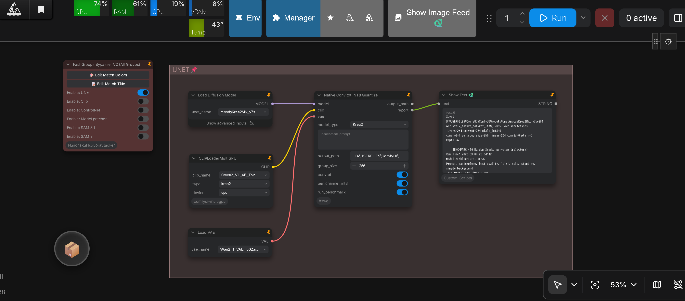

# How to quantize Krea2 ConvRot INT8

Quantize **Krea2 DiT** (SingleStreamDiT) diffusion models to **ConvRot INT8** using the full HSWQ pipeline (`Krea2/hswq_convrot_int8_krea2_v1.5.py`).

Krea2 DiT models have structure-sensitive layers (patch input embeddings, output projection heads, cross-attention text projectors, modulation blocks, and normalization layers) that cannot be naively quantized to INT8 without catastrophic numerical scale collapse (which leads to pitch black output images upon VAE decoding). HSWQ prevents this by enforcing a dedicated **structure blacklist**, preserving high-precision float32 layers, and applying data-driven **4-axis composite ranking** (DualMonitor $E[x^2]$ × HistCosine V5 × NVFP4 measured error × SVD Leverage) to protect critical weights in original BF16/FP32 precision.

The dedicated VRAM for calibration should be **16GB or more** (runs CLIP context extraction and CUDA DiT forward sweeps).

---

## Clone the repository

```bash
git clone https://github.com/ussoewwin/Hybrid-Sensitivity-Weighted-Quantization.git
cd Hybrid-Sensitivity-Weighted-Quantization
```

## Install PyTorch (CUDA)

First, install PyTorch (CUDA).  
In a Windows environment on a local PC, it is advisable to set up a venv or embedded Python environment.

```bash
pip install torch torchvision --index-url https://download.pytorch.org/whl/cu130
```

## Install other libraries

```bash
pip install -r requirements.txt
pip install -U comfy_kitchen
pip install diffusers accelerate scikit-image
```

- `comfy_kitchen` provides the quantization kernels, layout operations, and online Hadamard activation rotation.
- `scikit-image` is required for MSE / SSIM pixel-space evaluation.
- `diffusers` and `accelerate` provide tensor management utilities.

---

## Prerequisites for Calibration

HSWQ Krea2 INT8 calibration uses real text conditioning to drive the DiT during DualMonitor forward sweeps:

1. **Calibration Prompts:** A text file containing prompts (one per line), e.g., `calibration_prompts_128.txt`.
2. **Krea2 Text Encoder (CLIP):** The Qwen3-VL-4B checkpoint used by ComfyUI `CLIPType.KREA2` (e.g. `qwen3_4b_vl.safetensors` or `qwen3_4b_abliterated_fp16_converted.safetensors`).
3. **ComfyUI Path:** The root directory of a ComfyUI installation that contains `comfy/ldm/krea2/model.py`.

---

## Quantize a Krea2 model (CLI)

Replace every `<...>` placeholder with actual paths on your filesystem. `--model` and `--input` are aliases for the same argument.

### 1. Standard HSWQ ConvRot INT8 (Fixed Structure Protection)

Runs DualMonitor calibration (32 samples, 25 inference steps) and applies FULL ConvRot on all eligible Linear and Conv2d layers while preserving blacklisted structure layers in original BF16:

```bash
python Krea2/hswq_convrot_int8_krea2_v1.5.py \
  --model "<path-to-models>/krea2_dit.safetensors" \
  --output "<path-to-models>/krea2_dit_convrot_int8.safetensors" \
  --calib_file "calibration_prompts_128.txt" \
  --clip_path "<path-to-clip>/qwen3_4b_vl.safetensors" \
  --comfy_path "<path-to-ComfyUI>" \
  --num_calib_samples 32 \
  --num_inference_steps 25 \
  --per_channel_int8
```

### 2. HSWQ ConvRot INT8 with Data-Driven Sensitivity Protection (Recommended: 1off)

In addition to the fixed structure blacklist, reverts the top $M$ most sensitive layers (ranked by the 4-axis composite metric) back to original BF16. All Krea2 recipes standardize on **`1off`** (Card 1 Bias Correction OFF):

```bash
python Krea2/hswq_convrot_int8_krea2_v1.5.py \
  --model "<path-to-models>/krea2_dit.safetensors" \
  --output "<path-to-models>/krea2_dit_convrot_int8_k15.safetensors" \
  --calib_file "calibration_prompts_128.txt" \
  --clip_path "<path-to-clip>/qwen3_4b_vl.safetensors" \
  --comfy_path "<path-to-ComfyUI>" \
  --keep_sensitive 15 \
  --per_channel_int8
```

---

## Technical Details & Parameters

### Structure Blacklist (Preventing Black Latent Output)

DiT architectures are fragile at specific boundary and projection layers. `Krea2/hswq_convrot_int8_krea2_v1.5.py` implements an explicit safety net:

- **Structure Blacklist:**
  `first.`, `last.`, `mod.`, `norm`, `projector`, `tmlp`, `txtmlp`, `tproj`, `txtfusion`, and `bias`.
  - `first.weight`: Input patchification embedding. Quantizing this layer severely distorts input scale.
  - `last.weight`: Final latent projection head. Quantizing this layer causes output variance collapse, producing solid black images.
  - `projector` / `txtfusion`: Cross-modal feature alignment projection between Qwen3-VL text embeddings and DiT hidden states.
  - `norm` / `mod.`: Adaptive normalization and timestep/condition modulation scale factors.
- **Float32 Preservation:** Precision-critical `torch.float32` layers are always retained in float32.
- **Non-Diffusion Keys:** VAE and text encoder weights present in the checkpoint are bypassed untouched.

### Why Card 1 Bias Correction has No Effect on Krea2 (`1off`)

Card 1 Bias Correction (`--bias_correction`) is designed to add a compensation delta $\Delta b \approx -(W_q - W)\,\mu_x$ into `.bias`. However, on Krea2 DiT:

1. **Architecture Has No Bias on Quantized Blocks:**
   In `SingleStreamDiT`, all 28 transformer blocks (`SingleStreamBlock`) are constructed with `bias=False`:
   - Attention projections (`wq`, `wk`, `wv`, `gate`, `wo`) have `bias=False`.
   - SwiGLU MLP projections (`gate`, `up`, `down`) have `bias=False`.
   - TextFusion transformer blocks have `bias=False`.
2. **Layers with Bias are Blacklisted:**
   The only layers that contain bias tensors in Krea2 (`first.bias`, `last.linear.bias`, `tmlp`, `txtmlp`, `tproj`) are already protected by the structure blacklist and remain in full precision BF16/FP32.
3. **Delta Cannot be Applied or Used:**
   Because 100% of the layers converted to INT8 in Krea2 have no bias parameter (`module.bias is None`), `hswq_convrot_int8_krea2_v1.5.py` skips every layer (`no_bias`). Even if a `.bias` key were injected into the `.safetensors`, ComfyUI's Krea2 DiT loader executes standard bias-less linear operators, so injected bias tensors are ignored during forward passes.

Consequently, **Card 1 Bias Correction has zero functional effect on Krea2**. All benchmark records and production recipes standardize strictly on **`1off`** (bias correction disabled). Leave `--bias_correction` omitted.

### 4-Axis Composite Ranking

When `--blacklist_keep N` or `--keep_sensitive M` is set, layers are ranked across four complementary axes:

1. **Axis 1 (DualMonitor $E[x^2]$):** Activation energy collected across timesteps $t \in [0, 1]$ (weighted towards image generation timesteps $t \to 0$).
2. **Axis 2 (HistCosine V5):** Directional cosine similarity loss computed on SVD×RMS hybrid leverage-weighted histograms.
3. **Axis 3 (NVFP4 Measured Error):** Offline empirical quantization error measurement.
4. **Axis 4 (SVD Leverage):** Structural sensitivity derived from weight singular value decomposition.

Axis ranks are combined via a weighted geometric mean with weights derived from the IQR/median spread of each axis.

### FULL ConvRot (Linear + Conv2d)

- **Hadamard Rotation:** Enabled by default. 2D linear weights are rotated as $W_{\text{rot}} = W H^T$; 4D conv weights are rotated along input channels.
- **Group Size:** Preferred size is `256`. If `in_features` is not divisible by 256, the script adaptively selects the largest power-of-4 divisor ($\ge 4$).
- **Metadata:** Writes `comfy_quant` metadata with `{"format": "int8_tensorwise", "convrot": true, "convrot_groupsize": N}` and registers layers in `_quantization_metadata["layers"]` so that ComfyUI and `comfy_kitchen` automatically apply online activation rotation.

---

## Validation & Benchmarking

### Latent Trajectory Divergence (Deterministic 20-Seed)

To verify the quality and numerical stability of the quantized model against the unquantized BF16 baseline:

```bash
python benchmark/krea2_int8_traj_compare.py \
  --bf16 "<path-to-models>/krea2_dit.safetensors" \
  --int8 "<path-to-models>/krea2_dit_convrot_int8.safetensors" \
  --clip_path "<path-to-clip>/qwen3_4b_vl.safetensors" \
  --comfy_path "<path-to-ComfyUI>" \
  --num_seeds 20 \
  --steps 12
```

- Compares per-step latent trajectories across 20 fixed random seeds at CFG=1.0.
- Calculates per-step cosine similarity and checks for trajectory bifurcations ($\Delta \text{cosine} > 0.05$).
- Production targets: **Mean cosine $\ge 0.98$** and **0 bifurcations**.

### Benchmark Reference Scores

Published benchmark results across various Krea2 model checkpoints are documented in:
- [Krea2 ConvRot INT8 Benchmark Results](../benchmark%20result/benchmark_krea2_int8.md)

---

## ComfyUI Deployment

The resulting `.safetensors` file is fully compatible with standard ComfyUI:

1. Place the quantized `.safetensors` file into `ComfyUI/models/diffusion_models/` or `ComfyUI/models/checkpoints/`.
2. Load the model using standard **Load Diffusion Model** (or **UNetLoader**).
3. Connect the model to standard KSampler workflows. `comfy_kitchen` executes native INT8 GEMM with online activation rotation.

---

## Native ConvRot INT8 Quantization via ComfyUI (Node)

Currently, only **Native ConvRot INT8** quantization is supported within ComfyUI using the custom node **`Native ConvRot INT8 Quantize`** (`comfyui_nodes/`). Full HSWQ sensitivity ranking and selective layer retention are executed via the CLI script.

<p align="left">
  
</p>

### Native ConvRot INT8 Recommendation

For Krea2, several checkpoints achieve **mean latent trajectory cosine $\ge 0.98$ (with 0 trajectory bifurcations)** under native ConvRot INT8 quantization with structural blacklist protection.

When a checkpoint satisfies this fidelity gate (mean cosine $\ge 0.98$), **using native ConvRot INT8 directly without HSWQ is recommended**, maintaining virtually identical image composition with maximum compression (~50% file size vs ~55% under HSWQ due to BF16 sensitive layer retention). If a specific checkpoint exhibits trajectory drift or bifurcation (mean cosine $< 0.98$), proceed with the full HSWQ CLI calibration pipeline (`Krea2/hswq_convrot_int8_krea2_v1.5.py` with `--keep_sensitive 10` or `15`).

### Installation

Copy or link the repository into `ComfyUI/custom_nodes/`:

```bash
cd custom_nodes
git clone https://github.com/ussoewwin/Hybrid-Sensitivity-Weighted-Quantization.git
```

### Sample Workflow

A ready-to-use ComfyUI workflow JSON is provided in the repository:
- **[`sample workflow/native convrot int8.json`](../sample%20workflow/native%20convrot%20int8.json)**

Load this file directly into ComfyUI (or drag-and-drop the workflow PNG image) to load the complete quantization and benchmark graph.

### Node Workflow & Usage

1. **Load Model:** Connect the `MODEL` output from `UNetLoader` (or `Load Diffusion Model`) to the `model` input of the **`Native ConvRot INT8 Quantize`** node.
2. **Connect CLIP:** Connect `CLIP` from `CLIPLoader` (e.g. `qwen3_4b_vl.safetensors`, CLIPType `krea2`) to the `clip` input.
3. **Optional VAE:** Connect `VAE` from `VAELoader` to the optional `vae` input for decoded SSIM measurement.
4. **Configure Parameters:**
   - **`model_type`**: Select **`"Krea2"`**.
   - **`benchmark_prompt`**: Prompt text used during the automated benchmark (multiline text, defaults to `"masterpiece, best quality, 1girl, solo, standing, simple background"`).
   - **`output_path`**: Destination `.safetensors` path. If left empty, saves to the ComfyUI output directory automatically with a timestamped filename.
   - **`group_size`**: Preferred ConvRot Hadamard group size (default `256`, must be a power of 4).
   - **`convrot`**: Enable FULL ConvRot online Hadamard rotation (default `True`).
   - **`per_channel_int8`**: Channelwise amax/scale fallback for non-ConvRot layers (default `True`).
   - **`run_benchmark`**: Automatically run the deterministic 20-seed latent trajectory comparison (12 steps, CFG=1.0) upon save (default `True`).
5. **Execute Queue:** Queue the prompt. The node extracts diffusion weights directly from memory, preserves structure-sensitive layers (`first.`, `last.`, `mod.`, `norm`, `projector`, `txtfusion`, etc.) in original precision, quantizes eligible DiT Linear and Conv2d weights with Hadamard rotation, saves the checkpoint with `_quantization_metadata`, and outputs the 20-seed trajectory divergence report to the console and return output.
