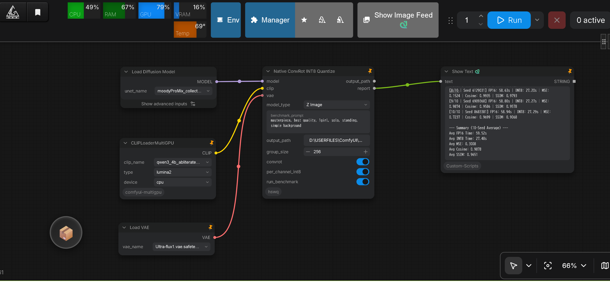

# How to quantize Qwen Image Edit

Use **native ConvRot INT8** via CLI (`Qwen Image/native_convert_int8_convrot_qwen.py`) or directly in ComfyUI with the custom node **`Native ConvRot INT8 Quantize`** (`comfyui_nodes/`, `model_type = "Qwen Image Edit"`).

The post-convert fidelity benchmark is **latent-space trajectory divergence** (per-step cosine + bifurcation detection), which is a stronger measure than decoded SSIM for quantization accuracy.

## Clone the repository

```bash
git clone https://github.com/ussoewwin/Hybrid-Sensitivity-Weighted-Quantization.git
cd Hybrid-Sensitivity-Weighted-Quantization
```

## Install PyTorch (CUDA)

First, install PyTorch (CUDA).  
In a Windows environment on a local PC, it is advisable to set up a venv virtual environment.

```bash
pip install torch torchvision --index-url https://download.pytorch.org/whl/cu130
```

## Install other libraries

```bash
pip install safetensors tqdm scikit-image
```

## Quantize a Qwen Image Edit model (CLI)

Replace every `<...>` placeholder with a real path on your machine. `--model` and `--input` are aliases for the same argument.

**Default flow:** convert → save → run the post-convert benchmark automatically (`--fp16` = `--model`, `--fp8` = `--output`). You do **not** need a second manual bench command after a normal run.

Required: **`--model`**, **`--output`**, **`--per_channel_int8`**, **`--clip_path`**, **`--comfy_path`** only. Tokenizer uses ComfyUI-bundled `comfy/text_encoders/qwen25_tokenizer` under `--comfy_path`.

```bash
python "Qwen Image/native_convert_int8_convrot_qwen.py" --model "<path-to-unet>/<qwen_image_edit>.safetensors" --output "<path-to-unet>/<qwen_image_edit>_convrot_int8.safetensors" --per_channel_int8 --clip_path "<path-to-qwen2.5-vl-7b>" --comfy_path "<path-to-ComfyUI>"
```

**Notes:**

- **FULL ConvRot** (Linear + Conv2d when `in_dim` is divisible by a power-of-4 group size) is **ON by default**. Pass `--no-convrot` only for plain INT8 without ConvRot.
- **`--per_channel_int8`:** use per-out-channel amax/scale instead of a single per-tensor scale when packing layers that do **not** go through ConvRot. Under default FULL ConvRot, almost all eligible Linear/Conv2d already use rotate + per-channel scale, so this flag has **little effect** in practice; keep it as **insurance** for any remaining non-ConvRot packs. Format tag stays `int8_tensorwise`.
- **Bias correction (optional):** `--bias_correction` + `--calib_file <prompts.txt>` applies Card 1 (`bias += -(W_q - W) @ mu_x`) on all INT8 Linear/Conv. Requires calibration prompts. `--num_calib_samples` (default 32) and `--num_inference_steps` (default 25) control calibration.
- **Post-convert bench:** **ON by default**. After save, the script runs the fidelity benchmark with the same `--clip_path` / `--comfy_path` (prompt/steps/seed fixed inside). Pass `--no-bench` to skip.
- **ComfyUI:** Load the ConvRot INT8 output with the **standard ComfyUI loader**. A dedicated HSWQ loader is not required.

## Quantize a Qwen Image Edit model via ComfyUI (Node)

Quantization can also be executed directly within ComfyUI using the custom node **`Native ConvRot INT8 Quantize`** (`comfyui_nodes/`).

<p align="left">
  
</p>

### Installation

Copy or link the repository into `ComfyUI/custom_nodes/`:

```bash
cd custom_nodes
git clone https://github.com/ussoewwin/Hybrid-Sensitivity-Weighted-Quantization.git
```

### Node Workflow & Usage

1. **Load Model:** Connect the `MODEL` output from `UNetLoader` (or `Load Diffusion Model`) to the `model` input of the **`Native ConvRot INT8 Quantize`** node.
2. **Connect CLIP:** Connect `CLIP` from `CLIPLoader` (e.g. `qwen_2.5_vl_7b_fp8_scaled.safetensors`) to the `clip` input.
3. **Configure Parameters:**
   - **`model_type`**: Set to **`"Qwen Image Edit"`** (this selects the Qwen Image Edit blacklist: `img_in`, `txt_in`, `time_text_embed`, `norm_out`, `proj_out`).
   - **`benchmark_prompt`**: Prompt text used during the automated 10-seed trajectory benchmark (multiline text, defaults to `"masterpiece, best quality, 1girl, solo, standing, simple background"`).
   - **`output_path`**: Destination `.safetensors` path. If left empty, saves to the ComfyUI output directory automatically with a timestamped filename.
   - **`group_size`**: Preferred ConvRot Hadamard group size (default `256`, must be a power of 4).
   - **`convrot`**: Enable FULL ConvRot online Hadamard rotation (default `True`).
   - **`per_channel_int8`**: Channelwise amax/scale fallback for non-ConvRot layers (default `True`).
   - **`run_benchmark`**: Automatically run a 10-seed trajectory-divergence benchmark (per-step latent cosine, bifurcation detection) upon save (default `True`).
4. **Execute Queue:** Run the prompt queue. The node extracts diffusion weights directly from memory, performs Hadamard rotation and INT8 symmetric quantization, saves the model checkpoint with `_quantization_metadata`, and outputs the benchmark report to the console.

### Benchmark output (node)

The 10-seed benchmark reports per-step latent trajectory divergence between the BF16 baseline and the ConvRot INT8 model:

```
=== BENCHMARK (10 Random Seeds, per-step trajectory) ===
[1/10 | Seed ...] FP16: ...s | INT8: ...s | MSE: ... | Cosine: ... | max-drop: ... | same-image
...
--- Summary (10-Seed Average) ---
Avg Cosine: 0.9946
Cosine: min=... max=...
same-image seeds : 10/10
bifurcated seeds : 0/10
```

- **`same-image`** = final latent cosine ≥ 0.98 (trajectory converged to the same image as BF16)
- **`bifurcated`** = single-step cosine drop > 0.05 (trajectory jumped to a different image)
- **`drifted`** = gradual divergence below the same-image threshold

For a typical Qwen Image Edit ConvRot INT8 result, expect **same-image 10/10** and **bifurcated 0/10** (mean cosine ≈ 0.99), i.e. practically lossless.
