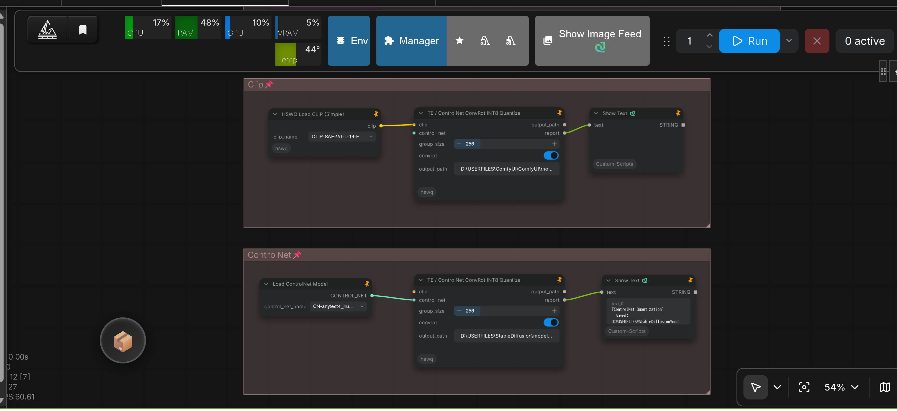
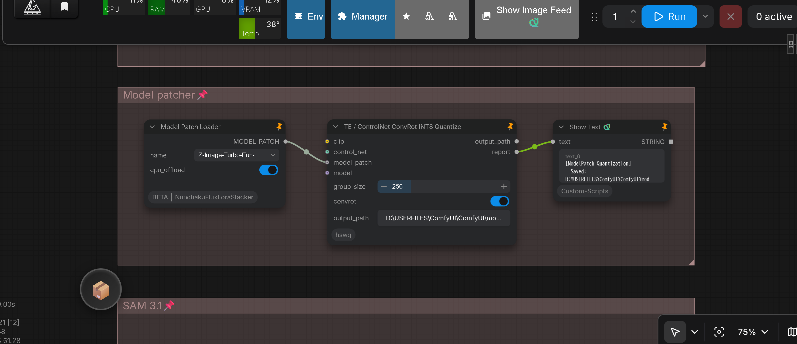
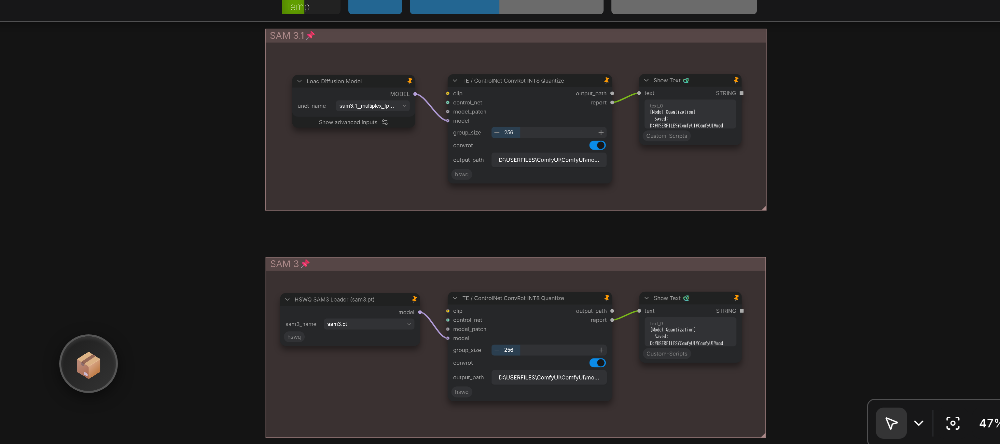

# How to quantize Text Encoder, ControlNet, Model Patch and SAM 3 / SAM 3.1 (native ConvRot INT8)

Quantize loaded **Text Encoders (CLIP, T5, Qwen2.5-VL, etc.)**, **ControlNet / ControlNet Union models**, **Model Patch (model patcher) ControlNets**, and **Segment Anything Models (SAM 3 / SAM 3.1 Multiplex)** directly in ComfyUI using the dedicated custom node **`TE / ControlNet ConvRot INT8 Quantize`** (`comfyui_nodes/te_controlnet_convrot_int8_convert.py`) and loader **`HSWQ SAM3 Loader (sam3.pt)`** (`comfyui_nodes/sam3_pt_loader.py`), or via the standalone CLI conversion script **`clip_convert/convert_clip_convrot_int8.py`**.

By applying orthogonal Hadamard rotations prior to per-channel INT8 quantization, this pipeline eliminates activation outlier spikes in deep Linear layers, reducing VRAM and storage footprint by ~50% while preserving 100% conditioning accuracy, mask segmentation fidelity, and structural guidance quality.

---

## ComfyUI Node Workflow

Quantization is performed directly in-graph from memory without requiring external CLI conversion scripts:

### Workflow Layouts

<p align="left">
  <b>1. Text Encoder & ControlNet Quantization:</b><br>
  
</p>

<p align="left">
  <b>2. Model Patch (Model Patcher) Quantization:</b><br>
  
</p>

<p align="left">
  <b>3. SAM 3 & SAM 3.1 Multiplex Quantization:</b><br>
  
</p>

---

### Sample Workflow

A ready-to-use ComfyUI workflow JSON covering all supported model types is provided in the repository:
- **[`sample workflow/native convrot int8.json`](../sample%20workflow/native%20convrot%20int8.json)**

You can load this file directly into ComfyUI (or drag-and-drop the workflow images above) to load the complete quantization graph.

---

### Pipeline Structure

The workflow consists of five specialized, parallel quantization branches:

1. **Text Encoder (CLIP / TE) Branch:**
   - **Loader:** `HSWQ Load CLIP (Simple)` (or standard `CLIPLoader` / `DualCLIPLoader` / `TripleCLIPLoader`).
   - **Quantizer:** `TE / ControlNet ConvRot INT8 Quantize` (connected via the `clip` input terminal).
   - **Monitor:** `Show Text` (Custom-Scripts) connected to `report` to display real-time quantization layer statistics and output path.

2. **ControlNet Branch:**
   - **Loader:** `Load ControlNet Model` (or `HSWQ Load ControlNet (Simple)`).
   - **Quantizer:** `TE / ControlNet ConvRot INT8 Quantize` (connected via the `control_net` input terminal).
   - **Monitor:** `Show Text` (Custom-Scripts) connected to `report` to display file size and layer breakdown.

3. **Model Patch (Model Patcher) Branch:**
   - **Loader:** `Load Model Patch` (`ModelPatchLoaderCustom` / stock `ModelPatchLoader`).
   - **Quantizer:** `TE / ControlNet ConvRot INT8 Quantize` (connected via the `model_patch` input terminal).
   - **Monitor:** `Show Text` (Custom-Scripts) connected to `report`.

4. **SAM 3.1 Branch (Multiplex Architecture):**
   - **Loader:** Standard **`UNetLoader`** (or `Load Diffusion Model`) loading `sam3.1_multiplex_fp16.safetensors` from `models/unet/` or `models/diffusion_models/`.
   - **Quantizer:** `TE / ControlNet ConvRot INT8 Quantize` (connected via the **`model`** input terminal).
   - **Monitor:** `Show Text` (Custom-Scripts) connected to `report`.

5. **SAM 3 Branch (Classic Non-Multiplex Architecture / sam3.pt):**
   - **Loader:** Dedicated **`HSWQ SAM3 Loader (sam3.pt)`** (`HSWQSAM3Loader`) loading `sam3.pt` or `sam3_fp16.safetensors`.
   - **Quantizer:** `TE / ControlNet ConvRot INT8 Quantize` (connected via the **`model`** input terminal).
   - **Monitor:** `Show Text` (Custom-Scripts) connected to `report`.

---

## SAM 3 vs. SAM 3.1 Architectural Differences

SAM 3 and SAM 3.1 have distinct internal network topologies and key layouts. The quantization engine incorporates explicit branching logic to ensure seamless compatibility:

| Architectural Feature | SAM 3 (`sam3.pt` / `sam3_fp16.safetensors`) | SAM 3.1 Multiplex (`sam3.1_multiplex_fp16.safetensors`) |
| :--- | :--- | :--- |
| **Model Type** | Classic Single-Object / Non-multiplex | 16-Object Multiplex Interactive Segmentation & Tracking |
| **FPN Neck Topology** | 4-Level FPN (`sam2_convs`, `vision_backbone.convs.3`) | 3-Level FPN (`propagation_convs`, `interactive_convs`) |
| **Text Projection Tensor** | $(1024 \times 512)$ Unused $\to$ **Automatically Dropped** | $(1024 \times 1024)$ Active $\to$ **Preserved & Quantized** |
| **Recommended Loader Node** | **`HSWQ SAM3 Loader (sam3.pt)`** (`HSWQSAM3Loader`) | **`UNetLoader`** / **`Load Diffusion Model`** |
| **Fused QKV In-Projection** | `.in_proj_weight` / `.in_proj_bias` split into `q_proj`, `k_proj`, `v_proj` | `.in_proj_weight` / `.in_proj_bias` split into `q_proj`, `k_proj`, `v_proj` |
| **Key Remapping** | `tracker.model.*` $\to$ `tracker.*`<br>`sam_mask_decoder.transformer.*` remapped | `tracker.model.*` $\to$ `tracker.*`<br>`sam_mask_decoder.transformer.*` remapped |
| **Quantization Input Slot** | `model` input on `TE / ControlNet ConvRot INT8 Quantize` | `model` input on `TE / ControlNet ConvRot INT8 Quantize` |
| **Quantized Output Size** | **~0.55 GB** (`sam3_convrot_int8.safetensors`) | **~0.84 - 0.89 GB** (`sam3.1_multiplex_convrot_int8.safetensors`) |

> [!IMPORTANT]
> **Key Reason for Separate Loaders:**
> - **SAM 3.1 (`sam3.1_multiplex_fp16.safetensors`)** is distributed in standard ComfyUI diffusion format and should be loaded via the stock **`UNetLoader`**.
> - **SAM 3 (`sam3.pt`)** contains raw checkpoint keys with an incompatible $(1024 \times 512)$ text projection and fused `in_proj` weights. The **`HSWQ SAM3 Loader (sam3.pt)`** node performs automatic key cleaning and structural reshaping so that the resulting `MODEL` is immediately quantizable and loadable.

---

## Clone the repository

```bash
git clone https://github.com/ussoewwin/Hybrid-Sensitivity-Weighted-Quantization.git
cd Hybrid-Sensitivity-Weighted-Quantization
```

## Install PyTorch (CUDA)

First, install PyTorch (CUDA).  
In a Windows environment on a local PC, it is advisable to set up a venv virtual environment.

```bash
pip install torch torchvision --index-url https://download.pytorch.org/whl/cu130
```

## Install other libraries

```bash
pip install -r requirements.txt
pip install -U comfy_kitchen
pip install diffusers accelerate scikit-image
```

`scikit-image` is required for SSIM and benchmark comparisons. `comfy_kitchen` provides the quantization kernels and layout operations.

---

## ComfyUI Custom Node Setup

Copy or link the repository into `ComfyUI/custom_nodes/`:

```bash
cd ComfyUI/custom_nodes
git clone https://github.com/ussoewwin/Hybrid-Sensitivity-Weighted-Quantization.git
```

---

## Node Parameters & Configuration

### 1. `TE / ControlNet ConvRot INT8 Quantize`

| Input / Widget | Type | Default | Description |
| :--- | :--- | :--- | :--- |
| **`clip`** | `CLIP` | Optional | Connected Text Encoder / CLIP model instance. |
| **`control_net`** | `CONTROL_NET` | Optional | Connected ControlNet or ControlNet Union model instance. |
| **`model_patch`** | `MODEL_PATCH` | Optional | Connected Model Patch (model patcher) instance, e.g. Z-Image Fun ControlNet loaded by `Load Model Patch` (`ModelPatchLoader`) from `models/model_patches/`. |
| **`model`** | `MODEL` | Optional | Connected SAM 3, SAM 3.1 Multiplex, or diffusion model instance loaded by `UNetLoader` or `HSWQ SAM3 Loader (sam3.pt)`. |
| **`group_size`** | `INT` | `256` | Preferred ConvRot Hadamard rotation group size (must be a power of 4: `4`, `16`, `64`, `256`, `1024`). |
| **`convrot`** | `BOOLEAN` | `True` | Enables orthogonal Hadamard rotation prior to INT8 scaling. When disabled, falls back to plain per-channel INT8. |
| **`output_path`** | `STRING` | `""` | Destination `.safetensors` path or directory. If left empty, saves automatically to `ComfyUI/output/` using `<model_name>_convrot_int8.safetensors`. |

> [!NOTE]
> At least one model input (`clip`, `control_net`, `model_patch`, or `model`) must be connected. You can also connect **multiple** inputs simultaneously to quantize matching models in a single queue execution.

### 2. `HSWQ SAM3 Loader (sam3.pt)`

| Input / Widget | Type | Default | Description |
| :--- | :--- | :--- | :--- |
| **`sam3_name`** | `COMBO` | First available | Target `sam3.pt` or `sam3.safetensors` file scanned across `models/checkpoints/`, `models/unet/`, `models/diffusion_models/`, and `models/sams/`. |

---

## Standalone CLI Conversion Script (`convert_clip_convrot_int8.py`)

For batch processing or headless environments, the CLI script `clip_convert/convert_clip_convrot_int8.py` can convert generic `.safetensors` (CLIP, LLM, ControlNet, SAM 3, SAM 3.1, UNet) directly from the command line:

```bash
# Convert SAM 3.1 Multiplex checkpoint
python clip_convert/convert_clip_convrot_int8.py \
  --model models/unet/sam3.1_multiplex_fp16.safetensors \
  --output models/unet/sam3.1_multiplex_convrot_int8.safetensors \
  --groupsize 256

# Convert generic CLIP / Text Encoder
python clip_convert/convert_clip_convrot_int8.py \
  --model models/clip/t5xxl_fp16.safetensors \
  --output models/clip/t5xxl_convrot_int8.safetensors \
  --groupsize 256
```

### CLI Arguments

- `--model`: Path to input `.safetensors` checkpoint.
- `--output`: Path for output `.safetensors` checkpoint.
- `--no-convrot`: Disables Hadamard rotation and executes plain per-channel INT8 quantization.
- `--groupsize`: Hadamard rotation block size (must be a power of 4: `4`, `16`, `64`, `256`, `1024`, default `256`).

---

## Quantization Mechanics & Format

1. **State-Dict Extraction & Automatic Key Processing:**
   - The node extracts weights in memory and traces upstream loader paths.
   - For SAM architectures, automatic detection routes keys through version-specific remapping: fused `in_proj` tensors are split into `q_proj`, `k_proj`, `v_proj`, unused projection layers are pruned, and decoder transformer keys are standardized.

2. **Selective Linear Quantization:**
   - All 2D floating-point Linear weights (`.weight` with `ndim == 2`) are processed with Hadamard rotation:
     $$\mathbf{W}_{\text{rot}} = \mathbf{W} \mathbf{H}^T$$
   - Quantized to signed 8-bit integers with per-out-channel scaling:
     $$\text{scale}_i = \frac{\max_j(|W_{\text{rot},ij}|)}{127}, \quad W_{q,ij} = \text{round}\left(\frac{W_{\text{rot},ij}}{\text{scale}_i}\right)$$
   - Non-2D weights (embeddings, 1D layer norms, biases, Conv2d) are preserved unquantized in original precision (FP16/BF16/FP32) to prevent precision collapse at model boundaries.

3. **Output Checkpoint Layout:**
   ```
   <layer>.weight           int8
   <layer>.weight_scale     float32  [out_features, 1]
   <layer>.comfy_quant      uint8 JSON  {"format":"int8_tensorwise","convrot":true,"convrot_groupsize":N}
   _quantization_metadata   JSON  {"format_version":"1.0","layers":{...}}
   ```

---

## Loading Quantized Models in ComfyUI

### SAM 3 / SAM 3.1 Multiplex Models
Quantized SAM 3 and SAM 3.1 checkpoints stamped with `int8_tensorwise` and `comfy_quant` are **100% natively supported** by ComfyUI:
- Place the generated `sam3_convrot_int8.safetensors` or `sam3.1_multiplex_convrot_int8.safetensors` in `ComfyUI/models/unet/` or `ComfyUI/models/diffusion_models/`.
- Load them using the standard **`UNetLoader`** (or **`Load Diffusion Model`**).
- Connect directly to downstream SAM segmentation / video tracking nodes. ComfyUI automatically utilizes native INT8 Tensor Core acceleration.

### ControlNet Models
ComfyUI does not natively support rotated INT8 tensors for ControlNet models out of the box. To load and execute these weights in ComfyUI workflows, use the dedicated loader from the **[ComfyUI-HSWQ-Loader-and-Tools](https://github.com/ussoewwin/ComfyUI-HSWQ-Loader-and-Tools)** extension:

```bash
cd ComfyUI/custom_nodes
git clone https://github.com/ussoewwin/ComfyUI-HSWQ-Loader-and-Tools.git
```

Use the **`HSWQ Load ControlNet (Simple)`** node to load the generated `.safetensors` checkpoint directly into your generation graph.

### Model Patch (model patcher) Models
Quantized Model Patches (e.g. Z-Image Fun ControlNet from `models/model_patches/`) are loaded with the **`HSWQ Load Model Patch (ConvRot INT8)`** node (`comfyui_nodes/hswq_model_patch_loader.py`). It mirrors the stock `ModelPatchLoader` dispatch but selects quant-aware `MixedPrecisionOps` when `int8_tensorwise` `comfy_quant` layers are detected, so weights stay INT8 in VRAM. For non-quantized checkpoints it delegates to the stock `Load Model Patch` node. The returned `MODEL_PATCH` plugs into the standard apply nodes (`Apply Z-Image Fun ControlNet`, etc.).

### Text Encoders (CLIP / TE)
Quantized Text Encoders stamped with `comfy_quant` can be loaded using standard ComfyUI `CLIPLoader` / `DualCLIPLoader` or `HSWQ Load CLIP (Simple)`.

---

## Supported Architectures & Verified Checkpoints

| Architecture | Model Family | Verified Models |
| :--- | :--- | :--- |
| **SAM 3.1** | Multiplex Segmentation & Tracking | `sam3.1_multiplex_fp16.safetensors` |
| **SAM 3** | Segmentation & Video Tracking | `sam3.pt`, `sam3_fp16.safetensors` |
| **Illustrious-XL / SDXL** | Anytest ControlNet | `CN-anytest4_illustrious2_A`, `CN-anytest4_illustrious2_B` |
| **SDXL 1.0** | ControlNet Union | `controlnet-union-pro-max-sdxl-1.0` (xinsir) |
| **Z-Image-Turbo** | ControlNet Union / Tile | `Z-Image-Turbo-Fun-Controlnet-Union-2.1-lite-2601-8steps`, `Z-Image-Turbo-Fun-Controlnet-Tile-2.1-lite-2601-8steps` |
| **Qwen-Image** | ControlNet Inpainting | `Qwen-Image-ControlNet-Inpainting` (alibaba-pai) |
| **Qwen-Image-2512** | ControlNet Union | `Qwen-Image-2512-Fun-Controlnet-Union-2602` |
| **FLUX.1-dev** | ControlNet Union Pro | `FLUX.1-dev-ControlNet-Union-Pro-2.0` (Shakker Labs) |
| **CLIP / Text Encoders** | CLIP-L, CLIP-G, T5-XXL, Qwen2.5-VL | `CLIP-SAE-ViT-L-14`, `t5xxl_fp16`, `qwen_2.5_vl_7b` |
