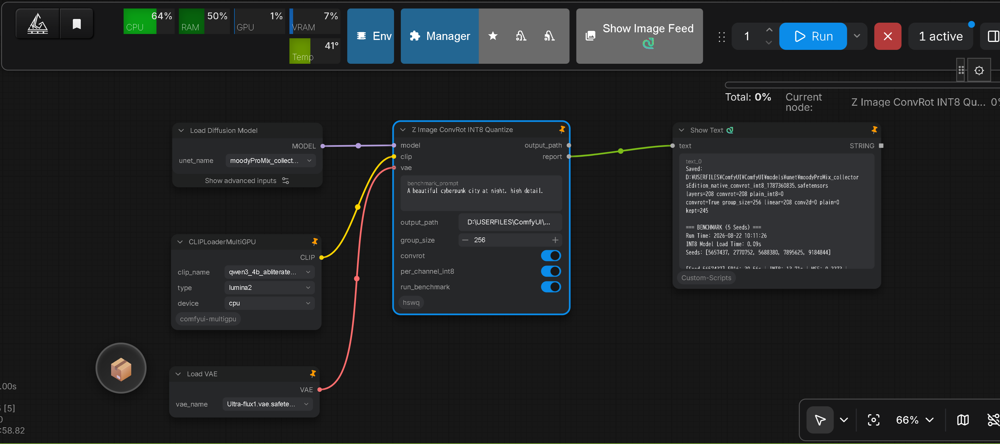

# How to quantize Z Image (ZI)

Use **native ConvRot INT8** with `native_convert_int8_convrot_zi.py` (quantize + **integrated post-convert bench**).

**HSWQ Z Image INT8 development and public release ended.** For Z Image 8-bit, use this native path (typically **SSIM > 0.99**). HSWQ INT8 continues for **SDXL** only.

**Prefer a Z Image Turbo (ZIT) checkpoint.** Plain Z Image base models are not recommended.

## Clone the repository

```bash
git clone https://github.com/ussoewwin/Hybrid-Sensitivity-Weighted-Quantization.git
cd Hybrid-Sensitivity-Weighted-Quantization
```

## Install PyTorch (CUDA)

First, install PyTorch (CUDA).  
In a Windows environment on a local PC, it is advisable to set up a venv virtual environment.

```bash
pip install torch torchvision --index-url https://download.pytorch.org/whl/cu130
```

## Install other libraries

```bash
pip install safetensors tqdm scikit-image
```

`scikit-image` is required for SSIM in `benchmark/zi_int8_bench.py` (post-convert bench).

## Quantize a ZI model (CLI)

Replace every `<...>` placeholder with a real path on your machine (no invented filenames; no machine-local drive hardcoding in published examples). `--model` and `--input` are aliases for the same argument.

**Default flow:** convert → save → run **`benchmark/zi_int8_bench.py`** automatically (`--fp16` = `--model`, `--fp8` = `--output`). You do **not** need a second manual bench command after a normal run.

Required: **`--model`**, **`--output`**, **`--per_channel_int8`**, **`--clip_path`**, **`--comfy_path`** only. Tokenizer uses ComfyUI-bundled `comfy/text_encoders/qwen25_tokenizer` under `--comfy_path`.

```bash
python native_convert_int8_convrot_zi.py --model "<path-to-unet>/<zit_unet>.safetensors" --output "<path-to-unet>/<zit_unet>_convrot_int8.safetensors" --per_channel_int8 --clip_path "<path-to-qwen3-4b>" --comfy_path "<path-to-ComfyUI>"
```

**Notes:**

- **FULL ConvRot** (Linear + Conv2d when `in_dim` is divisible by a power-of-4 group size) is **ON by default**. Pass `--no-convrot` only for plain INT8 without ConvRot.
- **`--per_channel_int8`:** use per-out-channel amax/scale instead of a single per-tensor scale when packing layers that do **not** go through ConvRot. Under default FULL ConvRot, almost all eligible Linear/Conv2d already use rotate + per-channel scale, so this flag has **little effect** in practice; keep it as **insurance** for any remaining non-ConvRot packs. Format tag stays `int8_tensorwise`.
- **Post-convert bench:** **ON by default**. After save, the script runs `benchmark/zi_int8_bench.py` with the same `--clip_path` / `--comfy_path` (prompt / steps=`25` / seed=`42` fixed inside). A non-zero bench exit code fails the convert process.
- **ComfyUI:** Load the ConvRot INT8 output with the **standard ComfyUI loader**. A dedicated HSWQ loader is not required.

## Quantize a ZI model via ComfyUI (Node)

Quantization can also be executed directly within ComfyUI using the custom node **`Z Image ConvRot INT8 Quantize`** (`comfyui_nodes/`).

<p align="left">
  
</p>

### Installation

Copy or link the repository into `ComfyUI/custom_nodes/`:

```bash
cd custom_nodes
git clone https://github.com/ussoewwin/Hybrid-Sensitivity-Weighted-Quantization.git
```

### Sample Workflow

A ready-to-use ComfyUI workflow JSON is provided in the repository:
- **[`sample workflow/Zi native convrot int8.json`](../sample%20workflow/Zi%20native%20convrot%20int8.json)**

You can load this file directly into ComfyUI (or drag-and-drop the workflow image) to load the complete quantization and benchmark graph.

### Node Workflow & Usage

1. **Load Model:** Connect the `MODEL` output from `UNetLoader` (or `Load Diffusion Model`) to the `model` input of the **`Z Image ConvRot INT8 Quantize`** node.
2. **Connect CLIP:** Connect `CLIP` from `CLIPLoader` (e.g. `qwen3_4b_abliterated_fp16_converted.safetensors`) to the `clip` input.
3. **Optional VAE:** Connect `VAE` from `VAELoader` to the optional `vae` input for automatic decoded SSIM measurement.
4. **Configure Parameters:**
   - **`output_path`**: Destination `.safetensors` path. If left empty, saves to the ComfyUI output directory automatically with a timestamped filename.
   - **`group_size`**: Preferred ConvRot Hadamard group size (default `256`, must be a power of 4).
   - **`convrot`**: Enable FULL ConvRot online Hadamard rotation (default `True`).
   - **`per_channel_int8`**: Channelwise amax/scale fallback for non-ConvRot layers (default `True`).
   - **`run_benchmark`**: Automatically run a 5-seed fidelity benchmark (latent MSE, cosine similarity, inference time, and decoded SSIM) upon save (default `True`).
5. **Execute Queue:** Run the prompt queue. The node extracts diffusion weights directly from memory, performs Hadamard rotation and INT8 symmetric quantization, saves the model checkpoint with `_quantization_metadata`, and outputs the benchmark report to the console and return output.

