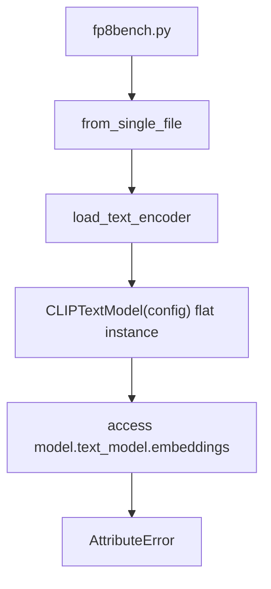
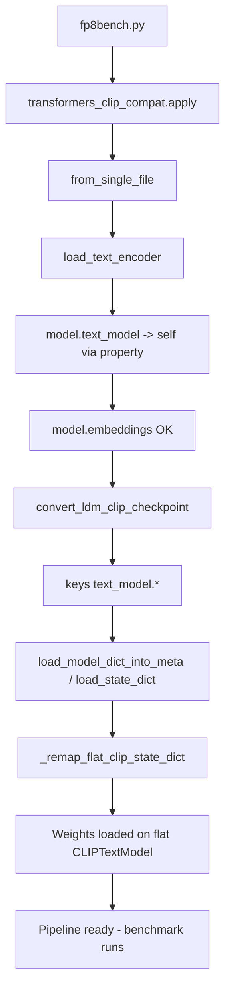

# SDXL Benchmark: Transformers 5.6+ CLIP Compatibility Fix

Technical note for commit `2c56ac8` (`fix: SDXL bench CLIP compat for transformers 5.6+`).

**Scope:** `benchmark/fp8bench.py`, `benchmark/fp8bench_enhanced.py`, and new `benchmark/transformers_clip_compat.py`.

**Environment where the failure was observed:**

| Component | Version |
|-----------|---------|
| Python venv | `D:\USERFILES\fp8e4m3\venv` |
| `transformers` (after upgrade) | **5.12.1** (was 5.4.0) |
| `diffusers` | installed in same venv |
| Entry point | `StableDiffusionXLPipeline.from_single_file()` in `fp8bench.py` |

---

## 1. Error Content

### 1.1 User-visible symptom

Running the SDXL FP8 benchmark after `pip install -U transformers` failed during **pipeline construction**, before any image generation or SSIM/MSE measurement.

Typical command:

```bash
cd D:\USERFILES\GitHub\hswq\benchmark
python fp8bench.py ^
  --fp16 "D:\path\to\model_fp16.safetensors" ^
  --fp8  "D:\path\to\model_fp8.safetensors" ^
  --prompt "masterpiece, best quality, 1girl, solo, standing, simple background"
```

### 1.2 Exception (core message)

```text
AttributeError: 'CLIPTextModel' object has no attribute 'text_model'
```

### 1.3 Representative stack trace

The failure occurs inside **diffusers** while loading the CLIP text encoder from a single-file SDXL checkpoint. The critical frame is in `diffusers/loaders/single_file_utils.py`:

```text
Traceback (most recent call last):
  ...
  File ".../diffusers/pipelines/stable_diffusion_xl/pipeline_stable_diffusion_xl.py", ... in from_single_file
  File ".../diffusers/loaders/single_file.py", ... in from_single_file
  File ".../diffusers/loaders/single_file_utils.py", line 1705, in load_text_encoder
    position_embedding_dim = model.text_model.embeddings.position_embedding.weight.shape[-1]
                             ^^^^^^^^^^^^^^^^
AttributeError: 'CLIPTextModel' object has no attribute 'text_model'
```

### 1.4 What did *not* fail

- The UNet / VAE weights in the `.safetensors` file were not the immediate problem.
- HSWQ quantization logic was not involved.
- The error appeared as soon as diffusers tried to instantiate and probe **CLIP-L** (`CLIPTextModel`) from the checkpoint.

### 1.5 Post-fix verification (same venv, transformers 5.12.1)

After applying `transformers_clip_compat.apply()` before importing diffusers:

- `fp8bench.py` completed successfully (exit code 0, ~51 s on the test GPU run).
- Example metrics from that run: **MSE 24.8071**, **SSIM 0.9158** (model pair and prompt as used in the debugging session).

---

## 2. Essential Root Cause

The failure is a **structural API mismatch** between two libraries that did not upgrade in lockstep:

| Layer | Expectation | Reality with transformers ≥ 5.6 |
|-------|-------------|-----------------------------------|
| **diffusers** `load_text_encoder()` | `CLIPTextModel` has nested submodule `text_model`, and checkpoint keys use prefix `text_model.` | Still written for the **pre-5.6** layout |
| **transformers** `CLIPTextModel` | (historically) `self.text_model = CLIPTextModel._from_config(...)` | **Flattened:** `embeddings`, `encoder`, `final_layer_norm` live **directly** on `CLIPTextModel` |
| **Checkpoint / LDM key format** | Keys like `text_model.embeddings.token_embedding.weight` | Unchanged for years |

### 2.1 transformers side (what changed)

In **transformers 5.6+**, bare `CLIPTextModel` is defined approximately as:

```python
class CLIPTextModel(CLIPPreTrainedModel):
    def __init__(self, config):
        super().__init__(config)
        self.embeddings = CLIPTextEmbeddings(config)
        self.encoder = CLIPEncoder(config)
        self.final_layer_norm = nn.LayerNorm(...)
```

There is **no** `self.text_model` child module on this class anymore.

By contrast, `CLIPTextModelWithProjection` (used for SDXL **CLIP-G / OpenCLIP**) **still** has:

```python
self.text_model = CLIPTextModel._from_config(config)
self.text_projection = nn.Linear(...)
```

So SDXL uses **two different CLIP layouts** in one pipeline, but diffusers' single-file loader assumes **both** can be accessed via `model.text_model.embeddings...` when probing embedding dimension.

### 2.2 diffusers side (what still assumes the old layout)

In `single_file_utils.py`, after building an empty `CLIPTextModel` from config, diffusers immediately does:

```python
position_embedding_dim = model.text_model.embeddings.position_embedding.weight.shape[-1]
```

That line is only valid if `model.text_model` exists. On transformers 5.6+ flat `CLIPTextModel`, it does not—hence the `AttributeError`.

Later, `convert_ldm_clip_checkpoint()` produces a state dict whose keys still use the **`text_model.`** prefix (e.g. `text_model.embeddings.token_embedding.weight`). That format matched the **old** nested module tree. The flat model expects keys like `embeddings.token_embedding.weight` without the prefix.

### 2.3 Why upgrading transformers alone triggered this

- **transformers 5.4.0:** `CLIPTextModel` still exposed the nested `text_model` submodule (legacy layout).
- **transformers 5.6.0+:** flattening landed in Hugging Face transformers (community discussion around PR huggingface/transformers#40760; release notes for 5.6 mention CLIP text encoder restructuring).
- **diffusers** in the same venv was not updated to a version that fully adapts to the flat layout for the `from_single_file` code path used by `fp8bench.py`.

The benchmark scripts did not change; the **dependency upgrade** changed the object graph under diffusers.

### 2.4 Prior art in this ecosystem (Forge-Nunchaku)

Stable Diffusion WebUI **Forge-Nunchaku** already handles the same key-prefix mismatch when loading CLIP for inference. In `backend/loader.py` (lines 157–170):

```python
# transformers 5.x flattened CLIPTextModel: text_model.X -> X
for k, v in state_dict.items():
    clean = k
    clean = clean.removeprefix("transformer.")
    clean = clean.removeprefix("text_model.")
    new_state_dict[f"transformer.{clean}"] = v
```

HSWQ's fix applies the **same conceptual remap** for the **diffusers benchmark path**, plus a **compatibility property** so diffusers' dimension probe (`model.text_model.embeddings`) succeeds on flat `CLIPTextModel`.

---

## 3. Modified Files

| File | Change type | Role |
|------|-------------|------|
| `benchmark/transformers_clip_compat.py` | **Added** | Idempotent runtime patches for transformers + diffusers loading |
| `benchmark/fp8bench.py` | **Modified** | Call `apply()` before `from diffusers import ...` |
| `benchmark/fp8bench_enhanced.py` | **Modified** | Same bootstrap as `fp8bench.py` |

**Not modified in this commit:**

- `benchmark/fp8bench_flux.py` (Flux pipeline; different text encoder stack)
- `quantize_sdxl_hswq_v2.1.py` and other quantize scripts
- ComfyUI / Forge code (reference only)

---

## 4. Full Added / Modified Code

### 4.1 New file: `benchmark/transformers_clip_compat.py` (complete)

```python
"""
Transformers 5.6+ compatibility for diffusers SDXL from_single_file.

In transformers >= 5.6, CLIPTextModel no longer nests weights under ``text_model.*``
(the submodule was flattened). diffusers' single-file loader still expects
``model.text_model.embeddings`` and checkpoint keys prefixed with ``text_model.``.

Forge-Nunchaku strips the ``text_model.`` prefix when loading (see backend/loader.py).
This module applies the same idea for diffusers-based benchmarks.
"""

from __future__ import annotations

_APPLIED = False


def _is_flat_clip_text_model(model) -> bool:
    from transformers import CLIPTextModel

    return isinstance(model, CLIPTextModel)


def _remap_flat_clip_state_dict(state_dict: dict) -> dict:
    """Map LDM/diffusers keys ``text_model.X`` -> ``X`` for flat CLIPTextModel."""
    prefix = "text_model."
    remapped: dict = {}
    for key, value in state_dict.items():
        if key.startswith(prefix):
            remapped[key[len(prefix) :]] = value
        elif key in ("logit_scale",):
            continue
        else:
            remapped[key] = value
    return remapped


def apply() -> None:
    """Idempotent: patch CLIP loading once per process."""
    global _APPLIED
    if _APPLIED:
        return

    from transformers import CLIPTextModel
    from diffusers.models import model_loading_utils as mlu

    if not getattr(CLIPTextModel, "_hswq_text_model_prop", False):

        def _text_model_self(self):
            return self

        CLIPTextModel.text_model = property(_text_model_self)
        CLIPTextModel._hswq_text_model_prop = True

    if not getattr(CLIPTextModel, "_hswq_load_state_dict_patched", False):
        _orig_load_state_dict = CLIPTextModel.load_state_dict

        def _patched_load_state_dict(self, state_dict, *args, **kwargs):
            if _is_flat_clip_text_model(self):
                state_dict = _remap_flat_clip_state_dict(state_dict)
            return _orig_load_state_dict(self, state_dict, *args, **kwargs)

        CLIPTextModel.load_state_dict = _patched_load_state_dict
        CLIPTextModel._hswq_load_state_dict_patched = True

    if not getattr(mlu, "_hswq_load_meta_patched", False):
        _orig_load_meta = mlu.load_model_dict_into_meta

        def _patched_load_meta(model, state_dict, *args, **kwargs):
            if _is_flat_clip_text_model(model):
                state_dict = _remap_flat_clip_state_dict(state_dict)
            return _orig_load_meta(model, state_dict, *args, **kwargs)

        mlu.load_model_dict_into_meta = _patched_load_meta
        mlu._hswq_load_meta_patched = True

    _APPLIED = True
```

### 4.2 Change in `benchmark/fp8bench.py` (inserted after `import torch`)

```python
import transformers_clip_compat

transformers_clip_compat.apply()
```

Full top-of-file context after patch:

```python
import argparse
import torch

import transformers_clip_compat

transformers_clip_compat.apply()

from diffusers import StableDiffusionXLPipeline
import numpy as np
from PIL import Image, ImageChops
from skimage.metrics import structural_similarity as ssim
import os
import gc
import time
import sys
```

### 4.3 Change in `benchmark/fp8bench_enhanced.py` (same pattern)

```python
import argparse
import torch

import transformers_clip_compat

transformers_clip_compat.apply()

from diffusers import StableDiffusionXLPipeline
```

---

## 5. Meaning of Each Part of the Fix

### 5.1 Why `apply()` must run before `from diffusers import ...`

The patch replaces **class-level** methods and properties on `CLIPTextModel` and `load_model_dict_into_meta` in diffusers. Those classes are bound when diffusers is first imported and when `from_single_file` runs.

Calling `transformers_clip_compat.apply()` **before** importing `StableDiffusionXLPipeline` ensures:

1. The `text_model` property exists before diffusers touches `CLIPTextModel`.
2. `load_state_dict` / `load_model_dict_into_meta` wrappers are installed before any checkpoint load.

Import order in both benchmark scripts is intentional.

### 5.2 Patch A — `CLIPTextModel.text_model` property (returns `self`)

**Problem solved:** diffusers line  
`model.text_model.embeddings.position_embedding.weight.shape[-1]`

**Mechanism:** On flat `CLIPTextModel`, define:

```python
@property
def text_model(self):
    return self
```

Then `model.text_model.embeddings` resolves to `model.embeddings`, which exists on the flat class.

**Scope:** Only `CLIPTextModel`, not `CLIPTextModelWithProjection` (which already has a real `text_model` submodule). The property is installed on the class; for `CLIPTextModelWithProjection`, the existing attribute takes precedence over a class property in normal instance access—actually wait, if we set CLIPTextModel.text_model as property on the class, CLIPTextModelWithProjection is a subclass - does it inherit the property?

CLIPTextModelWithProjection extends CLIPPreTrainedModel, not CLIPTextModel. Let me check...

From grep:
```
class CLIPTextModelWithProjection(CLIPPreTrainedModel):
    def __init__(self, config):
        self.text_model = CLIPTextModel._from_config(config)
```

So CLIPTextModelWithProjection is NOT a subclass of CLIPTextModel - it's separate. Good - the property only on CLIPTextModel won't affect CLIPTextModelWithProjection.

**Guard flag:** `_hswq_text_model_prop` prevents double-installation if `apply()` is called twice.

### 5.3 Patch B — `_remap_flat_clip_state_dict`

**Problem solved:** Checkpoint / `convert_ldm_clip_checkpoint` output uses keys like:

```text
text_model.embeddings.token_embedding.weight
text_model.encoder.layers.0.self_attn.q_proj.weight
...
```

Flat `CLIPTextModel` parameter names are:

```text
embeddings.token_embedding.weight
encoder.layers.0.self_attn.q_proj.weight
...
```

**Mechanism:** Strip leading `text_model.` from each key.

**`logit_scale` dropped:** OpenCLIP checkpoints may carry `logit_scale` as a scalar tensor; flat CLIPTextModel does not use it in the same way. Skipping avoids spurious `load_state_dict` errors. Forge-Nunchaku also lists `logit_scale` in `ignore_errors`.

**Not stripping `transformer.` here:** The SDXL CLIP-L path in `convert_ldm_clip_checkpoint` already removes `conditioner.embedders.0.transformer` prefix and leaves `text_model.*` keys. OpenCLIP / CLIP-G paths use different converters.

### 5.4 Patch C — wrap `CLIPTextModel.load_state_dict`

**Problem solved:** Non-accelerate code path in diffusers:

```python
model.load_state_dict(diffusers_format_checkpoint, strict=False)
```

**Mechanism:** Intercept `state_dict` and remap when `self` is a flat `CLIPTextModel`.

**`_is_flat_clip_text_model`:** Uses `isinstance(model, CLIPTextModel)` so `CLIPTextModelWithProjection` (separate class) is not remapped twice incorrectly when it loads with its own nested structure.

### 5.5 Patch D — wrap `load_model_dict_into_meta`

**Problem solved:** When `accelerate` is installed (typical in modern diffusers stacks), weights are loaded via:

```python
load_model_dict_into_meta(model, diffusers_format_checkpoint, dtype=torch_dtype)
```

Without this hook, only Patch C would be bypassed and loading would still fail with unexpected key prefixes.

### 5.6 Idempotency (`_APPLIED` and `_hswq_*` flags)

Benchmark scripts may import multiple modules; enhanced vs basic should not double-wrap. Flags ensure:

- `apply()` is a no-op after the first successful run.
- Each individual patch installs at most once.

---

## 6. End-to-End Loading Flow (Before vs After)

### 6.1 Before fix (transformers 5.12.1)



### 6.2 After fix



---

## 7. Relationship to HSWQ Quantization

This fix is **only for the benchmark / inference loader path** in the HSWQ repository. It does not alter:

- HSWQ sensitivity analysis or FP8 weight format
- Which layers are quantized or vetoed
- SSIM/MSE formulas in `fp8bench.py`

It unblocks **loading** SDXL pipelines via diffusers after a transformers upgrade, so FP16 vs FP8 comparisons can run again.

---

## 8. Operational Notes

### 8.1 When you need this patch

- Any script in this repo that calls `StableDiffusionXLPipeline.from_single_file()` (or the same `load_text_encoder` path) with **transformers ≥ 5.6**.
- Symptoms: immediate `AttributeError` on `text_model`, or later `Missing key` / `Unexpected key` errors for CLIP weights.

### 8.2 When you do not need this patch

- Loaders that use **pre-5.6** transformers.
- Pipelines loaded via `from_pretrained` on a diffusers model repo (different code path; may already work depending on versions).
- **ComfyUI / Forge** (they use their own loader; see Forge-Nunchaku `backend/loader.py`).

### 8.3 Alternative mitigations (not chosen for this repo)

| Approach | Trade-off |
|----------|-----------|
| Pin `transformers<5.6` | Avoids code change but blocks security/features in newer transformers |
| Upgrade diffusers only | May fix upstream eventually; version combo must be tested |
| Fork diffusers `single_file_utils.py` | Heavy maintenance burden |

HSWQ chose a **small, local, Forge-aligned compat shim** so benchmarks stay on current transformers.

### 8.4 Extending to other benchmark scripts

`benchmark/fp8bench_flux.py` was **not** updated in commit `2c56ac8`. If Flux single-file loading hits similar issues on newer transformers, apply the same bootstrap:

```python
import transformers_clip_compat
transformers_clip_compat.apply()
# before diffusers import
```

Evaluate per pipeline; Flux text encoders may not use the same CLIP code path.

---

## 9. Key Naming Reference

| Source in SDXL .safetensors | After `convert_ldm_clip_checkpoint` | After `_remap_flat_clip_state_dict` | Flat `CLIPTextModel` param |
|------------------------------|-------------------------------------|-------------------------------------|----------------------------|
| `conditioner.embedders.0.transformer.text_model.embeddings.token_embedding.weight` | `text_model.embeddings.token_embedding.weight` | `embeddings.token_embedding.weight` | `embeddings.token_embedding.weight` |
| `conditioner.embedders.0.transformer.text_model.encoder.layers.0....` | `text_model.encoder.layers.0....` | `encoder.layers.0....` | `encoder.layers.0....` |

CLIP-G (OpenCLIP) uses `CLIPTextModelWithProjection` and separate converter functions; the property patch targets **CLIPTextModel** only. CLIP-G continues to use its real nested `text_model` submodule.

---

## 10. Summary

| Question | Answer |
|----------|--------|
| **What broke?** | `CLIPTextModel` lost `.text_model` in transformers 5.6+; diffusers still accesses it and loads `text_model.*` keys. |
| **Why is it "essential"?** | Library contract mismatch—not a bad checkpoint, not HSWQ quantization. |
| **What did we add?** | `transformers_clip_compat.py` with property + state-dict remapping hooks. |
| **What did we change in benchmarks?** | Two-line bootstrap before diffusers import. |
| **Is the fix complete for SDXL benches?** | Yes for `fp8bench.py` / `fp8bench_enhanced.py` with transformers 5.12.1; verified by successful end-to-end run. |

---

## 11. References

- Commit: `2c56ac8` on `main` — `fix: SDXL bench CLIP compat for transformers 5.6+`
- Forge-Nunchaku: `D:\USERFILES\GitHub\Stable-Diffusion-WebUI-Forge-Nunchaku\backend\loader.py` (CLIP load, `text_model.` strip)
- diffusers: `loaders/single_file_utils.py` → `load_text_encoder()` line ~1705
- transformers: `models/clip/modeling_clip.py` → `CLIPTextModel` (flat), `CLIPTextModelWithProjection` (nested)
