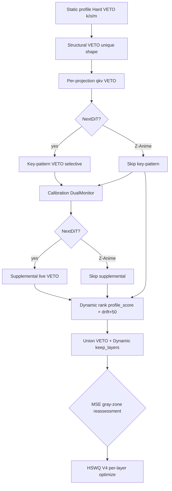

# HSWQ V1.92 → V2.0 – Detailed Improvements

This document explains all improvements from **V1.92** (`quantize_zib_hswq_v1.92.py`) to **V2.0** (`quantize_zib_hswq_v2.0.py`), based on the actual code diff (`git diff --no-index`: **+479 / −96 lines**).

**Script mapping**

| Version | File |
|---|---|
| V1.92 | `quantize_zib_hswq_v1.92.py` |
| V2.0 | `quantize_zib_hswq_v2.0.py` |

**Design shift (one sentence)**

V1.92 perfected **Z-Anime** (Diffusers I/O, BF16 keep, structural / per-projection qkv VETO, MSE release) but left **ZI / ZIB / ZIT and other NextDiT derivatives** on the older “profile Hard VETO + dynamic `keep_ratio` only” path. V2.0 promotes the Z-Anime lessons into a **universal Pure Autonomous Engine** for all NextDiT models—using **key patterns, live stats, and profile drift** instead of CLI flags or hardcoded layer-name lists.

---

## 0. What was wrong with V1.92 (problems)

### 0-1. NextDiT models lacked Z-Anime-grade FP16 targeting

In V1.92, **structural VETO**, **per-projection qkv VETO**, and **MSE-guided VETO release** run only inside `if is_zanime:` (see V1.92 `main()` ~L908–L1100). ZI, ZIB, ZIT, moodyRealMix, and other fused-key NextDiT checkpoints therefore had:

- No shape-uniqueness boundary protection
- No per-projection qkv abs_max check (fused qkv optimized as one tensor)
- No MSE trial to release borderline outlier-only VETO layers

Z-Anime-specific logic was proven; **generic NextDiT was under-protected**.

### 0-2. Blanket key-pattern VETO blew up file size

An intermediate experiment vetoed **every** `.attention.qkv`, `.feed_forward.w2`, `.adaLN_modulation`, and `.attention.out` layer. That pushed FP16 count so high that output approached **~9 GB** while SSIM stayed high—a bad trade (see V2.0 header comment referencing commit `ca87a38`). V2.0 replaces blanket veto with **selective** key-pattern rules (~6.6 GB reference at `keep_ratio=0.05`).

### 0-3. Profile vs live-weight mismatch was ignored for NextDiT

V1.92 `search_low` for non–Z-Anime models always used `upper_clip = 0.99`. Layers whose **live** weights drifted from the stored distribution profile (finetunes, merges, dtype-mixed checkpoints) could get a **1%-wide** HSWQ search window—effectively naive cast behavior.

V1.92 also ranked dynamic FP16 candidates with `profile_score = k + o*2 + m*0.5` only. Finetuned layers with shifted statistics but moderate profile numbers were **under-ranked** for FP16 protection.

### 0-4. Fused qkv quantization granularity

V1.92 optimized `.attention.qkv` as a **single** weight tensor for NextDiT (one `amax` for q+k+v). Z-Anime already split q/k/v for HSWQ and save. Per-projection outliers in one head could force suboptimal clipping on the other two.

### 0-5. MSE baseline sampling (Z-Anime path)

V1.92 used `random.sample` on all safe layers for MSE baseline. V2.0’s shared helper `_mse_grayzone_veto_reassessment` prefers **strided `feed_forward` layers** for a stabler MSE reference (NextDiT path); Z-Anime inline path still uses random sample (unchanged behavior).

---

## 1. V2.0 autonomous engine constants

New tunables centralize thresholds (no scattered magic numbers in `main()`).

### V1.92

*(No equivalent block — thresholds were inline, e.g. `5.0` for Z-Anime qkv, `40` for outlier.)*

### V2.0 (L359–366)

```python
# --- V2.0 autonomous engine tunables (no layer-name literals) ---
_DRIFT_VETO_THRESH = 0.5
_DRIFT_SENSITIVITY_MULT = 50.0
_QKV_PROJ_VETO_THRESH_ZANIME = 5.0
_QKV_PROJ_VETO_THRESH_DEFAULT = 4.5
_W2_OUTLIER_LIVE_THRESH = 40.0
_NEXTDIT_KP_BOUNDARY = (".cap_embedder.1", ".final_layer.linear", ".x_embedder")
_NEXTDIT_KP_PREFIX = "t_embedder."
```

### Meaning

| Constant | Role |
|---|---|
| `_DRIFT_VETO_THRESH` | Live vs profile drift above this → tighter `search_low`, supplemental VETO, or blocks MSE release |
| `_DRIFT_SENSITIVITY_MULT` | Adds `drift × 50` to dynamic FP16 ranking |
| `_QKV_PROJ_VETO_THRESH_*` | Per-projection abs_max limit (Z-Anime 5.0, NextDiT 4.5) |
| `_W2_OUTLIER_LIVE_THRESH` | Live `outlier_ratio` for w2 key-pattern / supplemental VETO |
| `_NEXTDIT_KP_*` | Key-pattern VETO targets (prefix / suffix), not full layer names |

---

## 2. Profile drift scoring and live weight stats

### Problem

Static profile JSON is computed once from the input checkpoint. At quantization time, **live** weights may differ (finetune, merge, partial BF16 storage). V1.92 never compared live vs profile for NextDiT.

### V2.0 — new helpers (full code)

```python
def _layer_weight_stats(tensor: torch.Tensor) -> tuple[float, float, float]:
    """Live kurtosis, outlier_ratio, abs_max for a weight tensor."""
    x = tensor.float()
    std = torch.std(x).item()
    amax = max(abs(x.min().item()), abs(x.max().item()))
    k = calculate_kurtosis(x)
    o = amax / std if std > 0 else 0.0
    return k, o, amax


def _weight_profile_drift(weight_tensor: torch.Tensor, prof: dict) -> float:
    """Relative drift between live weights and distribution profile (all models)."""
    if not prof:
        return 0.0
    lk, lo, lm = _layer_weight_stats(weight_tensor)
    pk = float(prof.get("kurtosis", 0) or 0)
    po = float(prof.get("outlier_ratio", 0) or 0)
    pm = float(prof.get("abs_max", 0) or 0)
    dk = abs(lk - pk) / max(pk, 1.0)
    do = abs(lo - po) / max(po, 1.0)
    dm = abs(lm - pm) / max(pm, 1e-6)
    return max(dk, do, dm)
```

### Application in `main()` — dynamic ranking (V2.0 L1306–1318)

**V1.92**

```python
profile_score = k + o * 2.0 + m * 0.5
layer_sensitivities.append((name, profile_score))
```

**V2.0**

```python
profile_score = k + o * 2.0 + m * 0.5
if name in _module_dict_sens:
    _mw = _module_dict_sens[name]
    if hasattr(_mw, "weight"):
        drift = _weight_profile_drift(_mw.weight.data, prof)
        profile_score += drift * 50.0
layer_sensitivities.append((name, profile_score))
```

### Meaning

Layers whose live statistics diverge from the profile gain priority in the **dynamic FP16 pool** (`keep_ratio`), even if static profile numbers look mild.

---

## 3. Gray-zone and drift cap on `search_low` (NextDiT)

### Problem

For NextDiT, V1.92 always capped `upper_clip` at **0.99**. “Gray-zone” layers (statistics just below Hard VETO thresholds) received almost no HSWQ search range. Z-Anime alone had `upper_clip = 0.90`.

### V1.92 `get_dynamic_search_low` (non–Z-Anime path, L636–661)

```python
def get_dynamic_search_low(name, weight_tensor):
    profile_key = name + ".weight"
    prof = model_profile.get(profile_key, model_profile.get(name, {})) if model_profile else {}
    # ... compute k_stat, o_ratio from prof or on-the-fly ...
    k_penalty = min(k_stat / 100.0, 0.49)
    o_penalty = min(o_ratio / 60.0, 0.49)
    upper_clip = 0.90 if is_zanime else 0.99
    return float(np.clip(0.50 + max(k_penalty, o_penalty), 0.50, upper_clip))
```

### V2.0 `get_dynamic_search_low` (L947–986)

```python
def get_dynamic_search_low(name, weight_tensor):
    profile_key = name + ".weight"
    prof = model_profile.get(profile_key, model_profile.get(name, {})) if model_profile else {}

    # Z-Anime: v1.92 path unchanged (is_zanime gate only).
    if is_zanime:
        if prof:
            k_stat = prof.get("kurtosis", 0)
            o_ratio = prof.get("outlier_ratio", 0)
        else:
            t_f32 = weight_tensor.float()
            k_stat = calculate_kurtosis(t_f32)
            std = torch.std(t_f32).item()
            abs_max = max(abs(t_f32.min().item()), abs(t_f32.max().item()))
            o_ratio = float(abs_max / std if std > 0 else 0)
        k_penalty = min(k_stat / 100.0, 0.49)
        o_penalty = min(o_ratio / 60.0, 0.49)
        upper_clip = 0.90 if is_zanime else 0.99
        return float(np.clip(0.50 + max(k_penalty, o_penalty), 0.50, upper_clip))

    if prof:
        k_stat = prof.get("kurtosis", 0)
        o_ratio = prof.get("outlier_ratio", 0)
        m_stat = prof.get("abs_max", 0)
    else:
        k_stat, o_ratio, m_stat = _layer_weight_stats(weight_tensor)

    k_penalty = min(k_stat / 100.0, 0.49)
    o_penalty = min(o_ratio / 60.0, 0.49)

    upper_clip = 0.99
    drift = _weight_profile_drift(weight_tensor, prof) if prof else 0.0
    in_gray = (
        (10 < k_stat <= 20)
        or (30 < o_ratio <= 40)
        or (5 < m_stat <= 20)
    )
    if in_gray or drift > _DRIFT_VETO_THRESH:
        upper_clip = 0.90
    return float(np.clip(0.50 + max(k_penalty, o_penalty), 0.50, upper_clip))
```

### Changes

| Item | V1.92 (NextDiT) | V2.0 (NextDiT) |
|---|---|---|
| `m_stat` in search_low | Not used | From profile or `_layer_weight_stats` |
| Gray-zone detection | None | `10<k≤20`, `30<o≤40`, `5<m≤20` |
| Drift tightening | None | `drift > 0.5` → `upper_clip = 0.90` |
| Z-Anime `search_low` | `upper_clip = 0.90` | **Unchanged** (explicit early return) |

### Meaning

Gray-zone and drift tightening widens the HSWQ amax search band (floor 0.50, cap 0.90 instead of 0.99) so the V4 optimizer can find a meaningful clip—not a near-identity cast.

---

## 4. Structural VETO — extended to all NextDiT models

### Problem

Shape-uniqueness VETO (boundary layers like `cap_embedder.1`, `final_layer.linear`) existed only for Z-Anime in V1.92.

### V1.92 (inline in `main()`, Z-Anime only, L908–932)

```python
if is_zanime:
    shape_count = {}
    for _n, _m in model.named_modules():
        if isinstance(_m, torch.nn.Linear):
            _shp = tuple(_m.weight.shape)
            shape_count[_shp] = shape_count.get(_shp, 0) + 1
    structural_veto = set()
    for _n, _m in model.named_modules():
        if isinstance(_m, torch.nn.Linear):
            _shp = tuple(_m.weight.shape)
            if shape_count[_shp] == 1 and _n not in hard_veto_layers:
                structural_veto.add(_n)
    if structural_veto:
        hard_veto_layers = hard_veto_layers.union(structural_veto)
```

### V2.0 — extracted helper (full code, L405–419)

```python
def _compute_structural_veto(model: nn.Module, hard_veto_layers: set) -> set:
    """Linear layers whose weight shape is unique within the model (boundary detection)."""
    shape_count: dict[tuple, int] = {}
    for _n, _m in model.named_modules():
        if isinstance(_m, torch.nn.Linear):
            _shp = tuple(_m.weight.shape)
            shape_count[_shp] = shape_count.get(_shp, 0) + 1
    structural_veto = set()
    for _n, _m in model.named_modules():
        if isinstance(_m, torch.nn.Linear):
            _shp = tuple(_m.weight.shape)
            if shape_count[_shp] == 1 and _n not in hard_veto_layers:
                structural_veto.add(_n)
                print(f"    [Structural VETO] {_n} shape={list(_shp)} (uniqueness=1)")
    return structural_veto
```

### V2.0 invocation (L1222–1251)

- **Z-Anime:** same as V1.92 (threshold unchanged), runs **before** calibration.
- **NextDiT:** same helper + per-projection qkv + key-pattern VETO.

### Meaning

No hardcoded layer names: **unique Linear weight shape** implies a structural boundary layer worth FP16 protection.

---

## 5. Per-projection `.attention.qkv` VETO — extended to all NextDiT

### Problem

Fused qkv weights concatenate q, k, v along dim 0. A single outlier projection can be masked in fused profile stats. V1.92 split-check was **Z-Anime only** at threshold **5.0**.

### V1.92 (inline, Z-Anime only, L942–961)

```python
if is_zanime:
    proj_veto = set()
    for _n, _m in model.named_modules():
        if isinstance(_m, torch.nn.Linear) and _n.endswith(".attention.qkv"):
            if _n in hard_veto_layers:
                continue
            _w = _m.weight.detach().float()
            _out_dim = _w.shape[0]
            if _out_dim % 3 != 0:
                continue
            _chunk = _out_dim // 3
            _amax = [_w[i * _chunk:(i + 1) * _chunk].abs().max().item() for i in range(3)]
            if max(_amax) > 5.0:
                proj_veto.add(_n)
    if proj_veto:
        hard_veto_layers = hard_veto_layers.union(proj_veto)
```

### V2.0 — full helper (L422–443)

```python
def _compute_per_projection_qkv_veto(
    model: nn.Module, hard_veto_layers: set, threshold: float
) -> set:
    """Auto-detect .attention.qkv via key pattern; VETO if any projection abs_max > threshold."""
    proj_veto = set()
    for _n, _m in model.named_modules():
        if not isinstance(_m, torch.nn.Linear) or not _n.endswith(".attention.qkv"):
            continue
        if _n in hard_veto_layers:
            continue
        _w = _m.weight.detach().float()
        _out_dim = _w.shape[0]
        if _out_dim % 3 != 0:
            continue
        _chunk = _out_dim // 3
        _amax = [_w[i * _chunk:(i + 1) * _chunk].abs().max().item() for i in range(3)]
        if max(_amax) > threshold:
            proj_veto.add(_n)
            _tags = ["to_q", "to_k", "to_v"]
            _hi = ", ".join(f"{t}={a:.2f}" for t, a in zip(_tags, _amax) if a > threshold)
            print(f"    [Per-Projection VETO] {_n} ({_hi})")
    return proj_veto
```

### V2.0 thresholds

| Model branch | Threshold constant | Value |
|---|---|---|
| Z-Anime | `_QKV_PROJ_VETO_THRESH_ZANIME` | 5.0 (same as V1.92) |
| NextDiT | `_QKV_PROJ_VETO_THRESH_DEFAULT` | 4.5 |

### Meaning

Detection uses **`.endswith(".attention.qkv")`** (key pattern), not a layer-name list. VETO applies on the **actual quantization unit** (per projection), consistent with Z-Anime split-save logic.

---

## 6. Selective NextDiT key-pattern VETO (new in V2.0)

### Problem

Profile Hard VETO misses some **boundary** and **embedding** layers. Blanket suffix veto for all qkv/w2/adaLN/out over-promotes FP16 and inflates file size.

### V2.0 — full helper (L369–402)

```python
def _compute_nextdit_keypattern_veto(model: nn.Module, hard_veto_layers: set) -> set:
    """Selective NextDiT key-pattern VETO (autonomous; no CLI flags).

    Reference ~6.6GB at r0.05: w2 fp8=32 fp16=1, qkv fp8=33 fp16=1.
    Blanket .attention.qkv / .feed_forward.w2 / .adaLN_modulation / .attention.out
    VETO inflates output to ~9GB while SSIM stays high. Keep boundary + t_embedder;
    w2 only when live outlier_ratio > 40. qkv/adaLN/out rely on profile hard_veto,
    structural VETO, and per-projection qkv.
    """
    added = set()
    for _n, _m in model.named_modules():
        if not isinstance(_m, torch.nn.Linear):
            continue
        if _n in hard_veto_layers:
            continue
        if _n.startswith(_NEXTDIT_KP_PREFIX):
            added.add(_n)
            print(f"    [Key-Pattern VETO] {_n} (t_embedder)")
            continue
        if _n.endswith(_NEXTDIT_KP_BOUNDARY):
            added.add(_n)
            print(f"    [Key-Pattern VETO] {_n} (boundary)")
            continue
        if _n.endswith(".feed_forward.w2"):
            _k, _o, _mstat = _layer_weight_stats(_m.weight.detach())
            if _o > _W2_OUTLIER_LIVE_THRESH:
                added.add(_n)
                print(
                    f"    [Key-Pattern VETO] {_n} "
                    f"(w2 outlier o={_o:.1f} > {_W2_OUTLIER_LIVE_THRESH})"
                )
    if added:
        print(f"  [Key-Pattern VETO] Added {len(added)} selective layers.")
    return added
```

### Meaning

| Pattern | Action |
|---|---|
| `t_embedder.*` prefix | Always VETO (time embedding path) |
| `.cap_embedder.1`, `.final_layer.linear`, `.x_embedder` suffix | Boundary VETO |
| `.feed_forward.w2` | VETO **only if live** `outlier_ratio > 40` |
| All other qkv / adaLN / out | Handled by profile + structural + per-projection VETO |

**Not used for Z-Anime** (`if not is_zanime` branch in `main()`).

---

## 7. Live supplemental VETO (NextDiT only)

### Problem

Profile JSON is static; some risky layers only appear in **live** weights (e.g. w2 outlier spike, t_embedder drift).

### V2.0 — full helper (L446–465)

```python
def _autonomous_supplemental_veto(
    model: nn.Module, hard_veto_layers: set, norm_profile: dict
) -> set:
    """Live VETO beyond profile: outlier-heavy w2, high-drift t_embedder (key patterns only)."""
    added = set()
    for _n, _m in model.named_modules():
        if not isinstance(_m, torch.nn.Linear):
            continue
        if _n in hard_veto_layers:
            continue
        prof = norm_profile.get(_n, {})
        drift = _weight_profile_drift(_m.weight.data, prof)
        _k, _o, _mstat = _layer_weight_stats(_m.weight.detach())
        if _n.endswith(".feed_forward.w2") and _o > _W2_OUTLIER_LIVE_THRESH:
            added.add(_n)
            print(f"    [Live VETO] {_n} (w2 outlier o={_o:.1f} > {_W2_OUTLIER_LIVE_THRESH})")
        elif _n.startswith("t_embedder.") and drift > _DRIFT_VETO_THRESH:
            added.add(_n)
            print(f"    [Live VETO] {_n} (t_embedder drift={drift:.3f} > {_DRIFT_VETO_THRESH})")
    return added
```

Called in `main()` after calibration when `not is_zanime` (L1297–1301).

### Meaning

Catches layers that **profile Hard VETO missed** but live statistics flag as risky—without hardcoding individual layer names.

---

## 8. MSE gray-zone VETO release (NextDiT universal)

### Problem

Static Hard VETO uses `o > 40` as a hard cutoff. Some w2 layers are outlier-heavy in profile but **quantize well** under HSWQ V4. V1.92 ran MSE release only for Z-Anime.

### V2.0 — release candidate collector (full code, L468–490)

```python
def _collect_mse_release_candidates(
    hard_veto_layers: set,
    structural_veto: set,
    norm_profile: dict,
    model: nn.Module,
) -> set:
    """Outlier-only profile VETO with low drift and non-structural — MSE release candidates."""
    candidates = set()
    _module_dict = dict(model.named_modules())
    for vname in hard_veto_layers:
        if vname in structural_veto:
            continue
        prof = norm_profile.get(vname, {})
        k = prof.get("kurtosis", 0)
        m = prof.get("abs_max", 0)
        o = prof.get("outlier_ratio", 0)
        if o > 40 and k <= 20 and m <= 20:
            vmod = _module_dict.get(vname)
            if vmod is not None and hasattr(vmod, "weight"):
                drift = _weight_profile_drift(vmod.weight.data, prof)
                if drift < _DRIFT_VETO_THRESH:
                    candidates.add(vname)
    return candidates
```

### V2.0 — shared reassessment (full code, L531–630)

```python
def _mse_grayzone_veto_reassessment(
    *,
    scope_label: str,
    hard_veto_layers: set,
    keep_layers: set,
    outlier_only_veto: set,
    target_modules: list,
    model: torch.nn.Module,
    _norm_profile: dict,
    get_layer_search_low,
    alpha: float,
    beta: float,
    device: str,
) -> tuple[set, set]:
    """Gray-zone VETO release via trial MSE (V2.0 universal; Z-Anime uses same helper)."""
    if not outlier_only_veto:
        return hard_veto_layers, keep_layers

    print(f"\n  [{scope_label} MSE-Guided Reassessment] {len(outlier_only_veto)} VETO layers are outlier-only (o>40, k<=20, m<=20).")
    print(f"  Trial-quantizing to measure actual HSWQ quantization error...")

    trial_optimizer = HSWQWeightedHistogramOptimizerV4(
        bins=8192, num_candidates=1000, refinement_iterations=10,
        device=device, alpha=alpha, beta=beta
    )

    safe_mses = []
    _module_dict = dict(model.named_modules())
    _safe_pool = [n for n in target_modules if n not in keep_layers and n in _module_dict]
    _safe_ff = [n for n in _safe_pool if "feed_forward" in n]
    step = max(1, len(_safe_ff) // 30)
    _safe_sample = _safe_ff[::step][:30]
    for sname in _safe_sample:
        smod = _module_dict[sname]
        if not hasattr(smod, "weight"):
            continue
        sw = smod.weight.data
        try:
            sresult = trial_optimizer.compute_optimal_amax_with_stats(
                sw, importance=None, use_svd_leverage=True, scaled=False
            )
            safe_mses.append(sresult["estimated_mse"])
        except Exception as e:
            print(f"    [MSE ERROR] Failed safe layer {sname}: {e}")
        torch.cuda.empty_cache()

    if not safe_mses:
        print(f"  [{scope_label} MSE-Guided Reassessment] No safe baseline available, skipping.")
        return hard_veto_layers, keep_layers

    safe_mses.sort()
    p75_idx = int(len(safe_mses) * 0.75)
    mse_threshold = safe_mses[min(p75_idx, len(safe_mses) - 1)] * 2.0
    print(
        f"  [MSE Baseline] Safe layers sampled: {len(safe_mses)}, "
        f"P75 MSE: {safe_mses[p75_idx]:.8f}, Threshold (2xP75): {mse_threshold:.8f}"
    )

    released = set()
    for vname in sorted(outlier_only_veto):
        if vname not in _module_dict:
            continue
        vmod = _module_dict[vname]
        if not hasattr(vmod, "weight"):
            continue
        vw = vmod.weight.data
        try:
            vresult = trial_optimizer.compute_optimal_amax_with_stats(
                vw, importance=None, use_svd_leverage=True, scaled=False
            )
            vmse = vresult["estimated_mse"]
            vprof = _norm_profile.get(vname, {})
            vor = vprof.get("outlier_ratio", 0)
            if vmse <= mse_threshold:
                released.add(vname)
                print(
                    f"    RELEASED: {vname} | MSE={vmse:.8f} <= threshold={mse_threshold:.8f} "
                    f"| o={vor:.1f} | amax={vresult['optimal_amax']:.4f}"
                )
            else:
                print(
                    f"    KEPT:     {vname} | MSE={vmse:.8f} >  threshold={mse_threshold:.8f} "
                    f"| o={vor:.1f}"
                )
        except Exception as e:
            print(f"    ERROR:    {vname} | {e}")
        torch.cuda.empty_cache()

    if released:
        hard_veto_layers = hard_veto_layers - released
        keep_layers = keep_layers - released
        print(
            f"  [{scope_label} MSE-Guided Reassessment] Released {len(released)} layers from VETO. "
            f"Remaining VETO: {len(hard_veto_layers)}."
        )
        print(f"  Updated FP16 kept layers: {len(keep_layers)}")
    else:
        print(f"  [{scope_label} MSE-Guided Reassessment] No layers released (all exceeded MSE threshold).")

    return hard_veto_layers, keep_layers
```

### V2.0 `main()` hook (L1427–1446)

```python
if not is_zanime:
    release_cands = _collect_mse_release_candidates(
        hard_veto_layers, structural_veto, _norm_profile, model
    )
    if keypattern_veto:
        release_cands -= keypattern_veto
    if release_cands:
        hard_veto_layers, keep_layers = _mse_grayzone_veto_reassessment(
            scope_label="V2.0",
            hard_veto_layers=hard_veto_layers,
            keep_layers=keep_layers,
            outlier_only_veto=release_cands,
            ...
        )
```

### Release rules (NextDiT)

| Condition | Effect |
|---|---|
| Static VETO **only** from `o > 40` (and `k≤20`, `m≤20`) | Candidate |
| In `structural_veto` | **Never** release |
| `drift ≥ 0.5` | **Never** release |
| In `keypattern_veto` | **Never** release |
| Trial MSE ≤ `2 × P75` of safe `feed_forward` sample | **Release** from VETO → quantize FP8 |

Z-Anime still uses the inline MSE block (same criteria as V1.92); not routed through `_collect_mse_release_candidates`.

---

## 9. NextDiT per-projection qkv HSWQ + fused Comfy save

### Problem

V1.92 used one `amax` for the entire fused qkv tensor on NextDiT. Z-Anime split q/k/v for optimization and Diffusers output.

### V2.0 — optimize (L1526–1551)

```python
if not is_zanime and name.endswith(".attention.qkv"):
    qkv_w = module.weight.data
    chunks = torch.chunk(qkv_w, 3, dim=0)
    if len(chunks) != 3 or any(c.shape[0] != chunks[0].shape[0] for c in chunks):
        # fallback: single fused amax
        ...
    else:
        amaxes = []
        for tag, chunk in zip(("q", "k", "v"), chunks):
            a = hswq_optimizer.compute_optimal_amax(
                chunk.contiguous(), importance,
                use_svd_leverage=True, scaled=False,
                search_range=layer_search_range,
            )
            amaxes.append(a)
        fused_qkv_split_amax[name] = tuple(amaxes)
    continue
```

### V2.0 — quantize helper (full code, L517–528)

```python
def _quantize_fused_qkv_chunks(
    qkv_weight: torch.Tensor,
    amaxes: tuple[float, float, float],
) -> torch.Tensor:
    """Per-projection clamp then re-fuse to Comfy .attention.qkv.weight."""
    chunks = torch.chunk(qkv_weight, 3, dim=0)
    out_chunks = []
    for chunk, amax in zip(chunks, amaxes):
        a = max(float(amax), 1e-6)
        fp8 = torch.clamp(chunk.contiguous().float(), -a, a).to(torch.float8_e4m3fn)
        out_chunks.append(fp8)
    return torch.cat(out_chunks, dim=0)
```

### V2.0 — save path (L1601–1607)

```python
if not is_zanime and module_name and module_name in fused_qkv_split_amax:
    fp8_fused = _quantize_fused_qkv_chunks(value, fused_qkv_split_amax[module_name])
    out_key = detected_prefix + stripped_key
    output_state_dict[out_key] = fp8_fused
    _emit_quant_meta(output_state_dict, detected_prefix + module_name)
    continue
```

### Meaning

| Aspect | Z-Anime (unchanged) | NextDiT (V2.0) |
|---|---|---|
| HSWQ unit | Per projection (to_q, to_k, to_v) | Per projection (q, k, v chunks) |
| Output keys | Diffusers split (`to_q` / `to_k` / `to_v`) | **Single** Comfy `.attention.qkv.weight` |
| amax | Three separate values | Three values applied per chunk, then **re-concatenated** |

ComfyUI / Lumina loaders keep fused qkv keys; quantization quality improves without breaking the key layout.

---

## 10. VETO pipeline order change

### V1.92

1. Load model → calibrate (DualMonitor) → **then** Z-Anime structural + qkv VETO  
2. Rank sensitivity → MSE (Z-Anime only) → optimize

### V2.0

1. Load model → **structural + per-projection qkv (+ key-pattern for NextDiT)**  
2. Calibrate (DualMonitor)  
3. Supplemental VETO (NextDiT) → rank with drift → MSE release  
4. Optimize

### Meaning

Structural and qkv VETO no longer depend on calibration hooks. They use **loaded weights** only. Calibration still feeds DualMonitor / channel importance for HSWQ V4, not for VETO set membership.

---

## 11. `load_zit_model` — BF16 fraction note

### V2.0 addition (L350–356, L655–662)

```python
def _bf16_weight_fraction(stripped_state_dict) -> float:
    """Fraction of .weight tensors stored as bfloat16 (metadata-only, no GPU)."""
    weights = [v for k, v in stripped_state_dict.items() if k.endswith(".weight")]
    if not weights:
        return 0.0
    bf16_n = sum(1 for v in weights if v.dtype == torch.bfloat16)
    return bf16_n / len(weights)
```

```python
bf16_frac = _bf16_weight_fraction(stripped_state_dict)
if not is_zanime and bf16_frac >= 0.5:
    print(
        f"  [Note] CKPT weights are {bf16_frac * 100:.0f}% BF16; "
        f"calibration stays {inference_dtype} (v1.92-proven moody/ZIT path)."
    )
```

### Meaning

Some NextDiT checkpoints store many weights as BF16 on disk but still calibrate in **FP16** (V1.92-proven path). V2.0 documents this explicitly; behavior is unchanged.

---

## 12. Parts that did NOT change

The following remain **identical or Z-Anime-guarded** (same as V1.92):

| Component | Notes |
|---|---|
| Static profile Hard VETO (`k>20`, `o>40`, `m>20`) | Same thresholds in `derive_hswq_strategy` |
| Profile key normalization (`ZIT_PREFIXES` strip) | Unchanged |
| Z-Anime profile bridge (`_is_zanime_profile`, `_convert_zanime_profile_to_nextdit`) | Unchanged |
| Z-Anime attention fuse / denormalize (`_fuse_zanime_attention`, `normalize_zanime_keys`, `_denormalize_zanime_output`) | Unchanged |
| Alpha / Beta derivation (`k_factor`, `alpha + beta = 1`) | Unchanged |
| DualMonitor + NaN/Inf guards | Unchanged |
| HSWQ V4 optimizer (`bins=8192`, `candidates=1000`, SVD leverage) | Unchanged |
| V1 FP8 output format (`comfy_quant`, `weight_scale=1.0`, `scaled=False`) | Unchanged |
| Z-Anime BF16 keep path + Diffusers output layout | Unchanged |
| Z-Anime MSE outlier-only release (inline in `main`) | Same criteria; not using `_collect_mse_release_candidates` |
| `keep_ratio` | Still **CLI** `--keep_ratio` only (not hardcoded in engine) |
| SageAttention2 | Removed in earlier release (not reintroduced) |

---

## 13. VETO / FP16 decision flow (V2.0)



---

## 14. File size vs quality trade-off (documented in code)

| Strategy | Approx. FP16 qkv / w2 (reference) | Output size (reference) |
|---|---|---|
| Selective key-pattern + structural + profile VETO (V2.0) | w2 fp16≈1, qkv fp16≈1 | **~6.6 GB** @ `keep_ratio=0.05` |
| Blanket qkv/w2/adaLN/out VETO (reverted) | Most boundary layers FP16 | **~9 GB** |

SSIM can remain high in both cases; V2.0 optimizes for **smaller FP16 footprint** without sacrificing the autonomous detection rules.

---

## 15. Migration guide

| Task | V1.92 | V2.0 |
|---|---|---|
| Script name | `quantize_zib_hswq_v1.92.py` | `quantize_zib_hswq_v2.0.py` |
| Z-Anime | Supported (primary tuning target) | Supported (**same** BF16 / Diffusers / thresholds) |
| ZI / ZIB / ZIT | Profile VETO + dynamic keep only | **+** structural, per-projection qkv, drift, gray-zone `search_low`, MSE release, selective key-pattern |
| CLI flags for layer names | None | **Still none** (autonomous key patterns only) |
| `keep_ratio` | `--keep_ratio` (e.g. 0.05–0.25) | Same |

---

## 16. Related documents

- [V1.9 → V1.92 Changes](V1.9_to_V1.92_Changes.md) — Hard VETO, profile normalization, dynamic pool exclusion  
- [HSWQ Hybrid Overview](HSWQ_ Hybrid Sensitivity Weighted Quantization.md) — §8 V2.0 Pure Autonomous Engine summary  
- **Quantizer source:** `quantize_zib_hswq_v2.0.py` (canonical V2.0 implementation)

---

*Generated from `git diff --no-index quantize_zib_hswq_v1.92.py quantize_zib_hswq_v2.0.py` in repository `ussoewwin/Hybrid-Sensitivity-Weighted-Quantization`.*
