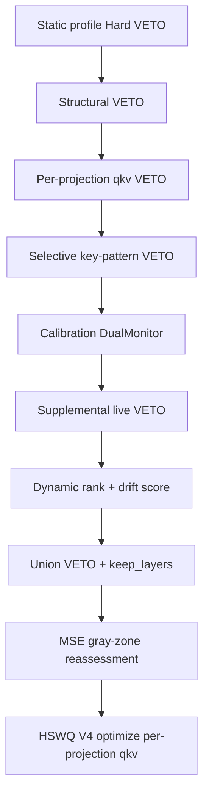

# HSWQ V1.92 → V2.0 — moodyRealMix V6/V7 Case and Engine Evolution

This document records **why V2.0 exists**, **what was analyzed on moodyRealMix_zitV6DPO vs moodyRealMix_zitV7**, **what countermeasures were tried**, and **what changed in code** from `quantize_zib_hswq_v1.92.py` to `quantize_zib_hswq_v2.0.py`.

**Scope:** fused-key **NextDiT / ZIT** checkpoints (moodyRealMix V6/V7, ZI, ZIB, ZIT, other finetunes on the same ComfyUI key layout).  
**Not in scope here:** unrelated checkpoint families with different tensor layouts or I/O conventions.

**Script mapping**

| Version | File |
|---|---|
| V1.92 | `quantize_zib_hswq_v1.92.py` |
| V1.93 (interim, renamed) | evolved on `main` as `quantize_zib_hswq_v1.93.py` → **`quantize_zib_hswq_v2.0.py`** (`6792b60`) |
| V2.0 | `quantize_zib_hswq_v2.0.py` |

Code diff (`git diff --no-index`): **+479 / −96 lines**.

---

## Document map (read this first)

| Question | Sections | What you get |
|---|---|---|
| **What was the problem?** | **§1–§4** | moodyRealMix_zitV7 + V1.92 + `--keep_ratio 0.05` → SSIM **~0.88**; why V6 survives (**0.9919**) but V7 does not; layer-level evidence (`final_layer`, `cap_embedder`, qkv 33/34 FP8). |
| **How was it fixed?** | **§5**, **§8** | Iteration table (blanket VETO → selective → Pure Autonomous V2 → V2.0 rename); cloud SSIM/size stages (**0.8839 → 0.9988/~9 GB → 0.9972/~6.8 GB**); design constraints (no filename flags, no hardcoded keep ratio). |
| **Full added/changed code + meaning** | **§6** | **33** code blocks = full `git diff` excerpts from `quantize_zib_hswq_v1.92.py` → `quantize_zib_hswq_v2.0.py`; **no `...` omissions**; each block has **`**Notes:**`** explaining moody / default NextDiT impact. |
| Shared core unchanged | **§7** | Profile Hard VETO, HSWQ V4, V1 FP8 format, `--keep_ratio` CLI. |
| Run V2.0 | **§10** | CLI example and migration table. |
| Analysis tooling | **§9** | `test/_analyze_v7_hswq_meta.py` and related scripts. |

**One-line root cause:** On the **default fused-key NextDiT path**, V1.92 only applied static profile Hard VETO + dynamic FP16 pool; V7’s harder weights left boundary/qkv layers in FP8 and collapsed SSIM. **V2.0** moves structural VETO, per-projection qkv VETO, selective key-pattern VETO, drift scoring, supplemental live VETO, and MSE gray-zone release onto that path **without** moody-only CLI flags or layer-name lists.

---

## 1. Problem statement (moody V7 run)

| Item | Fact |
|---|---|
| Target | **moodyRealMix_zitV7** quantized with **V1.92** at **`--keep_ratio 0.05`** |
| Observed SSIM | **Below 0.9** (~**0.88** band) |
| Reference output | `zit_hswq_r32_r0.05_v1.safetensors` (~6737 MB; same 413 weight keys/shapes as V7 base) |
| Comparison | **moodyRealMix_zitV6DPO** at same V1.92 + **r0.05** → SSIM **0.9919** |
| Official FP8 floor | V7 Official FP8 SSIM **0.8731** ([`test/benchmark_zit.md`](../benchmark%20result/benchmark_zit.md)) |

**Goal:** parse checkpoint metadata, explain why V7 collapses under V1.92, and improve the quantizer toward **SSIM ≥ 0.95**. **`keep_ratio` is a CLI option** (e.g. 0.05), not a fixed constant in engine logic.

**Important:** the benchmark table also lists **moodyRealMix_zitV7 @ r0.0 → SSIM 0.9976**. That is a **different successful HSWQ run** (more FP16 kept). It is **not** the failing **r0.05 + V1.92** case that triggered this work.

---

## 2. Published benchmark rows (moody V6 / V7)

From [`test/benchmark_zit.md`](../benchmark%20result/benchmark_zit.md) (source: `benchmark result/score_zi.txt`):

| Model | Keep ratio | HSWQ SSIM | Official FP8 SSIM | Δ SSIM (Official − HSWQ) |
|---|---|---|---|---|
| moodyRealMix_zitV6DPO | r0.05 | **0.9919** | 0.9899 | −0.0020 |
| moodyRealMix_zitV7 | r0.0 | **0.9976** | 0.8731 | −0.1245 |

V6 at **r0.05** sits at **0.99** with V1.92. V7’s **official** baseline is already **~0.11 SSIM below** V6 official (**0.9899** vs **0.8731**). V1.92 on V7 at **r0.05** fell into that **~0.88** band—i.e. **naive / official-FP8 quality**, not a small regression.

---

## 3. Analysis chronology (moody V6 vs V7)

### 3-1. Identify the failing artifact

Local inspection (session):

- `moodyRealMix_zitV7.safetensors` and `zit_hswq_r32_r0.05_v1.safetensors`: **413** common `.weight` keys, **identical shapes**.
- V7 base and v1 output: **BF16 100%** on weights (not “V6=FP16 / V7=BF16”).
- v1 output dtype split: **FP8 171** / **FP16 242**; fused `.attention.qkv`: **FP8 33** / **FP16 1** (only `layers.29` stayed FP16).

Script: `test/_analyze_v7_hswq_meta.py`.

### 3-2. Wrong early assumption (retracted)

Early comparison of `moodyRealMix_zitV6_distribution_profile.json` vs `V7` claimed **“profiles almost identical”** because:

- 208 layers; summary buckets (vulnerable 9 / semi 11 / stable 188) matched
- **hard_veto flag tuple changes: 0**
- **Dynamic FP16 keep @ r0.05: same 9 layers**

That was **misleading**. Same profile buckets do **not** imply same SSIM or same optimal FP16 targets.

### 3-3. Corrected V6 vs V7 comparison

Scripts: `test/_compare_v6_v7_profile.py`, `test/_dynamic_keep_diff.py`, `test/_search_low_diff.py`, `test/_v6_v7_veto_analysis.py`, `test/_gray_zone_v6_v7.py`, `test/_dtype_compare_v6_v7.py`.

| Check | V6 vs V7 |
|---|---|
| Profile JSON: four stats exactly equal | **8 / 208** layers only |
| Mean kurtosis (profile) | V6 **4.632** / V7 **4.631** |
| Raw weights: `max_rel>1%` or `mean_rel>0.1%` | **200 / 413** layers |
| Example | `layers.28.attention.qkv`: **mean_rel ≈ 20%** |
| Cosine similarity (30 random layers) | min **~0.9995**, mean **~1.0** (same architecture, different finetune) |
| `search_low` numeric drift | **152 / 208** layers differ, but deltas **~1e−4** (not primary SSIM driver) |
| Dynamic keep @ r0.05 | **Identical 9-layer set** (no swap) |

**Conclusion split:**

1. **Primary:** V7 checkpoint is **harder to quantize** (official FP8 **0.8731** proves a low ceiling independent of HSWQ).
2. **Secondary:** V1.92 left **boundary / qkv layers in FP8** on V7 that V6 tolerates at the same engine settings.
3. **Rejected as main story:** dtype mismatch V6/V7, profile bucket identity, dynamic keep reordering, `search_low` micro-drift alone.

### 3-4. V7 v1.92 output — layers implicated

From `test/_analyze_v7_hswq_meta.py` (V7 base stats × v1 output dtype):

| Layer pattern | V7 base signal | V1.92 output |
|---|---|---|
| `final_layer.linear` | kurtosis **5.97** | **FP8** |
| `cap_embedder.1` | k=**3.38**, outlier **30.1** | **FP8** |
| `.attention.qkv` (34 blocks) | per-projection outliers in several layers | **FP8 33** / FP16 **1** (`layers.29`: q amax **6.12** → FP16) |
| Profile hard_veto layers (43) | k/o/m over static thresholds | **All kept FP16** (static veto worked) |

V1.92 on the **default NextDiT path** applied only:

- Static profile **Hard VETO** (`k>20`, `o>40`, `m>20`)
- **Dynamic FP16 pool** from `keep_ratio` + `profile_score`

It did **not** apply on that path:

- Structural VETO (unique `Linear` shape → FP16)
- Per-projection fused **qkv** `abs_max` check
- Gray-zone tighter `search_low` (`upper_clip` **0.90**)
- MSE-guided release for borderline outlier-only veto layers
- Live weight vs profile **drift** scoring

Those protections existed in V1.92 only on the **`is_zanime=True` branch** (Z-Anime detection path), not on the **default fused-key NextDiT path** that moody V6/V7 use.

---

## 4. Why V1.92 fails V7 at r0.05 (one paragraph)

**moodyRealMix_zitV7** uses the **default fused-key NextDiT pipeline** in V1.92. That path quantizes `.attention.qkv` as **one tensor** (single `amax`), keeps gray-zone layers at **`upper_clip=0.99`**, and never runs structural / per-projection / MSE FP16 targeting. V6 survives that minimal stack at **0.9919**; V7’s weight statistics and lower official-FP8 ceiling do not—output lands near **0.88**, matching official FP8 (**0.8731**).

---

## 5. Countermeasure timeline (v1.93 interim → V2.0)

### Phase A — `quantize_zib_hswq_v1.93.py` on `main` (moody-focused iterations)

| Commit | Intent |
|---|---|
| `aa00d07` | First v1.93; BF16-base auto calibration (**reverted**—V6 is also BF16 100% and still **0.9919**) |
| `f7e2617` | moody file detect + enhanced VETO (structural + per-projection qkv) |
| `d543287` | **V7-only** enhanced path inside v1.93 |
| `e83cafc` | **`--moody-v7` CLI**; drop basename auto-detect |
| `30b98ee` | Wire **key-pattern hard VETO** into `main()` |
| `ca87a38` | **Selective** w2 VETO (avoid ~9 GB blanket FP16) |
| `d6755f0` | **Pure Autonomous V2** — remove moody CLI flags; add drift/MSE/key-pattern stack for all NextDiT |
| `f43100f` | Restore **selective** key-pattern after blanket VETO regression (~9 GB) |
| `d6a27fc` | Remove committed V6/V7 profile JSON from repo (local analysis artifacts) |
| `6792b60` | Rename **`quantize_zib_hswq_v1.93.py` → `quantize_zib_hswq_v2.0.py`**; archive ZIT v1.6 script |

### Phase B — Cloud benchmark runs (V7, r0.05)

**Source:** Console `ZIT FP8 BENCHMARK RESULTS` output pasted during v1.93 cloud runs (session transcript `98a4cd24-805b-484d-adef-7f57bf51f40b`). **Not** in [`test/benchmark_zit.md`](../benchmark%20result/benchmark_zit.md) or `benchmark result/score_zi.txt` — cite as interim cloud measurements only.

| Stage | SSIM | VRAM / file size | Notes |
|---|---|---|---|
| V1.92 output re-bench | **0.8839** | FP8 ~7293 MB | Confirms ~0.88 band |
| V1.9 engine + **blanket** key-pattern VETO | **0.9988** | **~9.7 GB** (~9 GB class) | SSIM high, **unacceptable size** |
| After **selective** VETO (`ca87a38` / `f43100f` line) | **0.9972** | FP8 ~7481 MB (~**6.8 GB** file) | High SSIM (~0.99) at acceptable file size |

Design constraints for V2.0:

- **No filename-dependent settings** → no `--moody-v7`, no basename-only rules in final engine
- **`r0.05` is a CLI option** → no hard-coded keep ratio in logic
- **Moody-only CLI flags removed** → verified in `d6755f0` / V2.0

### Phase C — V2.0 naming (`6792b60`)

Interim v1.93 autonomous engine renamed to **V2.0**; ZIT quantizer v1.6 moved to `archives/`.  
Doc-only follow-ups: `cae18f0`, `9b237f4`; unauthorized CHANGELOG/md edits reverted in `a2ce8e8`.

---

## 6. V1.92 → V2.0: full added/changed code and notes (moody / default NextDiT path)

This section maps to `git diff --no-index quantize_zib_hswq_v1.92.py quantize_zib_hswq_v2.0.py` (**+479 / −96 lines**). It lists **every new or changed V2.0 source block** with no `...` omissions.
Line numbers refer to **`quantize_zib_hswq_v2.0.py`**. Where contrast is needed, the **full matching V1.92 block** is shown too.

**moody V6/V7 execution path:** after `detect_and_strip_prefix`, the **fused `.attention.qkv` NextDiT** branch (`is_zanime=False` / `else` in `main()`).

### 6-0. Module docstring (replacement)

**V1.92 (L1–11)**
```python
"""
Z-Image Base (Non-Turbo) FP8 Quantization - HSWQ V1.9 (Pure Data-Driven Autonomous Engine)
Target Model: Z-Image Base (e.g., UR03: moodyWildV0200001.UR03.safetensors)

Design Philosophy:
  1. Mandatory Analysis: Relies on weight distribution profiles (Kurtosis, Outlier Ratio).
     Automatically triggers analysis/analyze_zib_distribution.py if profile is missing.
  2. Autonomous Strategy: No hardcoded Alpha/Beta. Derived from global model statistics.
  3. Dynamic Protection: Individual layer search ranges (search_low) decided by local stats.
  4. Environment Agnostic: Relative pathing for scripts and profiles (Cloud/Local support).
"""
```

**V2.0 (L1–21) — V2.0 design spelled out in docstring**
```python
"""
Z-Image Base (Non-Turbo) FP8 Quantization - HSWQ V2.0 (Pure Autonomous Engine)
Target Model: Z-Image Base / NextDiT derivatives (ZI, ZIB, ZIT, moodyRealMix, etc.)

V2.0 — no model-specific CLI flags or layer-name lists:
  1. Profile drift scoring on all layers (sensitivity + gray-zone search_low cap).
  2. Structural VETO (unique Linear weight shape) on all NextDiT models.
  3. Per-projection .attention.qkv VETO on all NextDiT models.
  4. NextDiT key-pattern VETO: boundary + t_embedder.* + outlier-heavy w2 only
     (NOT blanket qkv/w2/adaLN/out — that inflates output to ~9GB; see ca87a38).
  5. Live supplemental VETO (outlier-heavy w2, high-drift t_embedder.*).
  6. MSE gray-zone RELEASE only when o-only AND drift < 0.5 AND not structural/key-pattern.
  Z-Anime: Diffusers I/O, BF16 keep path, profile bridge — unchanged.

Design Philosophy:
  1. Mandatory Analysis: Relies on weight distribution profiles (Kurtosis, Outlier Ratio).
     Automatically triggers analysis/analyze_zib_distribution.py if profile is missing.
  2. Autonomous Strategy: No hardcoded Alpha/Beta. Derived from global model statistics.
  3. Dynamic Protection: Individual layer search ranges (search_low) decided by local stats.
  4. Environment Agnostic: Relative pathing for scripts and profiles (Cloud/Local support).
"""
```

**Notes:**
- V2.0 documents **no filename rules, no CLI layer-name lists, no moody-only flags** in the docstring.
- NextDiT models get drift / structural / per-projection qkv / selective key-pattern / supplemental / MSE release / per-projection qkv optimization. Moody-only CLI flags were removed in `d6755f0`.

### 6-1. New: `_bf16_weight_fraction` and V2.0 constant block (V2.0 L350–366)
```python
def _bf16_weight_fraction(stripped_state_dict) -> float:
    """Fraction of .weight tensors stored as bfloat16 (metadata-only, no GPU)."""
    weights = [v for k, v in stripped_state_dict.items() if k.endswith(".weight")]
    if not weights:
        return 0.0
    bf16_n = sum(1 for v in weights if v.dtype == torch.bfloat16)
    return bf16_n / len(weights)


# --- V2.0 autonomous engine tunables (no layer-name literals) ---
_DRIFT_VETO_THRESH = 0.5
_DRIFT_SENSITIVITY_MULT = 50.0
_QKV_PROJ_VETO_THRESH_ZANIME = 5.0
_QKV_PROJ_VETO_THRESH_DEFAULT = 4.5
_W2_OUTLIER_LIVE_THRESH = 40.0
_NEXTDIT_KP_BOUNDARY = (".cap_embedder.1", ".final_layer.linear", ".x_embedder")
_NEXTDIT_KP_PREFIX = "t_embedder."
```

**Notes:**
- `_bf16_weight_fraction`: logs when the checkpoint is BF16-heavy but **calibration stays FP16** (V1.92 behavior). The `aa00d07` BF16-calibration auto-switch was reverted.
- `_DRIFT_VETO_THRESH=0.5`: profile vs live relative drift above this marks gray-zone (`upper_clip=0.90`) and feeds supplemental VETO / MSE candidate checks.
- `_QKV_PROJ_VETO_THRESH_DEFAULT=4.5`: fused qkv per-chunk `abs_max` threshold on the moody / default NextDiT path (separate from the `is_zanime` constant `_QKV_PROJ_VETO_THRESH_ZANIME = 5.0` in source).
- `_NEXTDIT_KP_*`: **selective** key-pattern VETO (boundary suffixes, `t_embedder.` prefix, live outlier w2) instead of blanket qkv/w2 VETO (`ca87a38` / `f43100f`).

### 6-2. New: `_compute_nextdit_keypattern_veto` (V2.0 L369–402)
```python
def _compute_nextdit_keypattern_veto(model: nn.Module, hard_veto_layers: set) -> set:
    """Selective NextDiT key-pattern VETO (autonomous; no CLI flags).

    Reference ~6.6GB at r0.05: w2 fp8=32 fp16=1, qkv fp8=33 fp16=1.
    Blanket .attention.qkv / .feed_forward.w2 / .adaLN_modulation / .attention.out
    VETO inflates output to ~9GB while SSIM stays high. Keep boundary + t_embedder;
    w2 only when live outlier_ratio > 40. qkv/adaLN/out rely on profile hard_veto,
    structural VETO, and per-projection qkv.
    """
    added = set()
    for _n, _m in model.named_modules():
        if not isinstance(_m, torch.nn.Linear):
            continue
        if _n in hard_veto_layers:
            continue
        if _n.startswith(_NEXTDIT_KP_PREFIX):
            added.add(_n)
            print(f"    [Key-Pattern VETO] {_n} (t_embedder)")
            continue
        if _n.endswith(_NEXTDIT_KP_BOUNDARY):
            added.add(_n)
            print(f"    [Key-Pattern VETO] {_n} (boundary)")
            continue
        if _n.endswith(".feed_forward.w2"):
            _k, _o, _mstat = _layer_weight_stats(_m.weight.detach())
            if _o > _W2_OUTLIER_LIVE_THRESH:
                added.add(_n)
                print(
                    f"    [Key-Pattern VETO] {_n} "
                    f"(w2 outlier o={_o:.1f} > {_W2_OUTLIER_LIVE_THRESH})"
                )
    if added:
        print(f"  [Key-Pattern VETO] Added {len(added)} selective layers.")
    return added
```

**Notes:**
- For moody, FP16 only `cap_embedder.1`, `final_layer.linear`, `x_embedder`, `t_embedder.*`, and `.feed_forward.w2` with live outlier>40. Blanket VETO reached ~9 GB / SSIM 0.9988; selective reached ~6.8 GB / 0.9972 (cloud benchmark run).

### 6-3. New: `_compute_structural_veto` (V2.0 L405–419)
```python
def _compute_structural_veto(model: nn.Module, hard_veto_layers: set) -> set:
    """Linear layers whose weight shape is unique within the model (boundary detection)."""
    shape_count: dict[tuple, int] = {}
    for _n, _m in model.named_modules():
        if isinstance(_m, torch.nn.Linear):
            _shp = tuple(_m.weight.shape)
            shape_count[_shp] = shape_count.get(_shp, 0) + 1
    structural_veto = set()
    for _n, _m in model.named_modules():
        if isinstance(_m, torch.nn.Linear):
            _shp = tuple(_m.weight.shape)
            if shape_count[_shp] == 1 and _n not in hard_veto_layers:
                structural_veto.add(_n)
                print(f"    [Structural VETO] {_n} shape={list(_shp)} (uniqueness=1)")
    return structural_veto
```

**Notes:**
- FP16 for `Linear` layers whose weight shape appears exactly once (boundary layers). V1.92 kept this inline in `main()` after calibration on the `is_zanime=True` path only; V2.0 functionizes it and runs **before calibration on default NextDiT**.

### 6-4. New: `_compute_per_projection_qkv_veto` (V2.0 L422–443)
```python
def _compute_per_projection_qkv_veto(
    model: nn.Module, hard_veto_layers: set, threshold: float
) -> set:
    """Auto-detect .attention.qkv via key pattern; VETO if any projection abs_max > threshold."""
    proj_veto = set()
    for _n, _m in model.named_modules():
        if not isinstance(_m, torch.nn.Linear) or not _n.endswith(".attention.qkv"):
            continue
        if _n in hard_veto_layers:
            continue
        _w = _m.weight.detach().float()
        _out_dim = _w.shape[0]
        if _out_dim % 3 != 0:
            continue
        _chunk = _out_dim // 3
        _amax = [_w[i * _chunk:(i + 1) * _chunk].abs().max().item() for i in range(3)]
        if max(_amax) > threshold:
            proj_veto.add(_n)
            _tags = ["to_q", "to_k", "to_v"]
            _hi = ", ".join(f"{t}={a:.2f}" for t, a in zip(_tags, _amax) if a > threshold)
            print(f"    [Per-Projection VETO] {_n} ({_hi})")
    return proj_veto
```

**Notes:**
- Auto-detect via `.endswith(".attention.qkv")`; FP16 if any q/k/v chunk exceeds the threshold. Explains V7 v1.92 output where only `layers.29` stayed FP16 (q amax>5) while 33/34 qkv stayed FP8.

### 6-5. New: `_autonomous_supplemental_veto` (V2.0 L446–465)
```python
def _autonomous_supplemental_veto(
    model: nn.Module, hard_veto_layers: set, norm_profile: dict
) -> set:
    """Live VETO beyond profile: outlier-heavy w2, high-drift t_embedder (key patterns only)."""
    added = set()
    for _n, _m in model.named_modules():
        if not isinstance(_m, torch.nn.Linear):
            continue
        if _n in hard_veto_layers:
            continue
        prof = norm_profile.get(_n, {})
        drift = _weight_profile_drift(_m.weight.data, prof)
        _k, _o, _mstat = _layer_weight_stats(_m.weight.detach())
        if _n.endswith(".feed_forward.w2") and _o > _W2_OUTLIER_LIVE_THRESH:
            added.add(_n)
            print(f"    [Live VETO] {_n} (w2 outlier o={_o:.1f} > {_W2_OUTLIER_LIVE_THRESH})")
        elif _n.startswith("t_embedder.") and drift > _DRIFT_VETO_THRESH:
            added.add(_n)
            print(f"    [Live VETO] {_n} (t_embedder drift={drift:.3f} > {_DRIFT_VETO_THRESH})")
    return added
```

**Notes:**
- After calibration, add VETO from live stats not in the static profile: w2 outlier>40, `t_embedder.*` drift>0.5.

### 6-6. New: `_collect_mse_release_candidates` (V2.0 L468–490)
```python
def _collect_mse_release_candidates(
    hard_veto_layers: set,
    structural_veto: set,
    norm_profile: dict,
    model: nn.Module,
) -> set:
    """Outlier-only profile VETO with low drift and non-structural — MSE release candidates."""
    candidates = set()
    _module_dict = dict(model.named_modules())
    for vname in hard_veto_layers:
        if vname in structural_veto:
            continue
        prof = norm_profile.get(vname, {})
        k = prof.get("kurtosis", 0)
        m = prof.get("abs_max", 0)
        o = prof.get("outlier_ratio", 0)
        if o > 40 and k <= 20 and m <= 20:
            vmod = _module_dict.get(vname)
            if vmod is not None and hasattr(vmod, "weight"):
                drift = _weight_profile_drift(vmod.weight.data, prof)
                if drift < _DRIFT_VETO_THRESH:
                    candidates.add(vname)
    return candidates
```

**Notes:**
- Among static VETO layers, pick outlier-only (o>40, k≤20, m≤20) candidates outside structural VETO and with drift<0.5 for MSE trial. Excludes key-pattern VETO layers.

### 6-7. New: `_layer_weight_stats` (V2.0 L493–500)
```python
def _layer_weight_stats(tensor: torch.Tensor) -> tuple[float, float, float]:
    """Live kurtosis, outlier_ratio, abs_max for a weight tensor."""
    x = tensor.float()
    std = torch.std(x).item()
    amax = max(abs(x.min().item()), abs(x.max().item()))
    k = calculate_kurtosis(x)
    o = amax / std if std > 0 else 0.0
    return k, o, amax
```

**Notes:**
- Live kurtosis / outlier_ratio / abs_max.

### 6-8. New: `_weight_profile_drift` (V2.0 L503–514)
```python
def _weight_profile_drift(weight_tensor: torch.Tensor, prof: dict) -> float:
    """Relative drift between live weights and distribution profile (all models)."""
    if not prof:
        return 0.0
    lk, lo, lm = _layer_weight_stats(weight_tensor)
    pk = float(prof.get("kurtosis", 0) or 0)
    po = float(prof.get("outlier_ratio", 0) or 0)
    pm = float(prof.get("abs_max", 0) or 0)
    dk = abs(lk - pk) / max(pk, 1.0)
    do = abs(lo - po) / max(po, 1.0)
    dm = abs(lm - pm) / max(pm, 1e-6)
    return max(dk, do, dm)
```

**Notes:**
- Max relative drift of k/o/m between profile JSON and live weights. Scores finetuned layers (V7) where profile and live weights diverge.

### 6-9. New: `_quantize_fused_qkv_chunks` (V2.0 L517–528)
```python
def _quantize_fused_qkv_chunks(
    qkv_weight: torch.Tensor,
    amaxes: tuple[float, float, float],
) -> torch.Tensor:
    """Per-projection clamp then re-fuse to Comfy .attention.qkv.weight."""
    chunks = torch.chunk(qkv_weight, 3, dim=0)
    out_chunks = []
    for chunk, amax in zip(chunks, amaxes):
        a = max(float(amax), 1e-6)
        fp8 = torch.clamp(chunk.contiguous().float(), -a, a).to(torch.float8_e4m3fn)
        out_chunks.append(fp8)
    return torch.cat(out_chunks, dim=0)
```

**Notes:**
- Clamp q/k/v separately, then re-fuse while keeping Comfy `.attention.qkv.weight` keys.

### 6-10. New: `_mse_grayzone_veto_reassessment` (V2.0 L531–630)
```python
def _mse_grayzone_veto_reassessment(
    *,
    scope_label: str,
    hard_veto_layers: set,
    keep_layers: set,
    outlier_only_veto: set,
    target_modules: list,
    model: torch.nn.Module,
    _norm_profile: dict,
    get_layer_search_low,
    alpha: float,
    beta: float,
    device: str,
) -> tuple[set, set]:
    """Gray-zone VETO release via trial MSE (V2.0 universal; Z-Anime uses same helper)."""
    if not outlier_only_veto:
        return hard_veto_layers, keep_layers

    print(f"\n  [{scope_label} MSE-Guided Reassessment] {len(outlier_only_veto)} VETO layers are outlier-only (o>40, k<=20, m<=20).")
    print(f"  Trial-quantizing to measure actual HSWQ quantization error...")

    trial_optimizer = HSWQWeightedHistogramOptimizerV4(
        bins=8192, num_candidates=1000, refinement_iterations=10,
        device=device, alpha=alpha, beta=beta
    )

    safe_mses = []
    _module_dict = dict(model.named_modules())
    _safe_pool = [n for n in target_modules if n not in keep_layers and n in _module_dict]
    _safe_ff = [n for n in _safe_pool if "feed_forward" in n]
    step = max(1, len(_safe_ff) // 30)
    _safe_sample = _safe_ff[::step][:30]
    for sname in _safe_sample:
        smod = _module_dict[sname]
        if not hasattr(smod, "weight"):
            continue
        sw = smod.weight.data
        try:
            sresult = trial_optimizer.compute_optimal_amax_with_stats(
                sw, importance=None, use_svd_leverage=True, scaled=False
            )
            safe_mses.append(sresult["estimated_mse"])
        except Exception as e:
            print(f"    [MSE ERROR] Failed safe layer {sname}: {e}")
        torch.cuda.empty_cache()

    if not safe_mses:
        print(f"  [{scope_label} MSE-Guided Reassessment] No safe baseline available, skipping.")
        return hard_veto_layers, keep_layers

    safe_mses.sort()
    p75_idx = int(len(safe_mses) * 0.75)
    mse_threshold = safe_mses[min(p75_idx, len(safe_mses) - 1)] * 2.0
    print(
        f"  [MSE Baseline] Safe layers sampled: {len(safe_mses)}, "
        f"P75 MSE: {safe_mses[p75_idx]:.8f}, Threshold (2xP75): {mse_threshold:.8f}"
    )

    released = set()
    for vname in sorted(outlier_only_veto):
        if vname not in _module_dict:
            continue
        vmod = _module_dict[vname]
        if not hasattr(vmod, "weight"):
            continue
        vw = vmod.weight.data
        try:
            vresult = trial_optimizer.compute_optimal_amax_with_stats(
                vw, importance=None, use_svd_leverage=True, scaled=False
            )
            vmse = vresult["estimated_mse"]
            vprof = _norm_profile.get(vname, {})
            vor = vprof.get("outlier_ratio", 0)
            if vmse <= mse_threshold:
                released.add(vname)
                print(
                    f"    RELEASED: {vname} | MSE={vmse:.8f} <= threshold={mse_threshold:.8f} "
                    f"| o={vor:.1f} | amax={vresult['optimal_amax']:.4f}"
                )
            else:
                print(
                    f"    KEPT:     {vname} | MSE={vmse:.8f} >  threshold={mse_threshold:.8f} "
                    f"| o={vor:.1f}"
                )
        except Exception as e:
            print(f"    ERROR:    {vname} | {e}")
        torch.cuda.empty_cache()

    if released:
        hard_veto_layers = hard_veto_layers - released
        keep_layers = keep_layers - released
        print(
            f"  [{scope_label} MSE-Guided Reassessment] Released {len(released)} layers from VETO. "
            f"Remaining VETO: {len(hard_veto_layers)}."
        )
        print(f"  Updated FP16 kept layers: {len(keep_layers)}")
    else:
        print(f"  [{scope_label} MSE-Guided Reassessment] No layers released (all exceeded MSE threshold).")

    return hard_veto_layers, keep_layers
```

**Notes:**
- Shared MSE gray-zone release for NextDiT (V1.92 had this inline on the `is_zanime=True` path only). Uses safe-layer P75×2 as threshold to release outlier-only static VETO. moody path logs `scope_label="V2.0"`.

### 6-11. Change: `derive_hswq_strategy` signature and docstring (V2.0 L913–926)

**V1.92 (L606–615)**
```python
def derive_hswq_strategy(model_profile, is_zanime=False):
    """
    [Pure Data-Driven Engine]
    Derives Alpha/Beta from global model statistics and returns a continuous
    evaluation function that decides per-layer search_low without hardcoded thresholds.

    is_zanime: when True, relax the search_low upper clip from 0.99 to 0.90 so the
    gray-zone layers (k/o below VETO threshold but above stable range) actually receive
    a meaningful HSWQ search range. ZI/ZIB/ZIT (is_zanime=False) keeps the original 0.99.
    """
```

**V2.0 (L913–926)**
```python
def derive_hswq_strategy(
    model_profile,
    is_zanime=False,
    use_bf16_calibration=False,
):
    """
    [Pure Data-Driven Engine]
    Derives Alpha/Beta from global model statistics and returns a continuous
    evaluation function that decides per-layer search_low without hardcoded thresholds.

    use_bf16_calibration: Z-Anime only — upper_clip 0.90.
    NextDiT (ZI/ZIB/ZIT/derivatives): gray-zone or profile drift tightens upper_clip.
    keep_ratio is NOT fixed here — it is supplied at runtime via --keep_ratio.
    """
```

**Notes:**
- Adds `use_bf16_calibration` for the `is_zanime=True` branch path only. moody / default NextDiT always passes `False`. `--keep_ratio` remains a runtime CLI argument (not hardcoded here).

### 6-11b. Change: `get_dynamic_search_low` inside `derive_hswq_strategy` (NextDiT / moody)

**V1.92 — NextDiT always `upper_clip = 0.99` (L636–661)**
```python
    def get_dynamic_search_low(name, weight_tensor):
        profile_key = name + ".weight"
        prof = model_profile.get(profile_key, model_profile.get(name, {})) if model_profile else {}
        
        if prof:
            k_stat = prof.get("kurtosis", 0)
            o_ratio = prof.get("outlier_ratio", 0)
        else:
            # If profile entry is missing, compute statistics on-the-fly instead of falling back to a fixed default
            t_f32 = weight_tensor.float()
            k_stat = calculate_kurtosis(t_f32)
            std = torch.std(t_f32).item()
            abs_max = max(abs(t_f32.min().item()), abs(t_f32.max().item()))
            o_ratio = float(abs_max / std if std > 0 else 0)
            
        # Remove ad-hoc if/else thresholds and use a continuous mathematical mapping.
        # Map kurtosis (<=100) and outlier ratio (<=60) into a continuous range 0.50–0.99.
        k_penalty = min(k_stat / 100.0, 0.49)
        o_penalty = min(o_ratio / 60.0, 0.49)
        
        # Use 0.50 as the base and raise the protection line according to the strongest abnormality.
        # Z-Anime: cap at 0.90 so that gray-zone layers (k/o just below VETO threshold) keep a
        # real HSWQ search range instead of being clipped to a 1%-wide window (=naive cast).
        # ZI/ZIB/ZIT (is_zanime=False): cap stays at 0.99 to preserve the existing behavior.
        upper_clip = 0.90 if is_zanime else 0.99
        return float(np.clip(0.50 + max(k_penalty, o_penalty), 0.50, upper_clip))
```

**V2.0 — explicit `is_zanime` branch; NextDiT uses gray-zone or drift → `upper_clip = 0.90` (L947–986)**
```python
    def get_dynamic_search_low(name, weight_tensor):
        profile_key = name + ".weight"
        prof = model_profile.get(profile_key, model_profile.get(name, {})) if model_profile else {}

        # Z-Anime: v1.92 path unchanged (is_zanime gate only).
        if is_zanime:
            if prof:
                k_stat = prof.get("kurtosis", 0)
                o_ratio = prof.get("outlier_ratio", 0)
            else:
                t_f32 = weight_tensor.float()
                k_stat = calculate_kurtosis(t_f32)
                std = torch.std(t_f32).item()
                abs_max = max(abs(t_f32.min().item()), abs(t_f32.max().item()))
                o_ratio = float(abs_max / std if std > 0 else 0)
            k_penalty = min(k_stat / 100.0, 0.49)
            o_penalty = min(o_ratio / 60.0, 0.49)
            upper_clip = 0.90 if is_zanime else 0.99
            return float(np.clip(0.50 + max(k_penalty, o_penalty), 0.50, upper_clip))

        if prof:
            k_stat = prof.get("kurtosis", 0)
            o_ratio = prof.get("outlier_ratio", 0)
            m_stat = prof.get("abs_max", 0)
        else:
            k_stat, o_ratio, m_stat = _layer_weight_stats(weight_tensor)

        k_penalty = min(k_stat / 100.0, 0.49)
        o_penalty = min(o_ratio / 60.0, 0.49)

        upper_clip = 0.99
        drift = _weight_profile_drift(weight_tensor, prof) if prof else 0.0
        in_gray = (
            (10 < k_stat <= 20)
            or (30 < o_ratio <= 40)
            or (5 < m_stat <= 20)
        )
        if in_gray or drift > _DRIFT_VETO_THRESH:
            upper_clip = 0.90
        return float(np.clip(0.50 + max(k_penalty, o_penalty), 0.50, upper_clip))
```

**Notes:**
- V7 layers like `cap_embedder.1` (k≈3.38, o≈30) and gray-zone qkv kept `upper_clip=0.99` under V1.92, giving a narrow search window (near naive cast). V2.0 sets **0.90** when **10<k≤20 / 30<o≤40 / 5<m≤20** or **drift>0.5**. `use_bf16_calibration` applies only on the `is_zanime=True` path (unused on moody).

### 6-12. Change: `load_zit_model` — calibration dtype and return tuple (V2.0 L658–727)

**V1.92 (L364–420)**
```python
    # Z-Image: stays in FP16 (proven 0.95+ SSIM path).
    # Z-Anime: native BF16 base. Down-casting to FP16 before HSWQ calibration
    # collapses dynamic range on adaLN/outlier-heavy layers, so HSWQ ends up
    # picking optimal amax against already-degraded weights. Keep BF16 end-to-end
    # for Z-Anime calibration; HSWQ histogram+SVD path is unchanged.
    inference_dtype = torch.bfloat16 if is_zanime else torch.float16
    print(f"  [Calibration dtype] {inference_dtype} ({'Z-Anime BF16 path' if is_zanime else 'Z-Image FP16 path'})")
    
    nextdit_kwargs = {}
    if zit_config.get("qk_norm"):
        nextdit_kwargs["qk_norm"] = True
    model = NextDiT(
        patch_size=2,
        in_channels=16,
        dim=zit_config["hidden_size"],
        n_layers=zit_config["num_layers"],
        n_refiner_layers=zit_config["num_context_refiner"],
        n_heads=zit_config["hidden_size"] // 128,
        n_kv_heads=zit_config["hidden_size"] // 128,
        multiple_of=256,
        ffn_dim_multiplier=ffn_multiplier,
        norm_eps=1e-5,
        cap_feat_dim=2560,
        z_image_modulation=True,
        pad_tokens_multiple=64,
        device="cpu",
        dtype=inference_dtype,
        operations=ops,
        **nextdit_kwargs,
    )
    
    print("Loading Weights...")
    converted_state_dict = {}
    for key, value in stripped_state_dict.items():
        if is_zanime:
            converted_state_dict[key] = value
        else:
            if value.dtype == torch.bfloat16:
                converted_state_dict[key] = value.to(torch.float16)
            else:
                converted_state_dict[key] = value
            
    missing, unexpected = model.load_state_dict(converted_state_dict, strict=False)
    matched = len(converted_state_dict) - len(unexpected)
    match_rate = matched / len(converted_state_dict) if len(converted_state_dict) > 0 else 0
    print(f"  [Keys] Matched: {matched}, Missing: {len(missing)}, Unexpected: {len(unexpected)} (Rate: {match_rate*100:.1f}%)")
    
    # [Physical safeguard] Abort immediately if key match rate is too low to avoid quantizing effectively random weights
    if match_rate < 0.5:
        print("\n[FATAL ERROR] Key match rate is abnormally low (< 50%).")
        print("Due to prefix mismatch, weights are effectively random. Quantizing in this state will only produce garbage.")
        print("Please double-check your arguments and model structure.")
        sys.exit(1)
    
    model = model.to(device).to(inference_dtype)
    model.eval()
    return model, original_state_dict, stripped_state_dict, zit_config, detected_prefix, is_zanime, zanime_reverse_map, inference_dtype
```

**V2.0 (L658–727)**
```python
    # Z-Image / NextDiT: FP16 calibration (keep_ratio via --keep_ratio CLI, e.g. 0.05).
    # Z-Anime only: BF16 end-to-end calibration.
    use_bf16_calibration = is_zanime
    inference_dtype = torch.bfloat16 if is_zanime else torch.float16
    calib_label = "Z-Anime BF16 path" if is_zanime else "Z-Image FP16 path"
    bf16_frac = _bf16_weight_fraction(stripped_state_dict)
    if not is_zanime and bf16_frac >= 0.5:
        print(
            f"  [Note] CKPT weights are {bf16_frac * 100:.0f}% BF16; "
            f"calibration stays {inference_dtype} (v1.92-proven moody/ZIT path)."
        )
    print(f"  [Calibration dtype] {inference_dtype} ({calib_label})")
    
    nextdit_kwargs = {}
    if zit_config.get("qk_norm"):
        nextdit_kwargs["qk_norm"] = True
    model = NextDiT(
        patch_size=2,
        in_channels=16,
        dim=zit_config["hidden_size"],
        n_layers=zit_config["num_layers"],
        n_refiner_layers=zit_config["num_context_refiner"],
        n_heads=zit_config["hidden_size"] // 128,
        n_kv_heads=zit_config["hidden_size"] // 128,
        multiple_of=256,
        ffn_dim_multiplier=ffn_multiplier,
        norm_eps=1e-5,
        cap_feat_dim=2560,
        z_image_modulation=True,
        pad_tokens_multiple=64,
        device="cpu",
        dtype=inference_dtype,
        operations=ops,
        **nextdit_kwargs,
    )
    
    print("Loading Weights...")
    converted_state_dict = {}
    for key, value in stripped_state_dict.items():
        if is_zanime:
            converted_state_dict[key] = value
        elif value.dtype == torch.bfloat16:
            converted_state_dict[key] = value.to(torch.float16)
        else:
            converted_state_dict[key] = value
            
    missing, unexpected = model.load_state_dict(converted_state_dict, strict=False)
    matched = len(converted_state_dict) - len(unexpected)
    match_rate = matched / len(converted_state_dict) if len(converted_state_dict) > 0 else 0
    print(f"  [Keys] Matched: {matched}, Missing: {len(missing)}, Unexpected: {len(unexpected)} (Rate: {match_rate*100:.1f}%)")
    
    # [Physical safeguard] Abort immediately if key match rate is too low to avoid quantizing effectively random weights
    if match_rate < 0.5:
        print("\n[FATAL ERROR] Key match rate is abnormally low (< 50%).")
        print("Due to prefix mismatch, weights are effectively random. Quantizing in this state will only produce garbage.")
        print("Please double-check your arguments and model structure.")
        sys.exit(1)
    
    model = model.to(device).to(inference_dtype)
    model.eval()
    return (
        model,
        original_state_dict,
        stripped_state_dict,
        zit_config,
        detected_prefix,
        is_zanime,
        zanime_reverse_map,
        inference_dtype,
    )
```

**Notes:**
- On moody, `inference_dtype=torch.float16` matches V1.92. Adds `_bf16_weight_fraction` logging, `calib_label`, a comment that `--keep_ratio` is CLI-only, and multi-line return formatting. BF16→FP16 weight load logic is equivalent.

### 6-12b. Change: `main()` — strategy + model load (V2.0 L1205–1220)

**V1.92 (L880–881)**
```python
    alpha, beta, get_layer_search_low, hard_veto_layers = derive_hswq_strategy(model_profile, is_zanime=is_zanime_profile_flag)
    model, original_state_dict, stripped_state_dict, zit_config, detected_prefix, is_zanime, zanime_reverse_map, inference_dtype = load_zit_model(args.input, device, args.comfy_path)
```

**V2.0 (L1205–1220; moody skips profile bridge L1199–1204 because `is_zanime_profile_flag=False`)**
```python
    use_bf16_cal_precheck = is_zanime_profile_flag
    alpha, beta, get_layer_search_low, hard_veto_layers = derive_hswq_strategy(
        model_profile,
        is_zanime=is_zanime_profile_flag,
        use_bf16_calibration=use_bf16_cal_precheck,
    )
    (
        model,
        original_state_dict,
        stripped_state_dict,
        zit_config,
        detected_prefix,
        is_zanime,
        zanime_reverse_map,
        inference_dtype,
    ) = load_zit_model(args.input, device, args.comfy_path)
```

**Notes:**
- V1.92: one-liner `derive` then `load_zit_model`. V2.0: passes `use_bf16_calibration` into strategy, formats the return tuple, then continues to **pre-calibration VETO (§6-13)**. On moody, `is_zanime_profile_flag=False` → `use_bf16_cal_precheck=False`, so §6-11b gray-zone/drift branch is active.

### 6-13. Add: `main()` — V2.0 autonomous VETO right after model load (V2.0 L1222–1251)

**V1.92:** this block **does not exist** (structural / per-projection qkv lived inline after calibration on the `is_zanime=True` path only).

**V2.0 — full block (`if is_zanime` / `else`; moody uses `else`)**
```python
    # --- V2.0 autonomous VETO (all NextDiT; Z-Anime keeps separate thresholds) ---
    structural_veto: set = set()
    keypattern_veto: set = set()
    if is_zanime:
        structural_veto = _compute_structural_veto(model, hard_veto_layers)
        if structural_veto:
            hard_veto_layers = hard_veto_layers.union(structural_veto)
            print(f"  [Z-Anime Structural VETO] Added {len(structural_veto)} layers (total VETO: {len(hard_veto_layers)}).")
        proj_veto = _compute_per_projection_qkv_veto(
            model, hard_veto_layers, _QKV_PROJ_VETO_THRESH_ZANIME
        )
        if proj_veto:
            hard_veto_layers = hard_veto_layers.union(proj_veto)
            print(f"  [Z-Anime Per-Projection VETO] Added {len(proj_veto)} qkv layers (total VETO: {len(hard_veto_layers)}).")
    else:
        print("  [V2.0 Autonomous VETO] Structural + per-projection qkv + live supplemental.")
        structural_veto = _compute_structural_veto(model, hard_veto_layers)
        if structural_veto:
            hard_veto_layers = hard_veto_layers.union(structural_veto)
            print(f"  [Structural VETO] Added {len(structural_veto)} unique-shape layers (total VETO: {len(hard_veto_layers)}).")
        proj_veto = _compute_per_projection_qkv_veto(
            model, hard_veto_layers, _QKV_PROJ_VETO_THRESH_DEFAULT
        )
        if proj_veto:
            hard_veto_layers = hard_veto_layers.union(proj_veto)
            print(f"  [Per-Projection VETO] Added {len(proj_veto)} qkv layers (total VETO: {len(hard_veto_layers)}).")
        keypattern_veto = _compute_nextdit_keypattern_veto(model, hard_veto_layers)
        if keypattern_veto:
            hard_veto_layers = hard_veto_layers.union(keypattern_veto)
            print(f"  [Key-Pattern VETO] hard_veto total: {len(hard_veto_layers)}.")
```

**Notes:**
- On moody, **before calibration**: structural → per-projection qkv (4.5) → selective key-pattern extend `hard_veto_layers`. Under V1.92, V7 could keep `final_layer.linear` / `cap_embedder.1` in FP8.

### 6-14. Add: `main()` — supplemental VETO and drift-weighted sensitivity (V2.0 L1297–1319)
```python
    if not is_zanime:
        _supp = _autonomous_supplemental_veto(model, hard_veto_layers, _norm_profile)
        if _supp:
            hard_veto_layers = hard_veto_layers.union(_supp)
            print(f"  [Supplemental VETO] Added {len(_supp)} layers (total VETO: {len(hard_veto_layers)}).")

    # Exclude VETO layers from the Dynamic pool (they are always FP16, so Dynamic budget should go elsewhere)
    _module_dict_sens = dict(model.named_modules())
    layer_sensitivities = []
    for name in target_modules:
        if name in hard_veto_layers:
            continue  # Remove VETO layers from the candidate pool
        prof = _norm_profile.get(name, {})
        k = prof.get("kurtosis", 0)
        o = prof.get("outlier_ratio", 0)
        m = prof.get("abs_max", 0)
        profile_score = k + o * 2.0 + m * 0.5
        if name in _module_dict_sens:
            _mw = _module_dict_sens[name]
            if hasattr(_mw, "weight"):
                drift = _weight_profile_drift(_mw.weight.data, prof)
                profile_score += drift * 50.0
        layer_sensitivities.append((name, profile_score))
```

**V1.92 contrast (L984–994, no drift term)**
```python
    # Exclude VETO layers from the Dynamic pool (they are always FP16, so Dynamic budget should go elsewhere)
    layer_sensitivities = []
    for name in target_modules:
        if name in hard_veto_layers:
            continue  # Remove VETO layers from the candidate pool
        prof = _norm_profile.get(name, {})
        k = prof.get("kurtosis", 0)
        o = prof.get("outlier_ratio", 0)
        m = prof.get("abs_max", 0)
        profile_score = k + o * 2.0 + m * 0.5
        layer_sensitivities.append((name, profile_score))
```

**Notes:**
- After calibration, live stats can add FP16 layers; dynamic ranking adds **drift×50**. Surfaces finetuned layers that static profile scores alone would under-rank.

### 6-15. Add: `main()` — NextDiT MSE gray-zone reassessment (V2.0 L1427–1446)
```python
    if not is_zanime:
        release_cands = _collect_mse_release_candidates(
            hard_veto_layers, structural_veto, _norm_profile, model
        )
        if keypattern_veto:
            release_cands -= keypattern_veto
        if release_cands:
            hard_veto_layers, keep_layers = _mse_grayzone_veto_reassessment(
                scope_label="V2.0",
                hard_veto_layers=hard_veto_layers,
                keep_layers=keep_layers,
                outlier_only_veto=release_cands,
                target_modules=target_modules,
                model=model,
                _norm_profile=_norm_profile,
                get_layer_search_low=get_layer_search_low,
                alpha=alpha,
                beta=beta,
                device=device,
            )
```

**V1.92:** MSE reassessment only on the **`is_zanime=True` path** (L1003–1099 inline). Not present on default NextDiT / moody.

**Notes:**
- For outlier-only static VETO layers, trial MSE below safe-layer P75×2 releases back to FP8. Excludes `keypattern_veto` layers so structural/key-pattern protections are not undone by MSE.

### 6-16. Add: `main()` — NextDiT per-projection qkv optimization (V2.0 L1526–1551)
```python
            # NextDiT (non Z-Anime): per-projection amax, fused Comfy qkv save.
            if not is_zanime and name.endswith(".attention.qkv"):
                qkv_w = module.weight.data
                chunks = torch.chunk(qkv_w, 3, dim=0)
                if len(chunks) != 3 or any(c.shape[0] != chunks[0].shape[0] for c in chunks):
                    print(f"  [WARN] qkv split mismatch at {name}; falling back to fused amax.")
                    optimal_amax = hswq_optimizer.compute_optimal_amax(
                        qkv_w, importance,
                        use_svd_leverage=True, scaled=False,
                        search_range=layer_search_range,
                    )
                    weight_amax_dict[name + ".weight"] = optimal_amax
                else:
                    print(f"  [HSWQ-qkv] {name:50} | per-projection | search_range={layer_search_range[0]:.3f}-{layer_search_range[1]:.3f}")
                    amaxes = []
                    for tag, chunk in zip(("q", "k", "v"), chunks):
                        a = hswq_optimizer.compute_optimal_amax(
                            chunk.contiguous(), importance,
                            use_svd_leverage=True, scaled=False,
                            search_range=layer_search_range,
                        )
                        amaxes.append(a)
                        print(f"    [HSWQ-qkv]   {tag}: amax={a:.6f}")
                    fused_qkv_split_amax[name] = tuple(amaxes)
                torch.cuda.empty_cache()
                continue
```

**V1.92 — NextDiT used a single fused amax (no dedicated branch; one tensor in the main loop)**

**Notes:**
- Runs HSWQ V4 separately on q/k/v and stores amax in `fused_qkv_split_amax`. V1.92 single amax let one hot projection drag all three; a major reason 33/34 qkv stayed FP8 on V7.

### 6-17. Add: `main()` — NextDiT fused qkv save (V2.0 L1601–1607)
```python
        # NextDiT: fused qkv FP8 with per-projection amax (Comfy key unchanged).
        if not is_zanime and module_name and module_name in fused_qkv_split_amax:
            fp8_fused = _quantize_fused_qkv_chunks(value, fused_qkv_split_amax[module_name])
            out_key = detected_prefix + stripped_key
            output_state_dict[out_key] = fp8_fused
            _emit_quant_meta(output_state_dict, detected_prefix + module_name)
            continue
```

**V1.92:** no equivalent (qkv used the same single-amax path as other layers).

**Notes:**
- Keeps Comfy key `.attention.qkv.weight` while saving FP8 built from per-projection amax values.

### 6-18. V1.92 inline code moved into functions (reference)

V1.92 `main()` L908–963 held structural / per-projection qkv **only on the `is_zanime=True` path, after calibration**. V2.0 moves this into §6-2–6-4 functions and runs it on **default NextDiT (moody) at L1222+**.

**V1.92 inline (`is_zanime=True` path only, L908–963)**
```python
    # [Z-Anime Structural VETO] Identify Linear layers whose weight shape is unique
    # within the model. These are typically boundary / projection layers (e.g.
    # cap_embedder.1 [3840, 2560] for text->DiT bridge, final_layer.linear [64, 3840]
    # for output projection) that the data-driven (k/o/m) thresholds may miss but
    # which strongly affect SSIM. No layer names are hardcoded; selection is purely
    # structural via shape uniqueness over Linear weights of the loaded model.
    # Guarded by is_zanime so ZI/ZIB/ZIT behavior is strictly unchanged.
    if is_zanime:
        shape_count = {}
        for _n, _m in model.named_modules():
            if isinstance(_m, torch.nn.Linear):
                _shp = tuple(_m.weight.shape)
                shape_count[_shp] = shape_count.get(_shp, 0) + 1
        structural_veto = set()
        for _n, _m in model.named_modules():
            if isinstance(_m, torch.nn.Linear):
                _shp = tuple(_m.weight.shape)
                if shape_count[_shp] == 1 and _n not in hard_veto_layers:
                    structural_veto.add(_n)
                    print(f"    [Structural VETO] {_n} shape={list(_shp)} (uniqueness=1)")
        if structural_veto:
            hard_veto_layers = hard_veto_layers.union(structural_veto)
            print(f"  [Z-Anime Structural VETO] Added {len(structural_veto)} unique-shape layers (total VETO: {len(hard_veto_layers)}).")
        else:
            print(f"  [Z-Anime Structural VETO] No additional unique-shape layers found.")

    # [Z-Anime Per-Projection qkv VETO] Auto-detect attention.qkv layers via key
    # pattern (no hardcoded layer names) and split the fused weight into to_q /
    # to_k / to_v chunks. If any per-projection abs_max exceeds the FP8 E4M3
    # safe range threshold (m > 5.0, same magnitude scale as the existing
    # data-driven m > 20 hard_veto), add the qkv layer to hard_veto_layers.
    # Per-projection split is the same operation already performed during
    # quantization for is_zanime, so the threshold is applied on the actual
    # quantization unit, not the fused statistic.
    if is_zanime:
        proj_veto = set()
        for _n, _m in model.named_modules():
            if isinstance(_m, torch.nn.Linear) and _n.endswith(".attention.qkv"):
                if _n in hard_veto_layers:
                    continue
                _w = _m.weight.detach().float()
                _out_dim = _w.shape[0]
                if _out_dim % 3 != 0:
                    continue
                _chunk = _out_dim // 3
                _amax = [_w[i * _chunk:(i + 1) * _chunk].abs().max().item() for i in range(3)]
                if max(_amax) > 5.0:
                    proj_veto.add(_n)
                    _tags = ["to_q", "to_k", "to_v"]
                    _hi = ", ".join(f"{t}={a:.2f}" for t, a in zip(_tags, _amax) if a > 5.0)
                    print(f"    [Per-Projection VETO] {_n} ({_hi})")
        if proj_veto:
            hard_veto_layers = hard_veto_layers.union(proj_veto)
            print(f"  [Z-Anime Per-Projection VETO] Added {len(proj_veto)} qkv layers (total VETO: {len(hard_veto_layers)}).")
        else:
            print(f"  [Z-Anime Per-Projection VETO] No qkv layer exceeds per-projection abs_max threshold.")
```

### 6-19. Change: `main()` banner text (V2.0 L1101–1104)

**V1.92 (L776–779)**
```python
    device = "cuda" if torch.cuda.is_available() else "cpu"
    print("=" * 60)
    print("HSWQ V1.9 Autonomous Engine (Environment-Aware Analysis)")
    print("=" * 60)
```

**V2.0 (L1101–1104)**
```python
    device = "cuda" if torch.cuda.is_available() else "cpu"
    print("=" * 60)
    print("HSWQ V2.0 Pure Autonomous Engine (Environment-Aware Analysis)")
    print("=" * 60)
```

**Notes:**
- Log banner only; no logic change.

### 6-20. Add: before optimize loop — NextDiT qkv policy and `fused_qkv_split_amax` (V2.0 L1465–1474)

**V1.92 (L1119–1123)**
```python
    print("\n[HSWQ V1.9 Autonomous Engine] Starting Optimization...")
    if is_zanime:
        print("  [Z-Anime] qkv layers will be split into to_q / to_k / to_v and HSWQ-optimized individually.")
    weight_amax_dict = {}
    # Z-Anime only: per-layer split-amax map for qkv -> to_q/to_k/to_v.
```

**V2.0 (L1465–1474)**
```python
    print("\n[HSWQ V1.9 Autonomous Engine] Starting Optimization...")
    if is_zanime:
        print("  [Z-Anime] qkv layers will be split into to_q / to_k / to_v and HSWQ-optimized individually.")
    elif not is_zanime:
        print("  [NextDiT] qkv: per-projection HSWQ; output stays fused .attention.qkv.weight (Comfy).")
    weight_amax_dict = {}
    # Z-Anime only: per-layer split-amax map for qkv -> to_q/to_k/to_v.
    # Maps internal qkv module name to (amax_q, amax_k, amax_v).
    zanime_qkv_split_amax = {}
    fused_qkv_split_amax = {}
```

**Notes:**
- On moody (`elif not is_zanime`), logs that fused Comfy keys are kept while running per-projection HSWQ. `fused_qkv_split_amax` is filled in §6-16 and consumed in §6-17.

### 6-21. Change: `keep_dtype` comment on save (V2.0 L1572–1573)

**V1.92 (L1196–1198)**
```python
    # Z-Image keep layers: FP16 (legacy proven path).
    # Z-Anime keep layers: BF16 (matches official FP8 distribution baseline; required for SSIM >= 0.95).
    keep_dtype = torch.bfloat16 if is_zanime else torch.float16
```

**V2.0 (L1572–1573)**
```python
    # ZI/ZIB/ZIT / NextDiT: keep FP16. Z-Anime BF16 path: keep BF16.
    keep_dtype = torch.bfloat16 if is_zanime else torch.float16
```

**Notes:**
- moody / default NextDiT keep layers stay **FP16** (`keep_dtype=torch.float16`). Same behavior as V1.92; comment generalized for NextDiT.

---

## 7. What did NOT change (shared core)

| Component | V1.92 → V2.0 |
|---|---|
| Static profile Hard VETO thresholds (`k>20`, `o>40`, `m>20`) | Same |
| `ZIT_PREFIXES` profile key normalization | Same |
| Alpha / Beta derivation | Same |
| DualMonitor + NaN/Inf guards | Same |
| HSWQ V4 optimizer core | Same |
| V1 FP8 save format (`comfy_quant`, `weight_scale=1.0`, `scaled=False`) | Same |
| `--keep_ratio` | CLI only (unchanged) |
| SageAttention2 | Not reintroduced |

---

## 8. VETO decision flow (V2.0 — default NextDiT)



---

## 9. Analysis scripts (repository)

| Script | Role |
|---|---|
| `test/_analyze_v7_hswq_meta.py` | V7 base vs `zit_hswq_r32_r0.05_v1` dtype/stats |
| `test/_compare_v6_v7_profile.py` | Profile JSON + raw weight diff |
| `test/_dynamic_keep_diff.py` | v1.92 dynamic keep set @ r0.05 |
| `test/_search_low_diff.py` | `search_low` numeric diff |
| `test/_v6_v7_veto_analysis.py` | hard_veto / outlier-only / keypattern sets |
| `test/_gray_zone_v6_v7.py` | Gray-zone layers, qkv 28/29, tensor diff |
| `test/_dtype_compare_v6_v7.py` | bf16/fp16 counts |
| `test/_simulate_v2_veto_v7.py` | VETO coverage simulation on V7 |

---

## 10. Migration

```bash
python quantize_zib_hswq_v2.0.py \
  --input moodyRealMix_zitV7.safetensors \
  --output moodyRealMix_zitV7_hswq_r005_v2.safetensors \
  --calib_file <path/to/calib_prompts.txt> \
  --clip_path <path/to/clip.safetensors> \
  --keep_ratio 0.05 \
  --num_calib_samples 256 \
  --num_inference_steps 20
```

| CLI flag | Default | Meaning |
|---|---|---|
| `--input` | (required) | Input safetensors |
| `--output` | (required) | Output safetensors |
| `--calib_file` | (required) | Calibration prompts file |
| `--clip_path` | (required) | Text encoder weights |
| `--keep_ratio` | `0.25` | FP16 keep ratio (use **`0.05`** for moody runs) |
| `--num_calib_samples` | `256` | Calibration sample count |
| `--num_inference_steps` | `20` | Steps per calib sample |
| `--comfy_path` | auto | ComfyUI root |
| `--profile` | auto | Distribution profile JSON |
| `--tokenizer_path` | optional | Tokenizer path |
| `--token` | optional | HF token |

| Task | V1.92 | V2.0 |
|---|---|---|
| moodyRealMix_zitV7 @ r0.05 | ~**0.88** SSIM (V1.92 baseline) | Target: high-SSIM band via autonomous VETO (interim build **0.9972**) |
| moodyRealMix_zitV6DPO @ r0.05 | **0.9919** | Must remain stable (regression guard) |
| CLI moody flags | N/A | **Removed** |
| Layer-name lists | None | **Still none** |

---

## 11. Related documents

- [V1.9 → V1.92 Changes](V1.9_to_V1.92_Changes.md) — Hard VETO, profile normalization  
- [HSWQ Hybrid Overview](HSWQ_ Hybrid Sensitivity Weighted Quantization.md) — product overview  
- [Z Image benchmark table](../benchmark%20result/benchmark_zit.md) — moody V6/V7 rows  
- Quantizer source: `quantize_zib_hswq_v2.0.py`

---

*Derived from `git diff --no-index quantize_zib_hswq_v1.92.py quantize_zib_hswq_v2.0.py`, moody V6/V7 benchmark runs, and analysis scripts under `test/`.*
